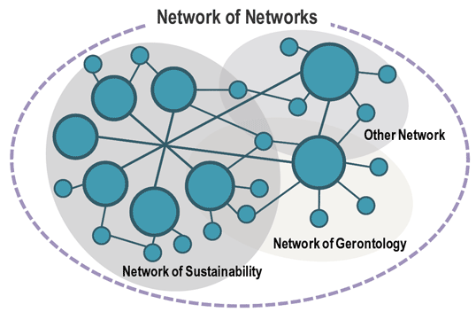
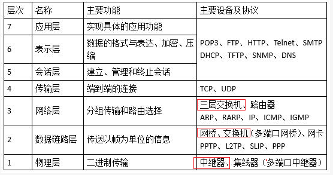
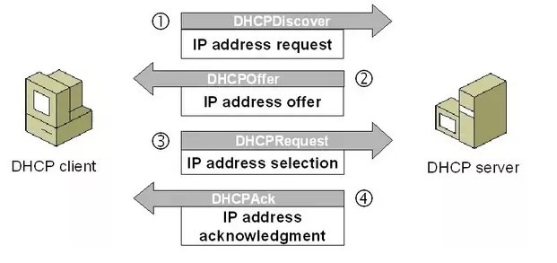
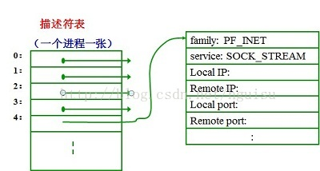

# 网络中的网络



网络把主机连接起来，而Internet把多种不同的网络连接起来，因此互连网是网络的网络


端系统/主机	位于**网络边缘**,通过通信链路和分组交换机交换数据

网络核心	由分组交换机和链路组成的网状网络


路由	源->目的的传输路径

转发	将分组从分组交换机的输入端口交换至正确的输出端口


## 报文交换


### 分组

发送端将数据分段,每段加上首部字节,通过通信链路和分组交换机进行传输

优点:传输的可靠性,提高通信线路利用率

缺点:增加转发/传输时延


**分组交换时延**

1. 节点处理	检查分组首部,决定分组被发送到哪个输出链路,检查分组出错,检查路由表

2. 排队		排队等待传输取决于流量强度，越接近1延迟越高,流量强度 【0，1】=分组*数量/带宽 = 已用带宽/总带宽
3. 传输		从队列到输出链路所需时间,分组比特L/链路传输速率R
4. 传播		链路中传播所需时间,链路距离d/传播速率s(接近光速)


**分组交换机**

链路层交换机(2层交换机)	用于接入网

路由器(三层交换机)		用于网络核心

**存储转发传输机制**	在开始向输出链路传输第一个bit前,必须先收到整个分组

**输出缓存/输出队列**的存在使得分组转发还需要额外的排队时延 -> 队满**丢包**

**转发表**	将分组首部的ip地址映射为输出链路


### 电路交换

在端系统间通话前,预留了通信所需的资源(电路/缓存/链路传输速率),这些资源在分组交换中不是提前预留的.电路交换需要在发送/接收方之间建立真实的连接,并预留带宽,确保能够以恒定的速率传输数据

**频分复用/时分复用**

优点:	时延低,随时通信,实时性强

缺点:	**独占带宽**,连接的端系统越多,分到的带宽越少,还无法分享带宽->信道利用率低


**RTT**	Round-Trip Time 往返时间

传播时延 + 排队时延 + 处理时延

从发送端发送数据开始,到收到来自接收端的确认,总共经历的时延


协议	定义多个通信实体间交换报文的格式/顺序,和发送/接受报文时的动作

协议栈	各层协议的集合


## ICP/ISP


ISP Internet service provider 服务提供商

ICP Internet content provider 内容提供商，百度，谷歌
ICP需要接入ISP，才能为端系统提供服务


ISP从互联网管理机构获得IP，同时拥有通信线路以及路由器等联网设备，端系统通过向 ISP 缴纳费用接入互联网


ISP接入Global ISP，使得ISP之间互连
Global ISP在全球有多个，不同的global ISP通过对等连接，双方各分配路由器/光纤，将旗下的用户互连	存在流量结算，根据双方的流量计算合作的价格


ISP之间的互连使得海外用户在接入互联网时需要经过多跳
ICP为了避免多跳，在全球各地的核心ISP旁边部署数据中心，以**专线**连接数据中心
当用户请求ICP服务时，先通过ISP连接到ICP的数据中心，当需要请求其他数据中心时，通过ICP的专线拉取数据，再返回给用户。多跳至其他数据中心


POP ISP上下层之间不对等的接入


## 层次化网络设计


### 1. 五层协议

-   **应用层**  ：为特定应用程序提供数据传输服务，例如 HTTP、DNS 等协议。数据单位为报文。

-   **传输层**  ：为进程提供通用数据传输服务。由于应用层协议很多，定义通用的传输层协议就可以支持不断增多的应用层协议。运输层包括两种协议：传输控制协议 TCP，提供面向连接、可靠的数据传输服务，数据单位为报文段；用户数据报协议 UDP，提供无连接、尽最大努力的数据传输服务，数据单位为用户数据报。TCP 主要提供完整性服务，UDP 主要提供及时性服务。

-   **网络层**  ：为主机提供数据传输服务。而传输层协议是为主机中的进程提供数据传输服务。网络层把传输层传递下来的报文段或者用户数据报封装成分组。

-   **数据链路层**  ：网络层针对的还是主机之间的数据传输服务，而主机之间可以有很多链路，链路层协议就是为同一链路的主机提供数据传输服务。数据链路层把网络层传下来的分组封装成帧。

-   **物理层**  ：考虑的是怎样在传输媒体上传输数据比特流，而不是指具体的传输媒体。物理层的作用是尽可能屏蔽传输媒体和通信手段的差异，使数据链路层感觉不到这些差异。

### 2. OSI

其中表示层和会话层用途如下：

-   **表示层**  ：数据压缩、加密以及数据描述，这使得应用程序不必关心在各台主机中数据内部格式不同的问题。

-   **会话层**  ：建立及管理会话。

五层协议没有表示层和会话层，而是将这些功能留给应用程序开发者处理。

### 3. TCP/IP

它只有四层，相当于五层协议中数据链路层和物理层合并为网络接口层。

TCP/IP 体系结构不严格遵循 OSI 分层概念，应用层可能会直接使用 IP 层或者网络接口层。


## 计算机网络分类


* 按范围分
  * 局域
  * 城域网
  * 广域网
  * 因特网

* 按拓扑分类
  * 总线型		总线出现故障将导致瘫痪
  * 星型			中心的负担重		也有双中心 ,但会造成设备冗余 ,成本上升
  * 环型


## 网络接入技术


# 因特网5层模型

每层所提供的服务实现易于改变,只要向上提供相同服务,并向下使用相同服务,使得服务的改变不影响其他层

缺点:	冗余了较低层的功能,下层提供每段链路/端到端2种传输方式,上层需要重复为这2中传输方式实现差错恢复;某层的功能需要其它层的信息,违反了层次分离的目标


封装


==链路交换机实现了1\~2层,路由器实现了1\~3层 -> 位于网络核心，不需要为进程或者应用程序提供服务,不需要实现传输层和应用层协议==

主机实现了5层协议 -> 最为复杂 -> 放在网络边缘


每一层的数据单元 = 首部字段 + 有效载荷字段

运输层报文段 = 应用层报文 + 运输层首部信息

网络层数据报 = 运输层报文段 + 源/目的端系统地址





## 应用层	报文message


|       应用       | 应用层协议 | 端口号  | 传输层协议 |            备注             |
| :--------------: | :--------: | :-----: | :--------: | :-------------------------: |
|     域名解析     |    DNS     |   53    |  UDP/TCP   | 长度超过 512 字节时使用 TCP |
| 动态主机配置协议 |    DHCP    |  67/68  |    UDP     |                             |
| 简单网络管理协议 |    SNMP    | 161/162 |    UDP     |                             |
|                  |    TFTP    |   69    |    UDP     |                             |
|   文件传送协议   |    FTP     |  20/21  |    TCP     |  控制连接 21，数据连接 20   |
|   远程终端协议   |   TELNET   |   23    |    TCP     |                             |
|  超文本传送协议  |    HTTP    |   80    |    TCP     |                             |
|                  |   HTTPS    |   443   |    TCP     |                             |
| 简单邮件传送协议 |    SMTP    |   25    |    TCP     |                             |
|   邮件读取协议   |    POP3    |   110   |    TCP     |                             |
| 网际报文存取协议 |    IMAP    |   143   |    TCP     |                             |


### 应用程序体系结构


从应用开发者的角度看,网络体系结构是固定的,并为应用程序提供特定的服务集合


**C/S体系结构**

有一个总是在线的服务器,接受许多客户端的请求

客户之间不直接通信

服务器具有固定+周知的IP

容易出现单机的瓶颈,需要配备大量主机的数据中心


**P2P体系结构**

端系统之间**对等**,发起通信方为客户,等待通信方为服务器

不存在总是在线的服务器

端系统间直接通讯(高度非集中式结构),端系统**间歇性接入网络**(IP变动)

安全性低


### 电子邮件协议

电子邮件系统的三部分：用户代理、邮件服务器,简单邮件传输协议


邮件协议包含发送/读取协议，发送协议常用 SMTP，读取协议常用 POP3 和 IMAP


**邮件发送过程:**

1. 发送方用户代理 -> 发送方邮件服务器
2. 发送方邮件服务器 -> 接收方邮件服务器
   1. 无法传送到接收方邮件服务器,邮件保存至报文队列,定时尝试重发
   2. 超时,发送邮件通知发送方
3. 接收方邮件服务器 -> 接收方邮箱

端系统上同时运行SMTP的客户端和服务端


#### SMTP 简单邮件传输协议

Simple Mail Transfer Protocol

SMTP 只能发送 7位的ASCII 码，而互联网邮件扩充了MIME,可以发送二进制文件


#### SMTP VS HTTP

| SMTP                                          | HTTP                    |
| --------------------------------------------- | ----------------------- |
| 推协议,从发送方邮件服务器 -> 接收方邮件服务器 | 拉协议,从服务器拉取数据 |
| 报文按7位ASCII码格式编码                      | 无编码限制              |
| 对象封装进Body中                              | 所有对象都在统一报文中  |


##### POP3

POP3 的特点是只要用户从服务器上读取了邮件，就把该邮件删除。但最新版 POP3 可以不删除邮件


##### IMAP

IMAP 协议中客户端和服务器上的邮件保持同步，如果不手动删除邮件，那么服务器上的邮件也不会被删除。IMAP 可以让用户随时随地去访问服务器上的邮件


### DNS 53

Domain Name System 域名系统

分层的DNS服务器实现分布式数据库,并定义了查询分布式数据库的应用层协议


==UDP/TCP的53端口==

* UDP: 普通的DNS查询

* TCP: 因为UDP的数据包只会传输512字节的数据,超长的报文将被截断.如今网络状况并不像十几年前那般简单,DNS报文传输的数据越来越多(鉴权,DNSSEC和IPV6地址),`RFC1123`规定了**当报文超长时,将使用TCP**; [区域复制](#区域复制)过程中,使用的也是TCP

无论是选择 UDP 还是 TCP，最核心的矛盾就在于需要传输的数据包大小，如果**数据包小到一定程度，UDP 协议绝对最佳的选择**，但是当数据包突破 512 字节以及 MTU 1500 字节的限制时，也只能选择使用更可靠的TCP协议, 并且**数据包越大,TCP协议头和三次握手带来的额外开销比例就主键降低**.目前针对DNS使用TCP协议的主要争论就是在于:DNS的**分布式**架构,导致一次DNS查询中,**DNS解析器会与n台DNS命名服务器通信**,使得TCP**三次握手带来的消耗成倍的增加**


#### 资源记录

存储了资源记录Resource Record,是[Name,Value,Type,TTL]的==四元组==

Name/Value的值取决于Type

Type=A	Name:主机名,Value:IP -> A提供了主机IP映射	[baidu.com,127.0.0.1,A]

Type=NS	Name:域,Value:掌握域中主机IP的权威DNS的IP -> DS用于沿着查询链来路由DNS查询	[baidu.com,baidu2.com,NS]

Type=CNAME	Name:别名,Value:规范主机名	[baidu.com,shop.baidu.com,CNAME]

Type=MX	Name:别名,Value:邮件服务器的规范主机名

用于某特定主机名的权威DNS,包含该主机名的S记录

不用于某特定主机名的权威DNS,包含该主机名的NS记录(域) + NS记录中value对应的DNS的A记录


CNAME允许 名称:IP = n:1 的映射关系。通常用于同时提供WWW和MAIL服务的计算机。例如“host.mydomain.com”（A记录）,同时提供WWW和MAIL服务，为了便于用户访问服务。可以为该计算机设置两个别名（CNAME）：WWW和MAIL


**A VS CNAME**

A 记录直接指向 IP 地址，CNAME 记录指向域名。IP 地址是互联网世界中唯一的，而 CNAME 指向的域名也要指向 A 记录，也就说 **IP 地址可以按需更换，无需变更CNAME的记录值**


**域名解析选 A 记录还是 CNAME 记录**

长期建站、项目运营的话，一般使用 CNAME 记录,可用于 CDN 加速，既可以起到加速网站的作用，又能**隐藏真实IP**，减少被攻击的几率

现在的云一般都接入了 BGP 多线路，至少是电信、联通、移动三线路，在更换 IP 的时候 CNAME 记录变，特别方便


#### DNS类型

1. 根域名服务器：并不直接把待查询的域名直接解析出IP地址，返回顶级域名服务器IP
2. 顶级域名服务器：管理顶级域名下的二级域名
3. 权威域名服务器：负责一个“区”的域名服务器
4. 本地域名服务器：离用户最近,起到代理作用,将用户的解析请求转发到DNS服务器层次结构


* 在一个区中,主DNS Server从自己本机的数据文件中读取该区的DNS数据信息

* 辅助DNS Server从本区的主DNS Server中读取该区的DNS数据信息
  * 辅助DNS Server启动时，==用TCP与主DNS Server通信==,**这是DNS唯一用到TCP的地方**
  * 由于涉及到主从复制,而UDP不可靠,传输的数据量小,只能传512字节

==主要使用UDP==,只要一次请求/应答,而使用基于TCP的DNS协议要三次握手、发送数据以及应答、四次挥手。**但UDP传输内容不能超过512字节**。但域名解析一般都不超过512字节


#### 区域复制

将DNS主服务器的解析库数据复制到从机,复制的过程也支持全量和增量两种形式

在复制过程中传输的报文很大,此时用的是==TCP==协议


#### 为什么DNS分布式

单点故障	**单点故障**将导致整个Internet崩溃

通信容量	集中处理所有的解析请求,通信**负载**过大

远距离的集中式数据库	单个DNS无法临近所有用户,将导致过高的**时延**

维护		每个新添加的主机都需要进行维护,维护集中在单机导致**频繁更新**


#### 域名解析


* 浏览器缓存
  * 缓存大小/时间有限制，通常情况下为几分钟到几小时不等，域名被缓存的时间**通过TTL属性设置**
    * 缓存时间长，一旦IP变化，会导致被客户端缓存的域名无法解析到变化后的IP
    * 时间太短，会导致用户每次访问网站都要重新解析一次域名

* 操作系统缓存  操作系统也有域名解析的过程
  * Windows C:\Windows\System32\drivers\etc\hosts
  * Linux中 /etc/hosts
  * 用户可以将任何域名解析到任何能够访问的IP地址,利于测试
  * 正是因为有这种本地DNS解析的规程，黑客把特定的域名解析到他指定的IP地址上，==域名劫持==

* 本地域名服务器 LDNS  提供给用户本地互联网接入的DNS解析服务
  * 性能高，会缓存域名解析结果，当然缓存时间是受到域名的失效时间控制的。大约80%的域名解析到这里就结束了，LDNS承担了域名解析主要工作
  * 通常会在用户所在城市的某个角落，不会很远
  * Windows ipconfig，Linux cat /etc/resolv.conf 查询配置的DNS服务器

* 根域名服务器Root Server
  * 返回给LDNS所查询的主域名服务器（gTLD Server）地址。gTLD是国际顶级域名服务器

* LDNS再向gTLD发送请求

* gTLD服务器查找并返回此域名对应的Name Server域名服务器的地址
  * Name Server通常就是用户注册的域名服务器，例如用户在某个域名服务提供商申请的域名，域名解析任务就由这个域名提供商的服务器完成

* Name Server域名服务器查询存储的域名和IP的映射关系表，连同TTL值返回给DNS Server域名服务器

* LDNS缓存这个域名和IP的对应关系，缓存时间由TTL值控制

* 把解析的结果返回给用户，用户根据TTL值缓存在本地系统缓存中
* 域名解析结束

在实际的DNS解析过程中，可能还不止这10步，如Name Server可能有很多级，或者有一个GTM来负载均衡控制，这都有可能会影响域名解析过程


```shell
# dig www.persona6.cn	dig指令显示域名解析过程
#dig +trace

; <<>> DiG 9.11.4-P2-RedHat-9.11.4-26.P2.el7_9.2 <<>> www.persona6.cn
;; global options: +cmd
;; Got answer:
;; ->>HEADER<<- opcode: QUERY, status: NOERROR, id: 50379
;; flags: qr rd ra; QUERY: 1, ANSWER: 1, AUTHORITY: 0, ADDITIONAL: 1

;; OPT PSEUDOSECTION:
; EDNS: version: 0, flags:; udp: 4096

#查询内容
;; QUESTION SECTION:
##	域名			IN代表互联网		查询类型 A:IP	MX:邮件S	PTR:根据IP地址反查域名	CNAME:查询域名相关别名
;www.persona6.cn.	IN				A

;; ANSWER SECTION:
#查询结果
www.persona6.cn.	600	IN	A	120.76.132.188

;; Query time: 41 msec
;; SERVER: 100.100.2.136#53(100.100.2.136)
;; WHEN: Mon Nov 30 17:54:13 CST 2020
;; MSG SIZE  rcvd: 60
```


`www.persona6.cn`对应的真正的域名为`www.persona6.cn.`	

* 根域名	`.`	每个域名都有根域名，通常省略

* 顶级域名 `.com、.net`

* 2级域名 `.persona6`，用户自己注册

* 3级域名/主机名 `www`，用户在自己的域里面为S分配的名称


==先在本机的DNS查,再去根S查。发现属于`cn`域，**返回`com`域中的DNS的IP地址**==


### CDN


Content Delivery Network 内容分发网络

通过在现有的Internet中新增Cache层，将网站内容发布到最接近用户的网络边缘节点，使用户==就近获取网站内容==

解决服务器端的“第一公里”问题 　
缓解甚至消除了不同运营商之间互联的瓶颈造成的影响 　
减轻了各省的出口带宽压力 　
缓解了骨干网的压力 　
优化了网上热点内容的分布


* 用户向localDNS发起请求查询输入域名对应的IP地址（若有缓存直接返回，否则去rootDNS查询）

* localDNS迭代向rootDNS查询，逐级迭代,rootDNS=>顶级DNS=>权限DNS

* 获得权限DNS后，localDNS向权限DNS发起域名解析请求

* 权限DNS通常会将域名CNAME【没有的话默认为普通请求，直接返回解析到的IP】指向CDN网络中的智能DNS负载均衡系统

* DNS负载均衡系统通过一些智能算法，将最合适的CDN节点IP地址返回给localDNS

* localDNS将获得的IP地址返回给用户

* 用户得到节点的IP地址后，向该节点发起访问请求

* CDN节点返回请求文件，如果该节点中请求的文件不存在，就会再回到源站获取这个文件，然后返回给用户


### FTP

FTP 使用 TCP 进行连接，它需要两个连接来传送一个文件：

- 控制连接：服务器打开端口号 21 等待客户端的连接，客户端主动建立连接后，使用这个连接将客户端的命令传送给服务器，并传回服务器的应答。
- 数据连接：用来传送一个文件数据。

根据数据连接是否是服务器端主动建立，FTP 有主动和被动两种模式：

**主动模式**：服务器端主动建立数据连接，其中服务器端的端口号为 20，客户端的端口号随机，但是必须大于 1024，因为 0\~1023 是熟知端口号

**被动模式**：客户端主动建立数据连接，其中客户端的端口号由客户端自己指定，服务器端的端口号随机。


主动模式要求客户端开放端口号给服务器端，需要去配置客户端的防火墙。被动模式只需要服务器端开放端口号即可，无需客户端配置防火墙。但是被动模式会导致服务器端的安全性减弱，因为开放了过多的端口号


### TFTP

简单文件传输协议,使用UDP,提供不可靠的数据流传输服务


### DHCP


Dynamic Host Configuration Protocol	动态主机配置协议

提供了即插即用的连网方式，用户不再需要手动配置 IP 地址等信息。

DHCP 配置的内容不仅是 IP 地址，还包括子网掩码、网关 IP 地址。

DHCP 工作过程如下：

1. 客户端发送 Discover 报文，该报文的目的地址为 255.255.255.255:67，源地址为 0.0.0.0:68，被放入 UDP 中，该报文被广播到同一个子网的所有主机上。如果客户端和 DHCP 服务器不在同一个子网，就需要使用中继代理。
2. DHCP 服务器收到 Discover 报文之后，发送 Offer 报文给客户端，该报文包含了客户端所需要的信息。因为客户端可能收到多个 DHCP 服务器提供的信息，因此客户端需要进行选择。
3. 如果客户端选择了某个 DHCP 服务器提供的信息，那么就发送 Request 报文给该 DHCP 服务器。
4. DHCP 服务器发送 Ack 报文，表示客户端此时可以使用提供给它的信息。





### Telnet

远程登录协议,使用TCP


### HTTP

超文本传输协议，基于请求/响应模式、无状态、按照URL指示将纯文本数据进行传输，以实现超链接功能

由于TCP为HTTP提供可靠数据传输服务,使HTTP不必关心数据丢失/乱序恢复 -> 分层架构的优势


<a name="HTTP被动性">被动性</a>	服务端不能主动联系客户端


**Hyper Text** 超文本
以超链接将不同空间的文字信息组织在一起的网状文本。其中的文字包含其他位置的URL链接，允许从当前阅读位置直接切换到指向的链接


**无状态**
客户端连续请求，服务器不保存关于客户的任何信息,无法知道这个客户曾经访问过。**这使得HTTP协议尽可能简单，使得它能够处理大量事务**


**长/短连接**	每次请求/响应都需要建立新的TCP连接 -> 短连接频繁创建套接字,影响性能


**URL**

Uniform Resource Locator	统一资源定位符

对互联网资源的位置和访问方法的表示，互联网上每个文件都有唯一的URL，包含文件的位置以及浏览器处理方式。URL**由协议、主机和端口以及文件名三部分构成**


Url中包含了**URN**（Uniform Resource Name，统一资源名称）,但URN只是用来定义资源的名称，并不具备定位该资源能力


#### 请求头


**USER-agent** 浏览器标识

Accept 客户端能处理的页面的类型

Accept-Charset 客户端能处理的字符集

Host 服务器的DNS名称. 一个IP可以对应多个Host, HTTP1.0的请求头不携带Host字段, 服务器端无法得知客户端是访问哪个Host调用的接口

**Referer** 表明自己是从哪个 网页/URL 获得/点击 跳转过来的

Server：响应头包含处理请求的原始服务器的软件信息
Location：WEB 服务器告诉浏览器，试图访问的对象已经被移到别的位置了，到该头部指定的位置去取。


#### 请求/响应报文

客户端发送请求报文给服务器，服务器根据请求报文进行处理，并将处理结果放入响应报文中返回客户端


##### 请求报文结构

1. 请求行(首行)	请求方法、URL、协议版本
2. 首部行(后续行)	首部名称:对应的值
3. 分隔用的空行
4. 内容主体

```shell
GET http://www.example.com/ HTTP/1.1
Accept: text/html
Accept-Encoding: gzip, deflate
Accept-Language: zh-CN,zh;q=0.9,en;q=0.8	#用户想得到的语法版本
Cache-Control: max-age=0
Host: www.example.com
If-Modified-Since: Thu, 17 Oct 2019 07:18:26 GMT
If-None-Match: "3147526947+gzip"
Proxy-Connection: keep-alive
Upgrade-Insecure-Requests: 1
User-Agent: Mozilla/5.0 xxx		#用户代理(浏览器类型)
															#空行分隔
param1=1&param2=2							#主体
```


##### 响应报文结构


1. 状态行(首行)	协议版本、状态码以及描述
2. 响应头
3. 分隔用的空行
4. 内容主体

```shell
HTTP/1.1 200 OK  //状态行
Cache-Control: max-age=604800 //响应头
Connection: keep-alive
Content-Encoding: gzip
Content-Length: 648	#字节数
Content-Type: text/html; charset=UTF-8
Date: Mon, 02 Nov 2020 17:53:39 GMT
Etag: "3147526947+ident+gzip"
Expires: Mon, 09 Nov 2020 17:53:39 GMT
Keep-Alive: timeout=4
Last-Modified: Thu, 17 Oct 2019 07:18:26 GMT
Proxy-Connection: keep-alive
Server: ECS (sjc/16DF)
Vary: Accept-Encoding
X-Cache: HIT
                           //空行
<!doctype html>            //响应体
<html>
</html>
```


##### HTTP8种方法


GET	获取资源

[条件GET](####条件GET)

HEAD	获取报文首部,和GET类似，但是不返回报文实体主体部分。主要用于确认 URL 的有效性以及资源更新的日期时间等

POST	传输实体主体

PUT 修改

DELETE

OPTIONS	查询URL支持的方法。返回 `Allow: GET, POST, HEAD, OPTIONS` 这样的内容

CONNECT	要求在与代理服务器通信时建立隧道,使用 SSL（Secure Sockets Layer，安全套接层）和 TLS（Transport Layer Security，传输层安全）协议把通信内容加密后经网络隧道传输。

TRACE	服务器会将通信路径返回给客户端,发送请求时，在 Max-Forwards 首部字段中填入数值，每经过一个服务器就会减 1，当数值为 0 时就停止传输。


##### 状态码


* 1xx	服务器正在处理请求

  * 100（Continue）,允许C在请求之前先用request header试探一下server，看server要不要接收request body，再决定要不要发request body

    C事先发送一个只带头域的请求,如果S接收此请求就回送响应码100

* 2xx	成功处理了请求

* 3xx (重定向)表示要完成请求，需要进一步操作
  
  * **301 Moved Permanently**  ：永久性重定向
  
  * **302 Found**  ：临时性重定向
  * **303 See Other**  ：和 302 有着相同的功能，但是 303 明确要求客户端应该采用 GET 方法获取资源。
  
  * 注：虽然 HTTP 协议规定 301、302 状态下重定向时不允许把 POST 方法改成 GET 方法，但是大多数浏览器都会在 301、302 和 303 状态下的重定向把 POST 方法改成 GET 方法。
  
  * **304 Not Modified**  ：如果请求报文首部包含一些条件，例如：If-Match，If-Modified-Since，If-None-Match，If-Range，If-Unmodified-Since，如果不满足条件，则服务器会返回 304 状态码。
  
  * **307 Temporary Redirect**  ：临时重定向，与 302 的含义类似，但是 307 要求浏览器不会把重定向请求的 POST 方法改成 GET 方法。
  
* 4xx(请求错误)请求可能出错，妨碍服务器的处理
  * 400 参数校验不合法
  * 401 未登录
  * 403 无权限

* 5xx(服务器错误)
  * 500 服务器内部错误
  * 501 (尚未实施) 服务器不具备完成请求的功能。 例如，服务器无法识别请求方法
  * 502 (错误网关) 服务器作为网关或代理，从上游服务器收到无效响应
  * 503 (服务不可用) 服务器目前无法使用(由于超载或停机维护)
  * 504 (网关超时) 服务器作为网关或代理，但是没有及时从上游服务器收到请求
  * 505 (HTTP 版本不受支持) 服务器不支持请求中所用的 HTTP 协议版本


##### HTTP 首部

有 4 种类型的首部字段：通用首部字段、请求首部字段、响应首部字段和实体首部字段。


###### 通用首部字段

|    首部字段名     |                    说明                    |
| :---------------: | :----------------------------------------: |
|   Cache-Control   |               控制缓存的行为               |
|    Connection     | 控制不再转发给代理的首部字段、管理持久连接 |
|       Date        |             创建报文的日期时间             |
|      Pragma       |                  报文指令                  |
|      Trailer      |             报文末端的首部一览             |
| Transfer-Encoding |         指定报文主体的传输编码方式         |
|      Upgrade      |               升级为其他协议               |
|        Via        |            代理服务器的相关信息            |
|      Warning      |                  错误通知                  |

###### 请求首部字段

|     首部字段名      |                      说明                       |
| :-----------------: | :---------------------------------------------: |
|       Accept        |            用户代理可处理的媒体类型             |
|   Accept-Charset    |                  优先的字符集                   |
|   Accept-Encoding   |                 优先的内容编码                  |
|   Accept-Language   |             优先的语言（自然语言）              |
|    Authorization    |                  Web 认证信息                   |
|       Expect        |              期待服务器的特定行为               |
|        From         |               用户的电子邮箱地址                |
|        Host         |               请求资源所在服务器                |
|      If-Match       |              比较实体标记（ETag）               |
|  If-Modified-Since  |               比较资源的更新时间                |
|    If-None-Match    |        比较实体标记（与 If-Match 相反）         |
|      If-Range       |      资源未更新时发送实体 Byte 的范围请求       |
| If-Unmodified-Since | 比较资源的更新时间（与 If-Modified-Since 相反） |
|    Max-Forwards     |                 最大传输逐跳数                  |
| Proxy-Authorization |         代理服务器要求客户端的认证信息          |
|        Range        |               实体的字节范围请求                |
|       Referer       |            对请求中 URI 的原始获取方            |
|         TE          |                传输编码的优先级                 |
|     User-Agent      |              HTTP 客户端程序的信息              |

###### 响应首部字段

|     首部字段名     |             说明             |
| :----------------: | :--------------------------: |
|   Accept-Ranges    |     是否接受字节范围请求     |
|        Age         |     推算资源创建经过时间     |
|        ETag        |        资源的匹配信息        |
|      Location      |   令客户端重定向至指定 URI   |
| Proxy-Authenticate | 代理服务器对客户端的认证信息 |
|    Retry-After     |   对再次发起请求的时机要求   |
|       Server       |    HTTP 服务器的安装信息     |
|        Vary        |   代理服务器缓存的管理信息   |
|  WWW-Authenticate  |   服务器对客户端的认证信息   |

###### 实体首部字段

|    首部字段名    |          说明          |
| :--------------: | :--------------------: |
|      Allow       | 资源可支持的 HTTP 方法 |
| Content-Encoding | 实体主体适用的编码方式 |
| Content-Language |   实体主体的自然语言   |
|  Content-Length  |     实体主体的大小     |
| Content-Location |   替代对应资源的 URI   |
|   Content-MD5    |   实体主体的报文摘要   |
|  Content-Range   |   实体主体的位置范围   |
|   Content-Type   |   实体主体的媒体类型   |
|     Expires      | 实体主体过期的日期时间 |
|  Last-Modified   | 资源的最后修改日期时间 |


#### SSL 安全套接字协议

Secure Sockets Layer

SSL是信息传输的加密方法，而https是信息传输加密成功后的结果


443端口

为网络通信提供安全及数据完整性的一种安全协议

SSL协议可以保护正常运行于TCP之上的任何应用协议

是传输层与应用层之间的协议，高层的应用协议能透明地建立在SSL协议之上；**SSL协议在应用层之前就完成了加密算法、通信密钥的协商和服务器的认证工作，此后应用层发送的数据都会被加密，保证通信的安全性**


SSL协议提供的安全通道有以下三个特性
1.机密性：SSL协议使用**密钥加密通信数据**
2.可靠性：服务器和客户都会被认证，客户的认证是可选的
3.完整性：SSL协议会对传送的数据进行完整性检


SSL提供的服务
1.认证用户和服务器，确保数据发送到正确的客户机和服务器
2.加密数据以防止数据中途被窃取
3.维护数据的完整性，确保数据在传输过程中不被改变


**SSL的数据包结构**


SSL协议的分层模型原理：
SSL协议是一个分层的协议，共有两层组成。处于SSL协议的底层的是SSL记录层协议(SSL Record Protocol)，它位于可靠的传输层协议(如TCP)之上，用于封装高层协议的数据。其中SSL握手协议(SSL Handshake Protocol)允许服务方和客户方互相认证，并在应用层协议传送数据之前协商出一个加密算法和会话密钥（类似于IPSEC的第一阶段）


**握手协议(SSL Handshake Protocol)**
允许服务方和客户方互相认证，并在应用层协议传送数据之前协商出一个加密算法和会话密钥。握手协议可以用于建立一个新的会话，也可以恢复一个先前存在的会话，但每次握手都会建立一个全新的连接
功能：
1.协商SSL协议的版本
2.协商加密套件
3.协商密钥参数
4.验证通讯双方的身份(可选)
5.建立SSL连接


1.网络连接建立，SSL客户端发送消息，消息中包含SSL版本号、密码设置、可实现的算法列表、随机数以及服务器使用SSL协议通信所需的其它信息；
2.SSL服务器端回应消息，确定SSL版本号、加密算法和压缩算法；
3.SSL服务器发出服务器数字证书；
4.SSL客户端的身份认证是可选的；
5.客户端生成预主密钥pre_master_secret，用服务器的公钥加密后返回服务器，服务器利用自己的私钥解密后得到会话密钥；

6. 若服务器要求客户认证，客户机会向服务器随加密的pre_master_secret一起发送签名的数据和客户自己的证书。
7. 服务器若认证客户成功，使用私钥加密pre_master_secret，然后执行一系列步骤生成master secret。否则会话终止。
8. 客户机与服务器使用master secret生成会话密钥。该密钥是对称密钥，用于加密和解密在SSL会话期间交换的信息，检验信息完整性。
9. 发送消息通知以后从客户机来的消息将用会话密钥加密。客户机然后发送一条独立的（加密的）消息表明握手的客户机部分已经完成。


#### HTTP1.0

- 增加了 HEAD、POST 等新方法
- 增加了响应状态码, 请求头和响应头, HTTP 版本号
- 引入了 Content-Type ，使得传输的数据不再限于文本
- 响应体的`Expires`标签, 可以让客户端在一段时间内缓存响应体

**默认短连接**,通过`Connection : Keep-Alive`可以开启长连接,**长连接适合一点对多点通讯**

HTTP的长/短连接实际上就是TCP的长/短连接

大致需要==2RTT== =1RTT建立连接 + 1RTT传输对象


#### HTTP1.1

* **默认长连接**，发送**探测包**维持连接，通过`Connection : close`关闭	适合P2P通信

  大致需要==1RTT== = 1RTT传输对象	省去了重复建立连接的耗时

* ~~Pipelining 流水线~~  无需等待前面的请求响应，即可发送第二次请求, , 减少了建立和关闭连接的消耗和延迟

  浏览器中此功能是默认关闭的, 因为启用的条件过于苛刻了: 

  1. 只有幂等的请求才能支持客户端连续请求, 例如get, 非幂等的请求之间可能存在依赖关系, 不能让服务器受到乱序的请求
  2. **服务器必须按照请求收到的顺序发送响应**, 这就导致服务器端还是顺序地去执行请求
  3. 大多数 HTTP 代理服务器不支持 pipelining
  3. 请求之间没有优先级, 会导致某个请求被阻塞很久

* 新增[100状态码](#状态码)

* 提供了与身份认证、状态管理和Cache缓存等机制相关的请求头和响应头

* host头  在一台物理机上存在多个虚拟主机共享同一个ip地址时, 通过host来区分是哪台虚拟主机

* 内容编码  通过压缩请求体/响应体减少传输的数据量,  **头部不编码**

  常用的内容编码有：gzip、compress、deflate、identity

  浏览器发送 Accept-Encoding 首部，其中包含有它所支持的压缩算法。服务器则从中选择一种算法对响应的消息主体进行压缩，并且发送 Content-Encoding 首部来告知浏览器它选择了哪一种算法


##### ~~Cookie~~


服务器发送到客户端并保存在本地，在客户端再次发起请求时被携带上，表明两个请求来自同一客户端

现代浏览器开始支持各种各样的存储方式，Cookie 渐渐被淘汰。新的浏览器 API 允许开发者直接将数据存储到本地，如 Web storage API（本地存储和会话存储）或 IndexedDB


###### 创建过程

服务器发送的响应报文包含 Set-Cookie 首部字段，客户端得到响应报文后把 Cookie 内容保存到浏览器中。

```html
HTTP/1.0 200 OK
Content-type: text/html
Set-Cookie: yummy_cookie=choco
Set-Cookie: tasty_cookie=strawberry

[page content]
```

客户端之后对同一个服务器发送请求时，会从浏览器中取出 Cookie 信息并通过 Cookie 请求首部字段发送给服务器。

```html
GET /sample_page.html HTTP/1.1
Host: www.example.org
Cookie: yummy_cookie=choco; tasty_cookie=strawberry
```

###### 分类

- 会话期 Cookie：浏览器关闭之后它会被自动删除，也就是说它仅在会话期内有效。
- 持久性 Cookie：指定过期时间（Expires）或有效期（max-age）之后就成为了持久性的 Cookie。


##### Session

使用 Session 维护用户登录状态的过程如下：

- 用户进行登录时，用户提交包含用户名和密码的表单，放入 HTTP 请求报文中；
- 服务器验证该用户名和密码，如果正确则把用户信息存储到 Redis 中，它在 Redis 中的 Key 称为 Session ID；
- 服务器返回的响应报文的 Set-Cookie 首部字段包含了这个 Session ID，客户端收到响应报文之后将该 Cookie 值存入浏览器中；
- 客户端之后对同一个服务器进行请求时会包含该 Cookie 值，服务器收到之后提取出 Session ID，从 Redis 中取出用户信息，继续之前的业务操作。


##### Cache-Control

Cache-Control 首部字段控制缓存

```shell
Cache-Control: no-store	#禁止缓存
Cache-Control: no-cache	#强制确认缓存,缓存服务器需要先向源服务器验证缓存资源的有效性，只有当缓存资源有效时才能使用该缓存对客户端的请求进行响应
Cache-Control: private	#将资源作为私有缓存，只能被单独用户使用，一般存储在用户浏览器中
Cache-Control: public	#将资源作为公共缓存，可以被多个用户使用，一般存储在代理服务器
```


**缓存过期机制**

max-age 指令出现在请求报文，并且缓存资源的缓存时间小于该指令指定的时间，那么就能接受该缓存。

max-age 指令出现在响应报文，表示缓存资源在缓存服务器中保存的时间。

```html
Cache-Control: max-age=31536000
```

Expires 首部字段也可以用于告知缓存服务器该资源什么时候会过期。

```html
Expires: Wed, 04 Jul 2012 08:26:05 GMT
```

- 在 HTTP/1.1 中，会优先处理 max-age 指令；
- 在 HTTP/1.0 中，max-age 指令会被忽略掉。


##### 范围请求

如果网络出现中断，服务器只发送了一部分数据，范围请求可以使得客户端只请求服务器未发送的那部分数据，从而避免服务器重新发送所有数据。

###### 1. Range

在请求报文中添加 Range 首部字段指定请求的范围。

```html
GET /z4d4kWk.jpg HTTP/1.1
Host: i.imgur.com
Range: bytes=0-1023
```

请求成功的话服务器返回的响应包含 206 Partial Content 状态码。

```html
HTTP/1.1 206 Partial Content
Content-Range: bytes 0-1023/146515
Content-Length: 1024
...
(binary content)
```

###### 2. Accept-Ranges

响应首部字段 Accept-Ranges 用于告知客户端是否能处理范围请求，可以处理使用 bytes，否则使用 none。

```html
Accept-Ranges: bytes
```

###### 3. 响应状态码

- 在请求成功的情况下，服务器会返回 206 Partial Content 状态码。
- 在请求的范围越界的情况下，服务器会返回 416 Requested Range Not Satisfiable 状态码。
- 在不支持范围请求的情况下，服务器会返回 200 OK 状态码。


##### 多部分对象集合

一份报文主体内可含有多种类型的实体同时发送，每个部分之间用 boundary 字段定义的分隔符进行分隔，每个部分都可以有首部字段。

例如，上传多个表单时可以使用如下方式：

```html
Content-Type: multipart/form-data; boundary=AaB03x

--AaB03x
Content-Disposition: form-data; name="submit-name"

Larry
--AaB03x
Content-Disposition: form-data; name="files"; filename="file1.txt"
Content-Type: text/plain

... contents of file1.txt ...
--AaB03x--
```


##### 压缩

HTTP/1.0对数据压缩的选项提供的不多，不支持压缩细节的选择，也无法区分端到端（end-to-end）压缩或者是逐跳（hop-by-hop）压缩。

HTTP/1.1则对内容编码（content-codings）和传输编码（transfer-codings）做了区分。内容编码总是端到端的，传输编码总是逐跳的。

HTTP/1.0包含了`Content-Encoding`头部，对消息进行端到端编码。HTTP/1.1加入了`Transfer-Encoding`头部，可以对消息进行逐跳传输编码。HTTP/1.1还加入了`Accept-Encoding`头部，是客户端用来指示他能处理什么样的内容编码


##### 缺陷

- 客户端需要使用多个连接才能实现并发和缩短延迟
- 不会压缩请求和响应首部，导致不必要的网络流量
- 不支持有效的资源优先级，致使底层 TCP 连接的利用率低下


**安全性问题**

- 使用明文进行通信，内容可能会被窃听；
- 不验证通信方的身份，通信方的身份有可能遭遇伪装；
- 无法证明报文的完整性，报文有可能遭篡改。


#### HTTP2

在tls握手期间, 客户端会用http1.1询问服务器支持的http协议列表，并根据服务器返回支持的协议根据顺序选择协议，例如排序为h2，http/1.1浏览器就会选择h2（http2），若http/1.1在前面就会选择http1.1协议

* stream 是连接中的一个虚拟信道，可以承载双向消息传输。每个流有唯一整数标识符。客户端发起的流具有奇数 id，服务器端发起的流具有偶数 id

  stream可以设置**优先级**, 可以定义互相的依赖关系, 避免了关键请求被阻塞

  提供 `Multiplexing` 多路传输特性，==可以在一个`TCP`连接中同时完成多个`HTTP`请求==

* 采用**二进制格式**, 解析数据的开销更小，数据更加紧凑. 在此之前都是纯文本格式

* *HPACK* 压缩算法减少传输header的大小, 并且通信双方会各自缓存一份header字段表，避免重复传输cookie信息

* 支持服务器主动推送数据, 减少了请求的次数，比如客户端请求 1.html，把1.html 需要的 js 和 css 也一块返回


**2 VS 1.1**


**2是完全多路复用的，而非有序并阻塞的——只需一个连接即可实现并行**

使用报头压缩，2降低了开销

2让服务器可以将响应主动“推送”到客户端缓存中

多路复用对前端优化性能有很大的帮助


**什么是多路复用**

在 HTTP 1.1 中，发起一个请求是这样的：

浏览器请求 url -> 解析域名 -> 建立 HTTP 连接 -> 服务器处理文件 -> 返回数据 -> 浏览器解析、渲染文件 

这个流程最大的问题是，每次请求都需要建立一次 HTTP 连接，也就是我们常说的3次握手4次挥手，这个过程在一次请求过程中占用了相当长的时间，而且逻辑上是非必需的，因为不间断的请求数据，第一次建立连接是正常的，以后就占用这个通道，下载其他文件，这样效率多高啊！


HTTP 1.1 中提供了 Keep-Alive，允许我们建立一次 HTTP 连接，来返回多次请求数据

但是这里有两个问题：

HTTP 1.1 基于串行文件传输数据，因此这些请求必须是有序的，所以实际上我们只是节省了建立连接的时间，而获取数据的时间并没有减少

最大并发数问题，假设我们在 Apache 中设置了最大并发数 300，而因为浏览器本身的限制，最大请求数为 6，那么服务器能承载的最高并发数是 50


而 2 引入二进制数据帧和流的概念，其中帧对数据进行顺序标识，这样浏览器收到数据之后，就可以按照序列对数据进行合并，而不会出现合并后数据错乱的情况。同样是因为有了序列，服务器可以并行传输数据

2对同一域名下所有请求都是基于流，也就是说同一域名不管访问多少文件，也只建立一路连接,提高并发


##### 二进制分帧层

将报文分成二进制格式的 HEADERS 帧和 DATA 帧


在通信过程中，只会有一个 TCP 连接存在，它承载了任意数量的双向数据流（Stream）

- 数据流（Stream）有唯一标识符和可选的优先级信息，用于承载双向信息
- 消息（Message）是与逻辑请求或响应对应的完整的一系列帧
- 帧（Frame）是最小的通信单位，来自不同数据流的帧可以交错发送，然后再根据每个帧头的数据流标识符重新组装


##### 服务端推送

HTTP/2.0 在客户端请求一个资源时，会把相关的资源一起发送给客户端，客户端就不需要再次发起请求了。例如客户端请求 page.html 页面，服务端就把 script.js 和 style.css 等与之相关的资源一起发给客户端。


##### 首部压缩

HTTP/1.1 的首部带有大量信息，而且每次都要重复发送

HTTP/2.0 要求客户端和服务器同时维护首部字段表，避免了重复传输	还使用 Huffman 编码对首部字段进行压缩

<div align="center">  </div><br>


#### HTTPS


基于TCP+HTTP+SSL


缺点	加密解密耗时；证书授权昂贵


在TCP三次握手后建立可靠连接,在此基础上进行**四次握手**

C->S 明文传输 C的随机数**Client random** + 客户端支持的对称性加密算法列表 (抓包得到对称性加密算法)

S->C 同意其中一种算法 + S的随机数**Server random** + 服务器**证书** + S的**公钥** (抓包得到公钥)

C->S 取得S的公钥,用数字签名进行校验

C->S 用公钥和随机数对密码加密,并通过对称性加密算法传输新的随机数**Premaster secret** (此时抓包破解对称性加密,但公钥解不开非对称性加密)

S	用Client/Server random + Premaster secret 生成session key


让 HTTP 先和 SSL通信，再由 SSL 和 TCP 通信，也就是说 HTTPS 使用了隧道进行通信

通过使用 SSL，HTTPS 具有了加密（防窃听）、认证（防伪装）和完整性保护（防篡改）


HTTPS的报文摘要比HTTP更为安全,因为结合了加密/认证两个操作,

==HTTP的报文被篡改后,只要重新计算摘要,接收方无法意识到内容被篡改==

而HTTPS的对称/非对称加密+证书,防止密文被破解, 即使是篡改也难以计算摘要


#### GET VS POST

GET 用于获取资源，而POST用于传输实体主体

**二者都可以将参数放在url或body中**,但不能因为post通常将参数放在body中就认为它的安全性更高,对于抓包工具来说参数放在哪个位置都是能被获取到的


|                | GET                           | POST                                                         |
| -------------- | ----------------------------- | ------------------------------------------------------------ |
| 编码           | ==URL只支持ASCII码==          | body支持标准字符集                                           |
| 幂等性         | √ (包括HEAD，PUT 和 DELETE)   | ×                                                            |
| 缓存           | 浏览器主动缓存                | 不缓存,除非响应报文Cache-Control 首部字段指定进行缓存        |
| 浏览器历史记录 | 历史记录里保留url完整请求参数 | 不保留body参数                                               |
| 参数长度       | url请求参数一般最长2k字节     | body无限制                                                   |
|                | header和data一起发送          | ==两次请求==: 浏览器先发送header，服务器响应100 continue，浏览器再发送data (Firefox除外) |

**post为什么要分两次请求**

网络通顺时，多一次请求的延时基本可以忽略不计

网络阻塞时，两次包的TCP有助于验证数据包完整性


**从传输层的角度来说,get和post都是基于的TCP收发报文,二者并没有区别**

从**应用层**的角度来说,不同的浏览器/服务器对HTTP进行了规范,例如浏览器通常会将url长度限制在2k字节内,部分浏览器在进行get请求时,不会携带request body等等


##### XMLHttpRequest

为了阐述 POST 和 GET 的另一个区别，需要先了解 XMLHttpRequest：

> XMLHttpRequest 是一个 API，它为客户端提供了在客户端和服务器之间传输数据的功能。它提供了一个通过 URL 来获取数据的简单方式，并且不会使整个页面刷新。这使得网页只更新一部分页面而不会打扰到用户。XMLHttpRequest 在 AJAX 中被大量使用。

- 在使用 XMLHttpRequest 的 POST 方法时，浏览器会先发送 Header 再发送 Data。但并不是所有浏览器会这么做
- 而 GET 方法 Header 和 Data 会一起发送


#### HTTP VS HTTPS


* 安全性
  * http 明文
  * https 安全性的ssl加密传输

* 连接方式不同
  * http 无状态
  * https SSL＋HTTP协议构建的可进行加密传输、身份认证的网络协议

* 端口不同
  * http 80
  * https 443．

* 证书申请方式不同
  * http：免费申请
  * https：CA申请证书，免费证书少


### SNMP

简单网络管理协议

由一组网络管理的标准组成,包含一个应用层协议,数据库模型和一组资源对象. 该协议用于检测连接到网络上的设备


### Socket

套接字（socket）是所有通信的基石，是支持TCP/IP协议的网络通信的基本操作单元,**不是协议**

**按照Linux的一切皆文件的思想,socket也是文件,socket函数是对这个文件的读写**

服务其在启动时会绑定一个众所周知的地址（ip+端口号），用于提供服务；而客户端不用指定，由系统自动分配

==门面模式==，把复杂TCP/IP协议族隐藏，对用户来说，一组简单的接口就是全部，让Socket去组织数据，以符合指定的协议


在应用层通过传输层传输数据时，TCP会遇到为多个进程提供并发服务的问题。多个TCP连接或多个应用程序进程可能需要通过同一个TCP协议端口传输数据。通过Socket可以区分来自不同应用程序进程或网络连接的通信，实现数据传输的并发服务


套接字是同一台主机中**应用层与传输层**间的接口,进程通过套接字收发报文

开发者可以自定义套接字在应用层的一切,但无法干预传输层

**TCP套接字 = [发送方IP:端口 + 接收方IP:端口 + 协议类型] 五元组  任意元素变化,就是一个新的套接字**

UDP套接字 = [接收方IP:端口] 二元组


一个协议有1~n个套接字

==一个端口可以绑定多个套接字==(协议类型不同) : 五元组 唯一确定一个socket


TCP/IP协议族:网络层**ip**唯一标识网络中的主机，传输层**协议+端口**唯一标识进程。==三元组（ip，协议，端口）==标识网络的进程


#### 多个Socket共享端口

S-IP : 24.14.181.229	C-IP : 10.1.2.3	端口80


当Socket和端口为1:1关系时,S和C建立的连接:

C 10.1.2.3:80		S 24.14.181.229:80

这将导致80端口被占用,其他人无法访问


实际上是这样:

C  			| S      			| Role

-----------------------------------------------------------

0.0.0.0:80    | <none>          	| LISTENING

127.0.0.1:80   | 10.1.2.3:随机端口  | ESTABLISHED


1. S进程侦听端口,一旦建立连接,就创建新Socket+随机端口并移交给子线程,由子线程负责与C通信。**通信从不占用监听端口**
2. 连接由操作系统通过以下5元组唯一标识,任何元素不同都为完全独立的连接

4. **每个端口只能被监听一次**


Socket是应用层与TCP/IP协议族通信的中间软件抽象层


#### 套接字描述符


其实就是一个整数，我们最熟悉的句柄是0、1、2三个，0是标准输入，1是标准输出，2是标准错误输出。0、1、2是整数表示的，对应的FILE *结构的表示就是stdin、stdout、stderr

 

套接字API最初是作为UNIX操作系统的一部分而开发的，所以套接字API与系统的其他I/O设备集成在一起。特别是，当应用程序要为因特网通信而创建一个套接字（socket）时，操作系统就返回一个小整数作为描述符（descriptor）来标识这个套接字。然后，应用程序以该描述符作为传递参数，通过调用函数来完成某种操作（例如通过网络传送数据或接收输入的数据）。

在许多操作系统中，套接字描述符和其他I/O描述符是集成在一起的，所以应用程序可以对文件进行套接字I/O或I/O读/写操作。

当应用程序要创建一个套接字时，操作系统就返回一个小整数作为描述符，应用程序则使用这个描述符来引用该套接字需要I/O请求的应用程序请求操作系统打开一个文件。操作系统就创建一个文件描述符提供给应用程序访问文件。从应用程序的角度看，文件描述符是一个整数，应用程序可以用它来读写文件。下图显示，操作系统如何把文件描述符实现为一个指针数组，这些指针指向内部数据结构。


 对于每个程序系统都有一张单独的表。精确地讲，系统为每个运行的进程维护一张单独的文件描述符表。当进程打开一个文件时，系统把一个指向此文件内部数据结构的指针写入文件描述符表，并把该表的索引值返回给调用者 。应用程序只需记住这个描述符，并在以后操作该文件时使用它。操作系统把该描述符作为索引访问进程描述符表，通过指针找到保存该文件所有的信息的数据结构。

   **针对套接字的系统数据结构：**

  1）、套接字API里有个函数socket，它就是用来创建一个套接字。套接字设计的总体思路是，单个系统调用就可以创建任何套接字，因为套接字是相当笼统的。一旦套接字创建后，应用程序还需要调用其他函数来指定具体细节。例如调用socket将创建一个新的描述符条目：





2）、虽然套接字的内部数据结构包含很多字段，但是系统创建套接字后，大多数字字段没有填写。应用程序创建套接字后在该套接字可以使用之前，必须调用其他的过程来填充这些字段。

**3、文件描述符和文件指针的区别：**

 

**文件描述符：**在linux系统中打开文件就会获得文件描述符，它是个很小的正整数。每个进程在PCB（Process Control Block）中保存着一份文件描述符表，文件描述符就是这个表的索引，每个表项都有一个指向已打开文件的指针。

**文件指针：**C语言中使用文件指针做为I/O的句柄。文件指针指向进程用户区中的一个被称为FILE结构的数据结构。FILE结构包括一个缓冲区和一个文件描述符。而文件描述符是文件描述符表的一个索引，因此从某种意义上说文件指针就是句柄的句柄（在Windows系统上，文件描述符被称作文件句柄）。


#### 建立Socket

建立Socket连接至少需要一对套接字，其中一个运行于客户端，称为ClientSocket ，另一个运行于服务器端，称为ServerSocket

套接字之间的连接过程分为三个步骤：服务器监听，客户端请求，连接确认。
服务器监听：服务器端套接字并不定位具体的客户端套接字，而是处于等待连接的状态，实时监控网络状态，等待客户端的连接请求。
客户端请求：指客户端的套接字提出连接请求，要连接的目标是服务器端的套接字。为此，客户端的套接字必须首先描述它要连接的服务器的套接字，指出服务器端套接字的地址和端口号，然后就向服务器端套接字提出连接请求
连接确认：当服务器端套接字监听到或者说接收到客户端套接字的连接请求时，就响应客户端套接字的请求，建立一个新的线程，把服务器端套接字的描述发给客户端，一旦客户端确认了此描述，双方就正式建立连接。而服务器端套接字继续处于监听状态，继续接收其他客户端套接字的连接请求


### WebSocket

websocket是html5规范提出的协议；它基于TCP和HTTP协议是并存的两种协议。


webSocket定义了webSocket API ，支持页面使用webSocket协议与远程主机进行全双工的通信，它引入了websocket接口并且定义了一个全双工的通信通道，通过单一的套接字在web上进行操作。 html5 web sockets 以最小的开销高效的提供了web链接，相较于经常使用推送实时数据到客户端甚至通过维护两个http链接来模拟全双工链接的旧的轮询或长轮询。减少不必要的网络流量与延迟

websocket提供了一个url来表示想要链接的远程断电。该规范定义了ws://以及wss:// 从http协议的初始握手阶段升级到webSocket协议来建立，但底层依旧是TCP/IP链接


### WebSocket VS HTTP

两者都是基于TCP传输数据,是对TCP进行封装的协议


###  long poll/ajax轮询


这两个都可以实现实时信息传递

ajax轮询，让浏览器隔个几秒就发送一次请求，询问服务器是否有新信息

需要服务器有很快的处理速度和资源。（速度）


long poll 也采用轮询的方式，不过采取的是阻塞模型,客户端发起连接后，如果没消息，就一直不返回Response给客户端。直到有消息才返回，返回完之后，客户端再次建立连接，周而复始

需要服务器有很高的并发


二者都是在不断地建立HTTP连接，然后等待服务端处理，可以体现HTTP协议的[被动性](#HTTP被动性)


socket解决了HTTP的被动性，当服务器完成协议升级后（HTTP->Websocket），服务端就可以主动推送信息给客户端,只需要经过**一次HTTP请求**，就可以持续的信息传送(==回调==)


也解决了HTTP的浪费资源

HTTP需要经过两层代理，Nginx等服务器的解析，然后再传送给相应的Handler处理,Nginx速度是足够的，但是每次都卡在Handler
Websocket就解决了这样一个难题，建立后，可以直接跟Nginx建立持久连接，有信息的时候Handler想办法通知Nginx，然后Nginx统一转交给客户

同时，在传统的方式上，要不断的建立/关闭HTTP协议，由于HTTP是非状态性的，每次都要重新传输identity info（鉴别信息），来告诉服务端你是谁

虽然Nginx很快，但是每次都要处理这么一堆，效率也会有所下降的，同时还得不断把这些信息转交给Handler，会在网路传输中消耗过多的流量/时间
但是Websocket只需要一次HTTP握手，所以说整个通讯过程是建立在一次连接/状态中，也就避免了HTTP的非状态性，服务端会一直知道你的信息，直到你关闭请求，这样就解决了Nginx要反复解析HTTP协议，还要查看identity info的信息
同时由客户主动询问，转换为服务器推送，没有信息的时候就交给Nginx，不需要占用本身速度就慢的Handler


### 路由表


```shell
[root@lx ~]# route -n
Kernel IP routing table
Destination     Gateway         Genmask         Flags Metric Ref    Use Iface
0.0.0.0         172.27.111.253  0.0.0.0         UG    0      0        0 eth0
169.254.0.0     0.0.0.0         255.255.0.0     U     1002   0        0 eth0
172.17.0.0      0.0.0.0         255.255.0.0     U     0      0        0 docker0
172.27.96.0     0.0.0.0         255.255.240.0   U     0      0        0 eth0

[root@lx ~]# ping www.baidu.com
PING www.a.shifen.com (14.215.177.39) 56(84) bytes of data.

ping百度时,目标IP14.215.177.39,与路由表中各个路由的Genmask子网掩码进行按位与,得到的结果如果等于Destination下一跳IP,就表示路由可达,将请求发送给Gateway网关进行下一跳
```


#### Web缓存


web缓存器 Web Cahce = 代理服务器 Proxy Server

能够代表初始Web服务器完成HTTP请求的网络实体,有自己的磁盘存储空间,存储近期浏览过的对象的副本


#### CDN


#### 条件GET

Web缓存器中对象的副本可能是陈旧的,为了获取最新数据,HTTP提供条件GET验证缓存的有效性

通过在请求行加上首部行`If-Modified-Since:时间`实现

响应304代表缓存的版本是最新的


## 传输层	报文段segment

负责控制/监管数据传输,不负责传输数据/实现安全性

**实际的数据传输是在网络层通过IP实现的,传输层只是定位到了数据收发的进程**

向上层屏蔽了网络层的核心细节，使应用程序看起来像是在两个传输层实体之间有一条通信信道


在发送端,将应用进程的报文切分,加上运输层首部字段,转化为报文段后交给发送端的网络层	网络层将报文段封装为分组

在接收端,网络层从分组提取报文段后,交给运输层,运输层处理报文段后,交给进程


**TCP和UDP的端口是两套命名空间** -> TCP和UDP的端口可以重复 -> **IP + 传输层协议 + 端口** 才能定位到具体的服务


### TCP

Transmission Control Protocol ==面向连接的可靠传输控制协议==

原本为TCP/IP(传输控制/网际协议)协议,之后被拆分为单独的两个部分,以便提供广泛支持,允许任何主机与链路层协议互操作


| 面向连接         | 在应用层数据报文流动之前,在运输层进行三次握手建立套接字 |
| ---------------- | ------------------------------------------------------- |
| 可靠             | 不会出现字节的丢失/冗余                                 |
| **点对点全双工** |                                                         |
| 差错检测         |                                                         |
| 重传             |                                                         |
| 累积确认         |                                                         |
| 定时器           |                                                         |


==Socket==	可以理解为IP:Port-IP:Port的四元组

Socket唯一 -> 在接收方IP/Port固定,发送方IP固定的情况下,可以建立65535个连接


内核接收网络传输后,数据被保存在内核中,表现形式为Recv/Send-Q

**应用的发送/接收数据就是与内核的队列进行交互**


==在维持连接情况下，一个TCP可以发送多个HTTP请求==

 

==RTT== Round-Trip Time 从发送方发出数据并接收到ack的时间被叫做往返时延


| 大写:标志位 小写:序号 |                                                              | 字节 |
| --------------------- | ------------------------------------------------------------ | ---- |
| seq 序列号            | 标记顺序，第一个字节编号由本地随机产生                       | 4    |
| ack 确认号            | **代表发送方已收到前ack-1个报文**,期待收到对方第ack个序号的报文 | 4    |
| ACK 确认标记          | **仅当ACK=1时，确认字段才有效**                              | 1    |
| SYN 同步标记          | 连接建立时用于同步序号,**握手时1，握手完成0**                | 1    |
| FIN 终止标记          | 数据发送完毕，要求释放连接                                   | 1    |

==TCP把数据看作 无结构+有序的字节流==,这里为了方便,把ack的值描述成了报文的数量,但实际上是报文的字节数


#### MSS

Maximum Segment Size	最大报文段长度

通常根据本地发送主机发送的最大链路层帧长度(即最大传输单元MTU设置)


**TCP的报文段 + TCP/IP的首部长度 <= MTU**

以太网和PPP链路层的MTU都为1500字节 && TCP/IP首部长度40字节 -> MSS通常**1460**字节


#### 首部格式


|          |      |                                                          |                       |
| -------- | ---- | -------------------------------------------------------- | --------------------- |
| 序号     | 32   |                                                          |                       |
| 确认号   | 32   |                                                          |                       |
| 数据偏移 |      | 数据部分距离报文段起始处的偏移量，实际上指的是首部的长度 |                       |
| ACK      |      | 在连接建立后所有传送的报文段的ACK=1                      |                       |
| SYN      |      | SYN=1，ACK=0 连接请求   SYN=1，ACK=1 同意连接            |                       |
| FIN      |      | FIN=1 -> 释放连接                                        |                       |
| ==窗口== |      | 控制发送方的发送速率                                     | [流量控制](#流量控制) |


#### 连接数量限制

`Chrome`最多允许对同一个`Host`建立六个`TCP`连接。不同浏览器有区别


如果资源都是`HTTPS`连接并在同一个域名，那么浏览器在`SSL`握手之后会和S商量能使用HTTP2进行`Multiplexing`进行多路传输。不过也未必会所有挂在这个域名的资源都会使用一个`TCP`连接去获取，但Multiplexing很可能会被用到

如果用不了`HTTP2`,就会在一个`HOST`上建立多个`TCP`连接，**连接数量的最大限制取决于浏览器设置**，这些连接会在空闲的时候被浏览器用来发送新的请求，如果所有的连接都正在发送请求,其他请求阻塞


#### 三次握手

> 连接的定义: 
>
> 用于保证可靠性和流控制机制的信息，包括**Socket、序列号以及窗口大小**

Socket: 地址标识符+端口

**序列号**: 接收方通过序列化判断数据包是否接收成功,并且能够根据序列号对报文去重/排序

窗口大小: 流量控制


三次握手的核心是**协商初始序列号seq**,做好发数据的准备工作.**三次握手中双方都会互相交换自己定义的seq**


 

* 第1次握手：建立连接
  * C->（SYN=1,seq=x） 连接请求,**C的协商初始序列号x**
  * 进入"同步已发送"SYN_SENT状态，等待S确认

* 第2次握手：S收到SYN包
  * S->（ACK=1,ack=x+1,SYN=1,seq=y） 同意连接,**S的协商初始序列号y**

    x是C这边定义好的初始序列号,如果这里的ack!=x+1,C就会中断连接.**判断是否建立TCP连接的控制权是交给序列号的定义方的**,因为只有序列号定义方有足够的上下文去判断当前连接是否正确或者国企

  * S进入"同步收到"SYN_RECV状态

* 第3次握手：C收到S的SYN+ACK包
  * C-> (ACK=1,ack=y+1,seq=x+1）确认包

    如果这里ack!=y+1,连接也是建立失败的.**在第三次握手时,双方的seq都已经被定义好了**

  * C和S都进入"已建立连接"ESTABLISHED"状态

==由于TCP能够同时发送ACK和SYN,所以只需要3次而不是4次==


##### 两次握手的问题


ack报文**丢失**导致死锁

* C->S发送连接请求，S接收成功
* S->C发送ack确认,这个报文丢失了,但按照两次握手的协定，此时S就认为连接成功建立，开始发送数据分组
* 应答分组丢失后,**C认为连接未建立**，忽略S发来的数据，**继续等待C的ack**
* 而S发出的数据分组超时后,不断重发 -> 死锁


ack报文**重发**后建立了冗余的连接

* C->S发送连接请求，S接收成功
* S->C发送ack确认,这个报文因网络原因先后发送了2次,分别是ack=x+1和ack=x+2
* ack=x+1,ack=x+2两个报文都被C接收,于是C与S之间建立了两个连接.其中一个连接是永远也不会使用的


#### 四次挥手


* 第1次挥手

  * C -> FIN=1，seq=u（之前数据的最后序号+1）  连接释放报文，并停止发送数据,释放数据报文首部
    * FIN报文段即使不携带数据，也要消耗一个序号
  * C进入FIN-WAIT-1（终止等待1）状态

* 第2次挥手

  * S->ACK=1，ack=u+1，seq=v   收到连接释放报文，发出确认报文
  * S通知高层的应用进程，释放C->S方向的连接，这时处于半关闭状态，即C没有数据要发送，但是S若发送数据，C依然要接受
  * S进入CLOSE-WAIT（关闭等待）状态,这个状态要持续一段时间
  * C收到S的连接释放报文
  * C进入FIN-WAIT-2（终止等待2）状态，等待S的连接释放报文

* 第3次挥手

  * S->FIN=1，ack=u+1,seq=w(半关闭状态下S很可能又发送了一些数据)    数据发送完毕，向C发送连接释放报文
  * S进入了LAST-ACK（最后确认）状态，等待C的确认释放

* 第4次挥手

  * C->ACK=1，ack=w+1，seq=u+1   收到S的连接释放报文后，必须回复确认释放报文

  * C进入了**TIME-WAIT**（时间等待）状态。==此时TCP连接还没释放，还需等待2MSL==

    * **Client发出最后的ACK可能会丢失。Server如果没有收到ACK，将不断发送FIN片段**。所以Client不能立即关闭，必须确认Server接收到了该ACK
    * 2MSL是为了让本连接内所产生的所有报文都从网络中消失，使新连接不会出现旧报文
    * 同时设置==计时器==，2MSL内再次收到FIN，那么Client会重发ACK并再次等待2MSL

  * S收到了C发出的确认释放，立即进入CLOSED状态,==S结束TCP连接的时间比C早==

当Server收到FIN报文，**不立即关闭SOCKET**，只先回复ACK报文，等所有报文发送完，才发送FIN报文,==由于FIN和ACK不能一起发送,需要四次==


#### 可靠传输

超时重传实现可靠传输


确保进程从其接收缓存中读出的数据流是无损坏,无间隙,非冗余和按序的字节流


报文段从 发送->接收->确认 所经过的时间称为往返时间RTT，加权平均往返时间RTTs

超时时间 RTO 应该略大于 RTTs，TCP 使用的超时时间计算如下

<div align="center"></div> <br>

其中 RTT<sub>d</sub> 为偏差的加权平均值


#### 自动重传

Automatic Repeat-reQuest	ARQ协议

通过**确认和超时**，在下层协议不可靠的基础上实现可靠信息传输


**重传队列**

每传输一个报文,就会将该报文数据段的副本放入重传队列,并开启**计时器**

收到ack ? 从重传队列中删除 : 重传


**快速重传** 当接收方收到**乱序**的数据段时，会立刻发送三个连续的ACK触发发送方的重传


##### 停止等待ARQ协议

==每发完一个分组就停止发送==，等待对方回复ACK

超时后重新发送,并设置==超时计时器==,时间比数据在分组传输的平均往返时间更长一些

接收方收到重复分组，就丢弃该分组，发送与上次序号相同的ACK


- **优点：** 简单
- **缺点：** 信道利用率低，等待时间长


**连续 ARQ 协议** 可提高信道利用率。发送维持一个发送窗口，凡位于发送窗口内的分组可连续发送出去，而不需要等待对方确认。接收方一般采用累积确认，对按序到达的最后一个分组发送确认，表明到这个分组位置的所有分组都已经正确收到了。


- **确认丢失** ：确认消息在传输过程丢失。当A发送M1消息，B收到后，B向A发送了一个M1确认消息，但却在传输过程中丢失。而A并不知道，在超时计时过后，A重传M1消息，B再次收到该消息后采取以下两点措施：1. 丢弃这个重复的M1消息，不向上层交付。 2. 向A发送确认消息。（不会认为已经发送过了，就不再发送。A能重传，就证明B的确认消息丢失）。
- **确认迟到** ：确认消息在传输过程中迟到。A发送M1消息，B收到并发送确认。在超时时间内没有收到确认消息，A重传M1消息，B仍然收到并继续发送确认消息（B收到了2份M1）。此时A收到了B第二次发送的确认消息。接着发送其他数据。过了一会，A收到了B第一次发送的对M1的确认消息（A也收到了2份确认消息）。处理如下：1. A收到重复的确认后，直接丢弃。2. B收到重复的M1后，也直接丢弃重复的M1。


##### 连续ARQ协议

发送方维持一个==发送窗口==，窗口内的分组可以连续发送，不需要等待对方确认

接收方采用累计确认，对按序到达的最后一个分组发送确认，表明到这个分组为止的所有分组都已经正确收到了

**优缺点：**

- **优点：** **信道利用率高**，容易实现，即使确认丢失，也不必重传
- **缺点：** 不能向发送方反映出接收方已经正确收到的所有分组的信息。只遗漏最后一个分组,也需要重传窗口内的所有内容


#### 流量控制(滑动窗口)

发送方和接收方**各自维护**用于暂存字节流的==滑动窗口==: 控制发送数据包的最大长度

接通过 TCP窗口字段 定义窗口大小，从而影响发送速率.0代表不接收数据


接收窗口只对窗口内==最后一个按序到达==的字节进行确认，例如接收窗口已经收到的字节为 {31, 34, 35}，其中 {31} 按序到达,响应ack=31并右移窗口。发送方就知道31之前的所有字节都已经被接收


#### 拥塞控制

拥塞重传将导致拥塞程度更高 -> 控制发送速率来==降低网络拥塞程度==(与流量控制不同点)


TCP 主要通过四个算法来进行拥塞控制：慢开始、拥塞避免、快重传、快恢复

发送方维护拥塞窗口(==cwnd==)的状态变量: 在一个RTT内,发送发最大能发**多少个数据包**


为了便于讨论，做如下假设：

- 接收方有足够大的接收缓存，因此不会发生流量控制
- 虽然TCP的窗口基于字节，但是这里设窗口的大小单位为报文段


##### 慢启动

初始发送速率慢，cwnd = 1，只发送1个报文段；每次收到确认后，将 cwnd 翻倍


##### 拥塞避免

==ssthresh==: 慢启动阈值,当cwnd \>= ssthresh 时，重新慢开始


**出现超时，令 ssthresh = cwnd / 2**，重新慢开始


##### 快重传与快恢复

接收方在接收报文段后,对最后一个收到的有序报文段的序号seq进行确认

发送方收到三个重复ack -> 接收方存在报文丢失，立即重传seq+1报文段


由于只丢失个别报文段，而不是网络拥塞。因此执行快恢复，令 ssthresh = cwnd / 2 ，cwnd = ssthresh，**此时直接进入拥塞避免**


#### 弱网环境下TCP吞吐量急剧下降

弱网环境是丢包率较高的特殊场景,当 RTT为30ms时，一旦丢包率达到了2%，TCP 的吞吐量就会下降89.9%

|  RTT  | TCP 吞吐量 | TCP 吞吐量（2% 丢包率） |
| :---: | :--------: | :---------------------: |
| 0 ms  | 93.5 Mbps  |        3.72 Mbps        |
| 30 ms | 16.2 Mbps  |        1.63 Mbps        |
| 60 ms |  8.7 Mbps  |        1.33 Mbps        |
| 90 ms | 5.32 Mbps  |        0.85 Mbps        |

早期互联网设备都通过**有线网络**连接，出现**丢包的可能性低**，所以TCP协议的设计者认为丢包意味着网络出现拥塞,于是定义了拥塞算法. 而现在的网络环境复杂,**无线网络**的环境不稳定,加大的丢包的概率,对于**目前来说丢包不代表网络拥堵**,在这种情况下无法继续沿用拥塞算法


1. [拥塞控制](#拥塞控制)会在丢包时主动降低拥塞窗口大小,导致吞吐量降低

   并且拥塞窗口通常是慢启动的,它增长到阈值可能需要n个RTT的时间

2. 三次握手增加了数据传输的延迟和额外开销

   丢包率高意味着重传的次数多,这也使得三次握手的消耗成倍地增涨

3. 累计应答机制导致了数据段的重复传输


#### 保活计时器

每次收到报文后重新复位计时器，时间通常2小时

两小时内没有收到任何数据，S就会发送一个探测报文段，以后每隔75秒发送一次。若一连发送10个探测报文仍然没反应，S就认为C出了故障，关闭连接


#### TCP快启

TCP Fast Open，TFO,利用Cookie通过一次通信建立 TCP 连接

TCP连接的客户端向服务端发送 `SYN` 消息时会携带快启选项，服务端会生成一个 Cookie 并将其发送至客户端，客户端会缓存该 Cookie，当其与服务端重新建立连接时，它会使用存储的 Cookie 直接建立 TCP 连接，服务端验证 Cookie 后会向客户端发送 `SYN` 和 `ACK` 并开始传输数据，这也就能减少通信的次数


### UDP

User Datagram Protocol	用户数据报协议


只实现运输层必备的分解/复用和差错校验功能,**未实现拥塞控制导致网络拥堵,将导致TCP速率下降/丢包**


优点:

无连接 -> 没有建立连接的时延

无连接状态 -> 不需要维护接收/发送缓存,拥塞控制和ack/seq

分组首部开销 TCP:20	UDP:8


#### 首部格式


首部字段只有 8 个字节，包括源端口、目的端口、长度、检验和。12 字节的伪首部是为了计算检验和临时添加的。


#### 校验和


用于确定UDP报文段从源->目的,其中的bit是否发生变化

检验和首先在链路层被实现,但**并非所有链路层协议都实现了校验和,并且无法保证报文段在路由器内存中的bit差错**,需在传输层进行重复实现

是==端到端原则==的体现:在和高级别提供功能的代价相比,在较低级别上的功能可能是冗余/无价值的


发送方的UDP对报文段中 源端口 + 目的端口 + 长度 3个16bit的内容进行反码运算,求和时遇到的任何溢出都将回卷

**假定**

源端口	0110 0110 0110 0000

目的端口  0101 0101 0101 0101

长度	 1000 1111 0000 1100

~~求和结果  0100 1010 1100 0010~~

反码	 1011 0101 0011 1101

**4者求和  1111 1111 1111 1111**	可以通过反码求和的形式检验bit是否出错


### TCP VS UDP


| UDP                                      | TCP                                                |
| ---------------------------------------- | -------------------------------------------------- |
| 无连接，尽可能交付                       | 面向连接，可靠交付(握手挥手)                       |
| 面向报文（不合并/拆分，只添加UDP首部）   | 面向字节流（把报文视为字节流，组织成若干个数据块） |
| 一对一、一对多、多对一和多对多的交互通信 | 一对一                                             |
|                                          | 全双工                                             |
|                                          | 拥塞控制                                           |
| 首部8字节                                | 首部20~60字节                                      |


UDP的优势是对带宽的利用, 早期互联网的特点是接入带宽很窄而且抖动频繁. TCP因为拥塞控制、保证有序等原因, 在网络不通畅的情况下对带宽的利用率很低, 甚至会主动断掉socket后重新握手建立链接. 另外, TCP的报文比较大, 也会在当时的网络环境中产生拥堵问题

总结来说, 在**网络环境差到一定程度后，TCP的优势反而会成为劣势**

UDP能够在应用层比TCP更快地探测和重传，一旦超过一定的时间没有收到回复，客户端可以选择马上重试或者换一个IP:PORT重试，在服务器端则可以果断地断掉[socket](https://www.zhihu.com/search?q=socket&search_source=Entity&hybrid_search_source=Entity&hybrid_search_extra={"sourceType"%3A"answer"%2C"sourceId"%3A85286488})。而可以应用UDP的时候，往往是在应用层上做到了面向连接的特性。甚至在消息幂等的情况下，客户端可以无脑地进行重传，这样就可以**尽可能地降低网络抖动的影响**，同时也可以**尽可能地利用整个带宽**


### 可靠数据传输原理

下层协议可能不可靠,这为Tcp实现可靠性带来了困难

1. 应用数据被分割成 TCP 认为最适合发送的数据块
2. TCP 给发送的每一个包进行编号，接收方对数据包进行排序，把有序数据传送给应用层。 
3. **校验和：** TCP 将保持它首部和数据的检验和。这是一个端到端的检验和，目的是检测数据在传输过程中的任何变化。如果收到段的检验和有差错，TCP 将丢弃这个报文段和不确认收到此报文段。 
4. TCP 的接收端会丢弃重复的数据
5. **流量控制：** TCP 连接的每一方都有固定大小的缓冲空间，TCP的接收端只允许发送端发送接收端缓冲区能接纳的数据。当接收方来不及处理发送方的数据，能提示发送方降低发送的速率，防止包丢失。TCP 使用的流量控制协议是可变大小的滑动窗口协议。 （TCP 利用滑动窗口实现流量控制）
6. **拥塞控制：** 当网络拥塞时，减少数据的发送。
7. **ARQ协议：** 也是为了实现可靠传输的，它的基本原理就是每发完一个分组就停止发送，等待对方确认。在收到确认后再发下一个分组。
8. **超时重传：** 当 TCP 发出一个段后，它启动一个定时器，等待目的端确认收到这个报文段。如果不能及时收到一个确认，将重发这个报文段。


## 网络层	分组/数据报datagram


端到端(**寻找路由与确认主机**)	==将IP地址转换成Mac地址,并决定如何将数据从发送方路由到接收方==  **分组转发,路由选择**

为适应最大传输单元长度小于包长度的传输介质，**定义了包的分段方法**,如IP，IPX等


作为整个互联网的核心，只向上提供简单的、无连接的、尽最大努力交互的数据报服务


**数据包通过mac ip port定位到具体的进程号**


* 三层交换机   有**路由功能的交换机**

* 路由器       解决交换机的广播冲突问题


### IP


Internet Control Message Protocol **网际协议**,建立主机间的逻辑通信

==尽力而为交付服务模型== 不确保报文段交付,不确保交付顺序 -> 不可靠服务


IP = {\< 网络号 \>, \< 主机号 \>}


主机号全为0 网络地址

​     全为1 广播地址


|      |                   |         |                    |
| ---- | ----------------- | ------- | ------------------ |
| A类  | 00000000-01111111 | 0-127   | 24位主机号->2^24-2 |
| B类  | 10000000-10111111 | 128-191 | 16位主机号->2^16-2 |
| C类  | 11000000-11011111 | 198-223 |                    |

称为点分字节,每2点之间由1字节存储


#### 数据报格式


**版本**		4/6（IPv4/6）

**首部长度**	4 位->最大值15。每一位表示4字节的首部,又因固定部分20字节->首部长度最小值5

**总长度**	首部 + 数据部分

~~**区分服务**	用来获得更好的服务~~

**标识**		标识相同数据报的不同分片

**片偏移**	和标识符一起，用于分片场景。片偏移的单位为 8 字节

**生存时间**	防止路由不可达。以路由器跳数为单位，TTL=0 时丢弃数据报

**协议**

**首部检验和**	数据报每经过一个路由器，都要重新计算检验和，==检验和不包含数据部分==可以减少计算量

**可选字段**	字节数不是4的整数倍，就进行**填充**


**数据报的分片**


#### MTU 最大传输单元

Maximum transmission unit

MTU↑ -> 额外开销↑，MTU↓ -> 网络延迟↓

每个物理设备都有自己的 MTU，两个主机之间的 MTU由整个链路上 MTU 最小的物理设备决定


以太网对数据帧的限制一般都是 1500 字节，在一般情况下，IP 主机的路径 MTU 都是 1500，去掉 IP 首部的 20 字节，如果待传输的数据(包括传输层协议的头部)**大于 1480 节，那么该 IP 协议就会将数据包分片传输**


#### IP VS MAC


| IP                 | MAC                                                          |
| ------------------ | ------------------------------------------------------------ |
| Internet协议的地址 | Ethernet协议的地址,当存在一个附加层的地址寻址时，设备更易于移动和维修 |
| 基于网络拓朴分配   | 制造商分配                                                   |
| 可以自动分配       |                                                              |


#### 子网划分


==向主机号借位==，把两级 IP 地址划分为三级 IP 地址 {\< 网络号 \>, \< 子网号 \>, \< 主机号 \>}

要使用子网，必须配置子网掩码。一个 B 类地址的默认子网掩码为 255.255.0.0，如果 B 类地址的子网占两个比特，那么子网掩码为 11111111 11111111 11000000 00000000，也就是 255.255.192.0

**外部网络对子网无感知**


**子网掩码**	网络号和借位全1 ,主机号全0

**主机路由的子网掩码是255.255.255.255**


#### CIDR 无分类编制

取消ABC类地址和划分子网，使用网络前缀和主机号对 IP 进行编码，网络前缀的长度可以根据需要变化

IP 地址 = {\< 网络前缀号 \>, \< 主机号 \>}

CIDR 的记法上采用在 IP 地址后面加上网络前缀长度的方法，例如 128.14.35.7/20 表示前 20 位为网络前缀。

CIDR 的地址掩码可以继续称为子网掩码，子网掩码首 1 长度为网络前缀的长度


**路由聚合**	通过使用网络前缀来减少路由表项,CIDR地址块中有很多地址,可以表示原来的很多个网络，在路由表中只需要一个路由就可以代替原来的多个路由


在路由表中的项目由“网络前缀”和“下一跳地址”组成，在查找时可能会得到不止一个匹配结果，应当采用最长前缀匹配来确定应该匹配哪一个


#### 本地环回地址(loopback)


在请求/接受数据时, client和server需要两个不同的ip地址。
要在本地测试时, 可以将我们本地ip当做C的地址,再把127.0.0.1当做Sserver的地址
这样一来，C向127.0.0.1发送请求, 就会从127.0.0.1得到返回数据


#### IPV4->6

4->6的过渡期间,主要采用3种技术

* 双协议栈	主机同时运行4和6两种协议栈

* 隧道技术	在4之上连接6的站点.==将6的分组封装到4的分组中,再通过4的路由体系传输== ,分组报头的**协议域为41**,表示是6的分组
* NAT-PT	 利用**转换网关**转换4和6 IP报头的地址 ,根据不同协议对分组语义翻译


### ARP

Address Resolution Protocol 地址解析协议     **IP->MAC**,网络地址转换为mac地址

==RARP反向地址解析==    MAC->IP


网络层实现主机间通信，链路层实现链路间通信。在通信过程中，IP 数据报的源地址和目的地址始终不变，而 MAC 地址随着链路的改变而改变

<div align="center">  </div><br>


每个主机都有ARP高速缓存，保存局域网上的各主机和路由器的 IP -> MAC 的映射表

如果主机 A 知道主机 B 的 IP 地址，但地址映射不存在，此时主机 A 通过广播的方式发送 ARP 请求分组，主机 B 收到该请求后会发送 ARP 响应分组告知MAC 地址，随后主机 A 向其高速缓存中写入映射


### ICMP

Internet Control Message Protocol 网际控制报文协议

避免IP协议的报文出现差错,并提供差错的报告机制。封装在 IP 数据报中，但是不属于高层协议


ICMP 报文分为差错报告报文和询问报文。

<div align="center">  </div><br>

### IGMP

Internet Group Message Protocol 网际组管理协议

允许计算机参与多播,是计算机向相邻多路由器报告多组成员的协议


#### Ping

Ping 是 ICMP 的一个重要应用，测试主机间连通性

Ping 的原理是通过向目的主机发送 ICMP Echo 请求报文，目的主机收到之后会发送 Echo 回答报文。Ping 会根据时间和成功响应的次数估算出数据包往返时间以及丢包率


#### Traceroute

Traceroute 是 ICMP 的另一个应用，用来跟踪一个分组从源点到终点的路径。

Traceroute 发送的 IP 数据报封装的是无法交付的 UDP 用户数据报，并由目的主机发送终点不可达差错报告报文。

- 源主机向目的主机发送一连串的 IP 数据报。第一个数据报 P1 的生存时间 TTL 设置为 1，当 P1 到达路径上的第一个路由器 R1 时，R1 收下它并把 TTL 减 1，此时 TTL 等于 0，R1 就把 P1 丢弃，并向源主机发送一个 ICMP 时间超过差错报告报文；
- 源主机接着发送第二个数据报 P2，并把 TTL 设置为 2。P2 先到达 R1，R1 收下后把 TTL 减 1 再转发给 R2，R2 收下后也把 TTL 减 1，由于此时 TTL 等于 0，R2 就丢弃 P2，并向源主机发送一个 ICMP 时间超过差错报文。
- 不断执行这样的步骤，直到最后一个数据报刚刚到达目的主机，主机不转发数据报，也不把 TTL 值减 1。但是因为数据报封装的是无法交付的 UDP，因此目的主机要向源主机发送 ICMP 终点不可达差错报告报文。
- 之后源主机知道了到达目的主机所经过的路由器 IP 地址以及到达每个路由器的往返时间


### VPN 虚拟专用网

由于 IP 地址的紧缺，一个机构能申请到的 IP 地址数往往远小于本机构所拥有的主机数。并且一个机构并不需要把所有的主机接入到外部的互联网中，机构内的计算机可以使用仅在本机构有效的 IP 地址（专用地址）。

有三个专用地址块：

- 10.0.0.0 \~ 10.255.255.255
- 172.16.0.0 \~ 172.31.255.255
- 192.168.0.0 \~ 192.168.255.255

VPN 使用公用的互联网作为本机构各专用网之间的通信载体。专用指机构内的主机只与本机构内的其它主机通信；虚拟指好像是，而实际上并不是，它有经过公用的互联网。

下图中，场所 A 和 B 的通信经过互联网，如果场所 A 的主机 X 要和另一个场所 B 的主机 Y 通信，IP 数据报的源地址是 10.1.0.1，目的地址是 10.2.0.3。数据报先发送到与互联网相连的路由器 R1，R1 对内部数据进行加密，然后重新加上数据报的首部，源地址是路由器 R1 的全球地址 125.1.2.3，目的地址是路由器 R2 的全球地址 194.4.5.6。路由器 R2 收到数据报后将数据部分进行解密，恢复原来的数据报，此时目的地址为 10.2.0.3，就交付给 Y。


### NAT 网络地址转换

专用网内部的主机使用本地 IP 地址又想和互联网上的主机通信时，可以使用 NAT 来将本地 IP 转换为全球 IP。

在以前，NAT 将本地 IP 和全球 IP 一一对应，这种方式下拥有 n 个全球 IP 地址的专用网内最多只可以同时有 n 台主机接入互联网。为了更有效地利用全球 IP 地址，现在常用的 NAT 转换表把传输层的端口号也用上了，使得多个专用网内部的主机共用一个全球 IP 地址。使用端口号的 NAT 也叫做网络地址与端口转换 NAPT。

<div align="center">  </div><br>

### 路由器

路由器从功能上可以划分为：路由选择和分组转发。

分组转发结构由三个部分组成：交换结构、一组输入端口和一组输出端口。

<div align="center">  </div><br>

#### 路由器分组转发流程

- 从数据报的首部提取目的主机的 IP 地址 D，得到目的网络地址 N。
- 若 N 就是与此路由器直接相连的某个网络地址，则进行直接交付；
- 若路由表中有目的地址为 D 的特定主机路由，则把数据报传送给表中所指明的下一跳路由器；
- 若路由表中有到达网络 N 的路由，则把数据报传送给路由表中所指明的下一跳路由器；
- 若路由表中有一个默认路由，则把数据报传送给路由表中所指明的默认路由器；
- 报告转发分组出错。

<div align="center">  </div><br>

#### 路由选择协议

路由选择协议都是自适应的，能随着网络通信量和拓扑结构的变化而自适应地进行调整。

互联网可以划分为许多较小的自治系统 AS，一个 AS 可以使用一种和别的 AS 不同的路由选择协议。

可以把路由选择协议划分为两大类：

- 自治系统内部的路由选择：RIP 和 OSPF
- 自治系统间的路由选择：BGP

##### 内部网关协议 RIP

RIP 是一种基于距离向量的路由选择协议。距离是指跳数，直接相连的路由器跳数为 1。跳数最多为 15，超过 15 表示不可达。

RIP 按固定的时间间隔仅和相邻路由器交换自己的路由表，经过若干次交换之后，所有路由器最终会知道到达本自治系统中任何一个网络的最短距离和下一跳路由器地址。

距离向量算法：

- 对地址为 X 的相邻路由器发来的 RIP 报文，先修改报文中的所有项目，把下一跳字段中的地址改为 X，并把所有的距离字段加 1；
- 对修改后的 RIP 报文中的每一个项目，进行以下步骤：
 - 若原来的路由表中没有目的网络 N，则把该项目添加到路由表中；
 - 否则：若下一跳路由器地址是 X，则把收到的项目替换原来路由表中的项目；否则：若收到的项目中的距离 d 小于路由表中的距离，则进行更新（例如原始路由表项为 Net2, 5, P，新表项为 Net2, 4, X，则更新）；否则什么也不做。
- 若 3 分钟还没有收到相邻路由器的更新路由表，则把该相邻路由器标为不可达，即把距离置为 16。

RIP 协议实现简单，开销小。但是 RIP 能使用的最大距离为 15，限制了网络的规模。并且当网络出现故障时，要经过比较长的时间才能将此消息传送到所有路由器。

##### 内部网关协议 OSPF

开放最短路径优先 OSPF，是为了克服 RIP 的缺点而开发出来的。

开放表示 OSPF 不受某一家厂商控制，而是公开发表的；最短路径优先表示使用了 Dijkstra 提出的最短路径算法 SPF。

OSPF 具有以下特点：

- 向本自治系统中的所有路由器发送信息，这种方法是洪泛法。
- 发送的信息就是与相邻路由器的链路状态，链路状态包括与哪些路由器相连以及链路的度量，度量用费用、距离、时延、带宽等来表示。
- 只有当链路状态发生变化时，路由器才会发送信息。

所有路由器都具有全网的拓扑结构图，并且是一致的。相比于 RIP，OSPF 的更新过程收敛的很快。

##### 外部网关协议 BGP

BGP（Border Gateway Protocol，边界网关协议）

AS 之间的路由选择很困难，主要是由于：

- 互联网规模很大；
- 各个 AS 内部使用不同的路由选择协议，无法准确定义路径的度量；
- AS 之间的路由选择必须考虑有关的策略，比如有些 AS 不愿意让其它 AS 经过。

BGP 只能寻找一条比较好的路由，而不是最佳路由。

每个 AS 都必须配置 BGP 发言人，通过在两个相邻 BGP 发言人之间建立 TCP 连接来交换路由信息。

<div align="center">  </div><br>


### IGMP

Internet Group Management Protocol 网际组管理协议/组播协议/网关信息协议


## 数据链路层	帧frame


**保证数据的正确传输（校验）**,与TCP提供的可靠服务不同的是:链路层面向以太网/wifi/电缆接入网

定义了在单个链路上如何传输数据


网桥

交换机	解决集线器存在的分流冲突问题,存在广播冲突问题     ==多个冲突域,一个广播域==


PPTP ,L2TP ,IP ,ICMP ,IGMP


### 1. 封装成帧

将网络层传下来的分组添加首部和尾部，用于标记帧的开始和结束。

<div align="center">  </div><br>

### 2. 透明传输

透明表示一个实际存在的事物看起来好像不存在一样。

帧使用首部和尾部进行定界，如果帧的数据部分含有和首部尾部相同的内容，那么帧的开始和结束位置就会被错误的判定。需要在数据部分出现首部尾部相同的内容前面插入转义字符。如果数据部分出现转义字符，那么就在转义字符前面再加个转义字符。在接收端进行处理之后可以还原出原始数据。这个过程透明传输的内容是转义字符，用户察觉不到转义字符的存在。

<div align="center">  </div><br>

### 3. 差错检测

目前数据链路层广泛使用了循环冗余检验（CRC）来检查比特差错


### 信道分类


**广播信道**

一对多通信，一个节点发送的数据能够被广播信道上所有的节点接收到。

所有的节点都在同一个广播信道上发送数据，因此需要有专门的控制方法进行协调，避免发生冲突（冲突也叫碰撞）。

主要有两种控制方法进行协调，一个是使用信道复用技术，一是使用 CSMA/CD 协议。


**点对点信道**

一对一通信

因为不会发生碰撞，因此也比较简单，使用 PPP 协议进行控制


### 信道复用技术


**频分复用**

频分复用的所有主机在相同的时间占用不同的频率带宽资源。

<div align="center">  </div><br>

**时分复用**

时分复用的所有主机在不同的时间占用相同的频率带宽资源。

<div align="center">  </div><br>

使用频分复用和时分复用进行通信，在通信的过程中主机会一直占用一部分信道资源。但是由于计算机数据的突发性质，通信过程没必要一直占用信道资源而不让出给其它用户使用，因此这两种方式对信道的利用率都不高。

**统计时分复用**

是对时分复用的一种改进，不固定每个用户在时分复用帧中的位置，只要有数据就集中起来组成统计时分复用帧然后发送。

<div align="center">  </div><br>

**波分复用**

光的频分复用。由于光的频率很高，因此习惯上用波长而不是频率来表示所使用的光载波


**码分复用**

为每个用户分配 m bit 的码片，并且所有的码片正交，对于任意两个码片  和  有

<div align="center">  </div><br>

为了讨论方便，取 m=8，设码片  为 00011011。在拥有该码片的用户发送比特 1 时就发送该码片，发送比特 0 时就发送该码片的反码 11100100。

在计算时将 00011011 记作 (-1 -1 -1 +1 +1 -1 +1 +1)，可以得到

<div align="center">  </div><br>

<div align="center">  </div><br>

其中  为  的反码。

利用上面的式子我们知道，当接收端使用码片  对接收到的数据进行内积运算时，结果为 0 的是其它用户发送的数据，结果为 1 的是用户发送的比特 1，结果为 -1 的是用户发送的比特 0。

码分复用需要发送的数据量为原先的 m 倍。

<div align="center">  </div><br>


### 802.3协议

局域网协议

### 802.11协议

无线局域网协议


### CSMA/CD 协议

CSMA/CD 表示载波监听多点接入 / 碰撞检测。

-   **多点接入**  ：说明这是总线型网络，许多主机以多点的方式连接到总线上。
-   **载波监听**  ：每个主机都必须不停地监听信道。在发送前，如果监听到信道正在使用，就必须等待。
-   **碰撞检测**  ：在发送中，如果监听到信道已有其它主机正在发送数据，就表示发生了碰撞。虽然每个主机在发送数据之前都已经监听到信道为空闲，但是由于电磁波的传播时延的存在，还是有可能会发生碰撞。

记端到端的传播时延为 τ，最先发送的站点最多经过 2τ 就可以知道是否发生了碰撞，称 2τ 为   **争用期**  。只有经过争用期之后还没有检测到碰撞，才能肯定这次发送不会发生碰撞。

当发生碰撞时，站点要停止发送，等待一段时间再发送。这个时间采用   **截断二进制指数退避算法**   来确定。从离散的整数集合 {0, 1, .., (2<sup>k</sup>-1)} 中随机取出一个数，记作 r，然后取 r 倍的争用期作为重传等待时间。

<div align="center">  </div><br>

### PPP 协议

互联网用户通常需要连接到某个 ISP 之后才能接入到互联网，PPP 协议是用户计算机和 ISP 进行通信时所使用的数据链路层协议。

<div align="center">  </div><br>

PPP 的帧格式：

- F 字段为帧的定界符
- A 和 C 字段暂时没有意义
- FCS 字段是使用 CRC 的检验序列
- 信息部分的长度不超过 1500

<div align="center">  </div><br>

### MAC 地址

链路层地址，6 字节，用于==唯一标识网络适配器==（网卡）。

一台主机拥有多少个网络适配器就有多少个 MAC 地址。例如**笔记本电脑普遍存在无线网络适配器和有线网络适配器，因此就有两个 MAC 地址**


### 局域网

局域网是一种典型的广播信道，主要特点是网络为一个单位所拥有，且地理范围和站点数目均有限。

主要有以太网、令牌环网、FDDI 和 ATM 等局域网技术，目前以太网占领着有线局域网市场。


#### 拓扑结构


### 以太网

以太网是一种星型拓扑结构局域网。

早期使用集线器进行连接，集线器是一种物理层设备， 作用于比特而不是帧，当一个比特到达接口时，集线器重新生成这个比特，并将其能量强度放大，从而扩大网络的传输距离，之后再将这个比特发送到其它所有接口。如果集线器同时收到两个不同接口的帧，那么就发生了碰撞。

目前以太网使用交换机替代了集线器，交换机是一种链路层设备，它不会发生碰撞，能根据 MAC 地址进行存储转发。

以太网帧格式：

-   **类型**  ：标记上层使用的协议；
-   **数据**  ：长度在 46-1500 之间，如果太小则需要填充；
-   **FCS**  ：帧检验序列，使用的是 CRC 检验方法；

<div align="center">  </div><br>

### 交换机

交换机具有自学习能力，学习的是交换表的内容，交换表中存储着 MAC 地址到接口的映射。

正是由于这种自学习能力，因此交换机是一种即插即用设备，不需要网络管理员手动配置交换表内容。

下图中，交换机有 4 个接口，主机 A 向主机 B 发送数据帧时，交换机把主机 A 到接口 1 的映射写入交换表中。为了发送数据帧到 B，先查交换表，此时没有主机 B 的表项，那么主机 A 就发送广播帧，主机 C 和主机 D 会丢弃该帧，主机 B 回应该帧向主机 A 发送数据包时，交换机查找交换表得到主机 A 映射的接口为 1，就发送数据帧到接口 1，同时交换机添加主机 B 到接口 2 的映射。

<div align="center">  </div><br>

### 虚拟局域网

虚拟局域网可以建立与物理位置无关的逻辑组，只有在同一个虚拟局域网中的成员才会收到链路层广播信息。

例如下图中 (A1, A2, A3, A4) 属于一个虚拟局域网，A1 发送的广播会被 A2、A3、A4 收到，而其它站点收不到。

使用 VLAN 干线连接来建立虚拟局域网，每台交换机上的一个特殊接口被设置为干线接口，以互连 VLAN 交换机。IEEE 定义了一种扩展的以太网帧格式 802.1Q，它在标准以太网帧上加进了 4 字节首部 VLAN 标签，用于表示该帧属于哪一个虚拟局域网。

<div align="center">  </div><br>


## 物理层	bit


数据转换（数字信号->电信号）

用多个规范完成对所有细节的定义，如连接头、帧、帧的使用、电流、编码及光调制等

==arp，rarp==


* 集线器Hub	用于分流,存在**冲突域**	==一个冲突域,一个广播域==

* 中继器       用于信号放大 ,延长网络传输距离限制


* CSMA/CD	载波监听多路访问

* TokingRing	令牌环


**3种通信方式**

- 单工通信：单向传输
- 半双工通信：双向交替传输
- 全双工通信：双向同时传输

### RJ-45协议


**瓶颈链路**
端到端之间，影响吞吐量的链路


* 发送接收方式
  * 异步：报文发送和接收相互独立
    * 异步双工：接收和发送在同一个程序中，有两个不同的子进程分别负责发送和接送
    * 异步单工：接送和发送使用两个不同的程序来完成
  * 同步：报文发送和接收同步进行，需要考虑超时问题


* 报文格式
  * 非阻塞方式：读函数不停的进行读动作，如果没有报文接收到，等待一段时间后超时返回，**需要指定超时时间**
  * 阻塞方式：如果没有接收到报文，则读函数一直处于等待状态，直到报文到达。
    循环读写方式1、一次直接读写报文：在一次接收或发送报文动作中一次性不加分别地全部读取或全部发送报文字节。
  * 不指定长度循环读写：一般发生在短连接中，受网络路由等限制，一次较长的报文可能在网络传输过程中被分解成很多个包，一次读取可能不能全部读完一次报文，这就需要循环读取报文，知道读完为止
  * 带长度报文头循环读写：一般在长连接中，由于在长连接中没有条件能够判断循环读写什么时候结束。必须要加长度报文头。
    


# 打开网页的过程


# 网络存储技术


## DAS

Dirct Attached Storage 直接附加存储

将存储设备直连服务器,是硬件的堆叠,不依赖于存储操作系统


**缺点**

直接依赖于服务器,当存储容量增加时,有性能瓶颈


## NAS

NetWork Attached Storage 网络附加存储

用户通过网络访问,支持多种TCP/IP网络协议,主要是NFS和CIFS来进行文件访问

**特点** ==即插即用==		DAS不是即插即用的,需要安装对应的驱动


# 加密


发送数据	==发送方私钥签名,接收方公钥加密==

接收数据	==发送方公钥验签,接收方私钥解密==


==用证书来对验证身份;使用签名确保消息不可否认==


对称加密	加密解密同一套密钥	**加密强度低,密钥分发困难** ,效率高

* 加密算法	DES	3DES	RC-5	IDEA


非对称加密	速度慢,强度高	==接收方公钥加密 ,接收方私钥解密==

* 加密算法	RSA	ECC椭圆曲线加密算法


1. OpenSSL生成私钥(有hash/时间戳等保证唯一)
2. OpenSSL利用rsa算法,将私钥生成公钥,有私钥参与,公私成对使用


## 数字签名

证明文件是谁发的


**发送方的私钥签名**	发送方的公钥验签

签名时会生成信息摘要


## 信息摘要

对比发送和接收的摘要是否相同,判断文件是否被篡改


摘要由**不可逆**的散列函数加密 ,生成**固定长度**的散列值

* MD5	128位散列值

* SHA	160位		SHA更安全


## PKI公钥体系


数字证书由CA发布 ,**附带CA签名**		CA还管理密钥注册 ,更新 ,注销

证书包含版本、序列号、签名算法标识符、签发人姓名、有效期、主体名和主体公钥信息等并附有CA的签名


数字证书认证机构（CA，Certificate Authority）是客户端与服务器双方都可信赖的第三方机构

服务器的运营人员向 CA 提出公开密钥的申请，CA 在判明提出申请者的身份之后，会对已申请的公开密钥做数字签名，然后分配这个已签名的公开密钥，并将该公开密钥放入公开密钥证书后绑定在一起

进行 HTTPS 通信时，服务器会把证书发送给客户端。客户端取得其中的公开密钥之后，先使用数字签名进行验证，如果验证通过，就可以开始通信了


# 网络安全


TLS      安全传输层协议,保密,数据完整

SSL       安全套接层  ,                ,与TLS类似,都是传输层

PGP      基于RSA公钥的**邮件加密**

IPSec     网络层的加密安全协议

SSL/HTTPS /PGP    跟邮件服务有关


## 主动/被动攻击

* 主动攻击
  * 中断(可用性)
  * 篡改(完整性)
  * 伪造(真实性)
  * ==DDos拒绝服务==
    * 傀儡机向S发起大量请求,S忙于处理请求
    * **SYN Flooding** 利用TCP协议的缺陷，攻击者首先伪造地址对S发起SYN请求，S回应ACK+SYN。而真实的IP对此不作回应。S没有收到回应，会重试3-5次并且等待一个SYN Time（一般30秒-2分钟）后，丢弃这个连接
  * 资源使用
  * 欺骗
  * 伪装
  * 重放
  * 会话拦截

* 被动攻击	主要用**监听/分析**来获取数据
  * 消息内容获取	
  * 业务流分析
  * 系统干涉


## 防火墙


过滤不安全服务和非法用户,控制对特殊站点的访问,提供监视internet安全和预警的端点

==防火墙分为   内网->DMZ(缓冲区/隔离区)->外网==

安装防火墙后,外部网络无法访问内部S,需要设立**非安全系统与安全系统之间的DMZ隔离区,在DMZ上放置必须公开的S,如webS**


* 网络级防火墙

  * 包过滤	只检查**数据源和目的地的ip和端口**	安全性低
  * 状态检测	依据**状态表**

* 应用级防火墙

  * 双穴主机	外网->双穴主机->内网
  * 屏蔽主机	外网->屏蔽路由器->堡垒主机->内网
  * 屏蔽子网 	在外网与内网之间加入了**DMZ**


## 病毒/木马

* ==病毒	无需联网== 破坏计算机功能或数据,能自我复制
  * **蠕虫病毒     针对基础设施**(发电站等)    例如冲击波病毒
  * 引导区病毒   破坏电脑**引导盘/目录**
  * **宏病毒**       感染文档、数据库、电子表格等文件

* 木马	用于**窃取信息** ,需要联网 ,后门程序 ,能远程控制


ping      用户与外部站点的连通性

netstat   显示与ip,tcp等协议相关的统计数据

arp      查看arp缓存/解决地址解析问题

tracert   跟踪网络连接,查看在哪段路由出现连通问题

 

## 路由类型


# 端口和进程

进程是可以没有端口的,当需要建立网络连接时,由传输层的UDP/TCP通过bind/connect()为进程绑定/随机分配一个端口 -> 端口号是传输层的一个虚拟概念

进程只负责将数据从内存复制到tcp/udp的数据缓冲区,并指定socket的信息,数据的收发通过tcp/udp完成


一般只有服务端进程需要绑定端口,客户端进程的端口都是自动分配的 -> 服务端的端口是向外暴露的,需要是固定值.但客户端的端口不需要固定


## 端口范围划分
（1）0~1023：知名端口号，是留着备用的，一把都是用于协议，例如HTTP、FTP、SSH 
（2）1024~65535：是操作系统动态分配的端口号，客户端程序的端口号，就是由操作糸统从这个范围来分配的，在TCP与UDP的套接字通信中，客户端的端口号就是在此范围中


## 一个进程是否可以bind多个端口号？
可以

因为一个进程可以打开多个文件描述符，而每个文件描述符都对应一个端口号，所以一个进程可以绑定多个端口号


## 一个端口号是否可以被多个进程绑定？
不可以

ps：如果进程先绑定一个端口号，然后在fork一个子进程，这样的话就可以是实现多个进程绑定一个端口号，但是两个不同的进程绑定同一个端口号是不可以的


## TCP和UDP可以同时绑定相同端口吗

可以

在数据链路层中，通过 MAC 地址来寻找局域网中的主机。在网际层中，通过 IP 地址来寻找网络中互连的主机或路由器。在传输层中，需要通过端口进行寻址，来识别同一计算机中同时通信的不同应用程序。

所以，传输层的「端口号」的作用，是为了区分同一个主机上不同应用程序的数据包。

传输层有两个传输协议分别是 TCP 和 UDP，在内核中是两个完全独立的软件模块。

当主机收到数据包后，可以在 IP 包头的「协议号」字段知道该数据包是 TCP/UDP，所以可以根据这个信息确定送给哪个模块（TCP/UDP）处理，送给 TCP/UDP 模块的报文根据「端口号」确定送给哪个应用程序处理。


## 多个tcp进程可以绑定同一个端口么

如果两个 TCP 进程绑定的 IP 地址和端口都相同，那么执行 bind() 时候就会出错“Address already in use”

0.0.0.0代表主机上的所有ip,此时也会报错


## 客户端的端口可以复用

客户端在执行 connect 函数的时候，会在内核里随机选择一个端口，然后向服务端发起 SYN 报文，然后与服务端进行三次握手

TCP 连接是由五元组唯一确认的。所以如果客户端已使用端口 64992 与服务端 A 建立了连接，那么客户端要与服务端 B 建立连接，还是可以使用端口 64992 的,只要ip不同


