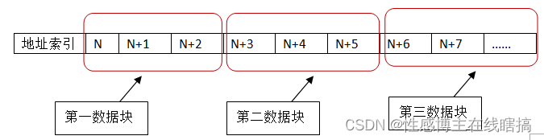
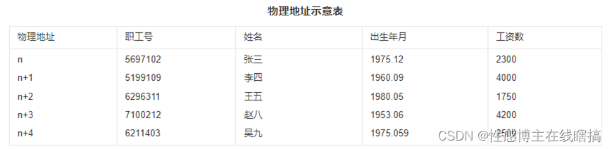

# 进制转换

* 短除法

* 分割法

## 数据的表示

对于计算 1-1	可以视为1+(-1)

* 正数 

  * **原反补相同**

* 负数

  * 反码	除符号位外,全取反
  * 补码	反码+1			**用于加减计算**	对于1-1,只有补码是全0
  * 移码	补码符号位取反	**用于浮点数计算**

* **原/反 有-0,**补/移只有0

## 浮点数

N = 尾数*基数^阶码

==小数点不占位数==,靠尾数和阶码定位小数点

==一个数的浮点数不唯一==,多种浮点数可以表示同一个数

**尾数用补码	阶码用移码**

**小数向大数看齐**,小数尾数右移

对阶 -> 尾数计算 -> 结果格式化

| 阶符 | 阶码 | 数符 | 尾数 |
| ---- | ---- | ---- | ---- |
|      |      |      |      |

## 位运算

~	取反

&	与	都为1时=1

|	或	都为0时=0

^	异或	位相同时为0,相异1

# 校验码

## 码距

两个码之间**变化最小**的二进制位数为码距

01->10	变化2位 ，码距2		0->1	码距1

并不是4	而是考虑最小

## 奇偶校验	

若干位有效信息,再加上一个二进制位(校验位)组成校验码

==奇校验	有效信息+校验位中,1出现奇数次==

**只能检查1位的错误**

## 循环校验码CRC

在k位信息码之后拼接r位校验码,用**模2除法**进行校验

只能检错**,不能纠错**		易于用**编码器及检测电路**实现

将余数拼接到后面,再次进行除法,如果仍能除尽,则正确

## 海明校验码

**多组**数位的奇偶校验,在数据位后面增加一些bit,**能纠错**

**1个以上的校验位**

**码距最小3**

​	2^k-1>=n+k	k海明码个数,n数据位个数

# 存储管理

## 页式存储	固长

将程序与内存划分为同样大小的页,以页单位将程序调入内存

逻辑地址 = **页号** + 页内地址

物理地址 = **页帧号** + 页内地址

* 优点	页长固定,利用率高,碎片小,分配管理简单

* 缺点	最后一页零头无法利用,按固定大小分页导致频繁调进调出,增加系统开销,造成抖动

假设一台按字节编址的16位计算机系统，采用虚拟页式存储管理方案，页面的大小为2K。某用户程序如图a所示，该程序的页面变换表如图b所示，表中状态位等于1和0分别表示页面在内存或不在内存。

 

　　图a中MOVE Datal, Data2是一个4字节的指令，Datal和Data2表示该指令的两个32位操作数。假设MOVE指令存放在2047地址开始的内存单元中，Datal存放在6143 地址开始的内存单元中，Data2存放在10239地址开始的内存单元中，那么执行MOVE 指令将产生（26)次缺页中断,其中：取指令产生（27)次缺页中断，取Datal和 Data2操作数分别产生（28)次缺页中断。

(26)A.3				B.4				C.5				D.6

(27)A.0				B.1				C.2				D.3

(28)A.1、1			B.1、2			C.2、2			D.2、3

答案】C  B  C

从题图中可见，程序的MOVE指令跨两个页面，且源地址Datal和目标地址Data2所涉及的区域也跨两个页面的页内地址， 根据题意1、2、3、4和5号页面不在内存，系统取“MOVE Datal，Data2”的指令时， 由于该指令跨越两个页面0、1，查页面变换表可以发现1号页面不在内存，故需要产生一次缺页中断；取地址为Datal的操作数时，由于该操作数不在内存且跨两个页面2、3, 需要将2、3页面装入内存，所以产生两次缺页中断；同理，取地址为Data2的操作数时， 由于该操作数不在内存且跨两个页面4、5,需要将4、5页面装入内存，所以产生两次缺页中断，共产生5次缺页中断。

## 段式存储	变长

合法段	0-25K		

非法段	0-35K			0号的段长30K,能放入25,不能放入35

按用户作业中的自然段来划分逻辑空间,然后调入内存

==段的长度可变==

* 优点
  * 多道程序共享内存,各段程序修改互不影响
  * 段的分界与程序的自然分界相对应,具有逻辑独立性,易于编译/管理/修改
* 缺点	长度可变导致分配空间不便,**容易在段间留下碎片**

## 段页式	较少考

先分段,再分页	页大小相同,段大小不同

* 优点	**空间浪费小**,存储共享容易,存储保护容易,能动态连接

* 缺点	由于管理软件增加,造成复杂性和开销,需要的硬件也增加,**执行效率低**

### 页面置换算法

* 最优算法OPT    由系统判断哪个页不需要,进行删除   过于理想化
* 随机算法
* 先进先出FIFO    先调进的可能在后面又被重复掉进,造成**抖动**
* 最近最少使用LRU  不会抖动    "局部性原理"
* 时间局部性    刚被访问的内容,立即又被访问
* 空间局部性    刚被访问的内容,邻近空间又被访问

## 寄存器

寄存器的功能是存储二进制代码,由具有存储功能的触发器组合构成

一个触发器可以存储1位二进制代码，故存放n位二进制代码的寄存器，需用n个触发器来构成

按照功能的不同，可将寄存器分为基本寄存器和移位寄存器两大类。基本寄存器只能并行送入数据，也只能并行输出。移位寄存器中的数据可以在移位脉冲作用下依次逐位右移或左移，数据既可以并行输入、并行输出，也可以串行输入、串行输出，还可以并行输入、串行输出，或串行输入、并行输出，十分灵活，用途也很广

# 计算机系统组成

==五大件==	控制器,运算器,存储器,输入,输出设备

输⼊设备（⽐如键盘）和输出设备（⽐如显示屏）都属于外部设备。⽹卡、硬盘既可 以属于输⼊设备，也可以属于输出设备

**Cpu由运算器,控制器,寄存器和内部总线组成**

## 运算器

负责在控制器的控制下完成各种运算

| 4个组成部分       |                                      |
| ----------------- | ------------------------------------ |
| 算术逻辑单元ALU   | 算术运算和逻辑运算                   |
| 累加寄存器AC      | 为算数逻辑提供临时空间，**暂存数据** |
| 数据缓冲寄存器DR  | 写内存时，暂存指令或数据             |
| 状态条件寄存器PSW | 存储状态/控制标志                    |

## 控制器

分析和执行指令的部件. 统一指挥其他部件的运行

先把指令从内存储器取到**缓冲寄存器DR**，再送入**指令寄存器IR**暂存，**指令译码器**根据IR产生各种微操作指令，控制其他的组成部件工作

| 4个组成部分  |                                   |
| ------------ | --------------------------------- |
| 程序计数器PC | 下条指令地址 ==唯一能被人为访问== |
| 指令寄存器IR | 存放即将执行的指令                |
| 指令译码器ID | 翻译指令中的操作码                |
| 时序部件     | 提供时序控制信号                  |

## 存储器

### 主存储器(内存)

存储现场操作的信息与中间结果, 包括机器指令和数据, **CPU可以直接读写主存**

#### 随机存储器RAM	

支持写入和读取, **断电后信息无法保存**

RAM可以分为DRAM（Dynamic RAM，动态 RAM） 和 SRAM（Static RAM，静态 RAM）两种

DRAM 的信息会随时间逐渐消失，因此需要定时对其进行刷新数据

SRAM 在不断电的情况下信息能够一直保持而不会丢失

#### 只读存储器ROM

ROM只能读数据而不能写入, 断电后写入的内容也不会丢失

* 掩膜ROM：不可编程ROM，属于第一代ROM，只能读，不能写。
* PROM：可编程ROM,只能写一次
  * 一个存储单元就是一个二极管和熔断丝，熔断丝导通的时代表1，通过烧录器把熔断丝烧断，电路不导通,实现单次的写入

后续又基于ROM的技术推出了**可写入的ROM存储器**

* EPROM：可编程ROM，紫外光可以多次擦除（可以写），速度慢，操作复杂

* EEPROM：电可擦可编程只读存储器,**掉电后数据不丢失,一般用在即插即用**。（可以写），比EPROM方便

### 辅助存储器(硬盘)

存储需要长期保存的信息

硬盘中存在多个磁盘片, 每个磁盘片对应上下两面的两个柱面, **每个柱面对应一个磁头**

所有**磁头被一个公共的传动设备控制移动**, 单个磁头无法单独移动

柱面由一圈圈的磁道组成, 最外层为0磁道. 越往内磁道越来越小,但密度越来越高,**磁道存储的数据一样多**

磁道会被划分为若干个扇区, 每个扇区存放定长的数据(例如512字节), 扇区编号是从1开始的. 平均旋转半圈即可定位到目标扇区

==磁盘访问时间 = 寻道时间(磁头移动到目标磁道) + 旋转延迟时间(磁盘片旋转到目标扇区)==

==磁盘调度算法==

* 先来先服务 FCFS

* 最短寻道时间优先 SSTF

* 扫描/电梯算法 SCAN  先从最里到最外,再从最外到最里

* 循环扫描 CSCAN    单边循环,只从里到外,到达最外圈时,直接返回

先来先服务和最短寻道时间可能随时改变移动臂的方向

读取数据时间 = 找磁道 + 找扇区 + 传输时间

## 多核CPU/多级缓存

缓存分为3级,L3缓存被多个CPU共享

## 运算速度

## 体系结构分类

两种分类方法

1. 冯•诺依曼提出**存储程序**的结构
   * 硬件由**五大件**组成
   * 采用二进制来表示指令和数据
   * 将编号的程序实现存入存储器, 启动计算机就能运行程序

2. Flynn分类法  根据指令流,数据流的多倍特征进行分类
   * 指令流是指令的一串序列
   * 数据流是指令流调用的数据序列, 包括输入数据和中间结果, 不包括输出数据

## 复杂/精简指令集系统

**复杂指令集系统CISC**   Complex Instruction Set Computer

增强指令的功能, 通过复杂的指令将一些原来由软件实现的功能改由硬件的指令系统实现

特点

1. 指令数量多, 并且大多数指令的使用频率低
2. 支持多种寻址方式
3. 指令长度不固定, 支持变长
4. 指令可以对主存单元中的数据直接进行处理
5. 以微程序控制为主, 难以用硬布线逻辑电路实现控制器

**精简指令集系统RISC**   Reduced Instruction Set Computer

尽量简化指令功能, 指令的操作能在单周期完成, 寻址方式尽可能地少, 编译效率高

特点

1. 指令数量少
2. 寻址方式少, 通常只支持寄存器寻址方式、立即数寻址方式和相对寻址方 式
3. 指令长度固定
4. 以硬布线逻辑电路实现控制器
5. 单周期指令执行，采用流水线技术. 大多数指令都能在一个机器周期内完成
6. 利于编译器进行优化, 生成高效率的机器代码
7. CPU 中的通用寄存器数量多

## 总线

一组能为多个部件**分时共享**的公共信息传送线路

共享: 总线上可以挂接多个部件，各个部件通过这组公共线路交换信息

分时: 同一时刻只允许**一个设备发送**,但允许**多个设备接收**

按总线相对于CPU的位置, 可分为2类

1. 内部总线  在CPU内部, 负责寄存器之间 和 算术逻辑部件ALU与控制部件 的数据交换
2. 外部总线  CPU与内存/外设的数据交换

**总线速度是制约计算机整体性能的最大因素**

按总线功能来划分, 可分为3类

* 数据总线DB	在CPU和RAM之间传输数据信息

* 地址总线AB	传输地址信息

* 控制总线CB	将微处理器控制信号传输到周边设备

==字长为32,则地址总线和数据总线的宽度都为32==

# 层次化存储结构

* CPU	寄存器	最快,容量小,成本高
* cache高速缓存   主存和CPU之间的一级Cache, 因为CPU的速度是存储器的上百倍, 为了平衡二者之间的速度而设置的缓存

* 内存/主存	随机存储器RAM	只读存储器ROM

* 外存	硬盘/U盘

从上到下速度变慢

* 虚拟存储器	比主存更大,可随机访问地址空间

虚拟存储技术使==辅存和主存==密切配合，对用户来说，好像计算机具有一个容量比实际主存大得多的主存可供使用，因此称为虚拟存储器。**虚拟存储器的地址称为虚地址或逻辑地址**

## Cache

cache通过程序的**局部性原理**,改善系统性能

* 时间局部性	刚刚被访问过的内容可能还会被访问

* 空间局部性	旁边的地址可能被访问(可以防止抖动)

==命中率==

"cache+主存储器"周期 = 命中率 x cache周期 + (1-h) x 主存储器周期

==映像==

* 直接相联映像
  * 硬件电路简单,**冲突率高**
  * 主存只能固定地存储在cache中

之后放入的主存16页,将顶替cache0页上的主存0页,造成冲突而0页可能在后续被再次调用,会造成抖动

**主存标记+cache页号+业内地址**

* 全相联映像
  * 电路难实现,只适合小cache,冲突率低
  * 主存可以放在cache的任意页

**主存标记+业内地址**

* 组相联映像
  * 直接相联和全相联的**折中**
  * 先分区,后分组,==同组之间用全相联映像==

cache组号+组内页号+页内地址

* 地址映像	将主存和cache划分为若干大小相同的页(块)

## 局部性原理

**时间局部性**	在一个较短的时间内, 程序所执行的指令可能被重复执行(循环)

**空间局部性**	访问了某个存储单元后, 其相邻的存储单位大概率也会在后续被访问到

## 数据存取方式

### 顺序存取

使用一个**共享的读写装置**进行存取, 对数据的读写只能是**线性顺序**. 例如**磁带**存储器

| N    | N+1  | N+2  | N+3  | N+4  | N+5  | N+6  | N+7  | ...... |
| ---- | ---- | ---- | ---- | ---- | ---- | ---- | ---- | ------ |

例如要读取地址N+7的数据，那么就需要从地址N开始，一路往右走去搜索地址N+7在哪里

### 直接存取

用**数据块**封装了一块连续的地址索引, 每个数据块都拥有唯一的地址标识. 使用共享的读写装置**直接移动到目标数据块**进行访问. 例如**磁盘**存储器

例如要读取地址N+7的数据，就直接在第三数据块的首地址N+6开始往右找

### 随机存取

存储器的每个存储单元都有**独立的读写装置**, 可以对任意一个存储单元进行直接访问. 例如**主存储器**

| N+0  | N+1  | N+2  | N+3  | N+4  | N+5  | N+6  | N+7  | ...... |
| ---- | ---- | ---- | ---- | ---- | ---- | ---- | ---- | ------ |

例如要读取地址N+7的数据，则直接用地址N+7的读写装置把数据拿出来

### 相联存取

也是随机存取的一种, 每个可寻址单元都有自己的读写装置。**通过存取数据的内容决定访问的地址**. 例如**Cache**

    

例如通过职工号5199109, 来决定访问地址为n+1的数据

## 编址与计算

存储器中每个单元的位数是固定的，称为存储器编址单位(也就是每个内存地址可以存储多少 bit 的信息)

按字编址	存储单元是字（字的长度可大可小，例如 16 位或 者 32 位)

按字节编址	存储单元字节

(43FFH - 4000H) **+ 1** = 400H = 2^10个地址

又因为存储单元为16位

总容量 = 2^10*16bit

芯片容量 = 总容量 / 芯片数 = 2^10*16bit/4

## 主机/外设数据传输控制方法

* 程序控制方式，由**CPU**执行程序控制数据的输入输出过程。

* 中断方式下，**外设**准备好输入数据或接收数据时向CPU发出**中断请求信号**，若CPU决定响应该请求，则暂停正在执行的任务，转而执行中断服务程序进行数据的输入输出处理，之后再回去执行原来被中断的任务。

* DMA方式下，CPU向**DMA控制器**下达指令，让DMA控制器来处理数据的传送，数据传送完毕再把信息反馈给CPU,减轻了CPU的负担

# 指令

一条指令就是机器语言中的一个语句

* 指令由**操作码+地址码**组成
  * 操作码决定操作类型(加减乘除)

  * 地址码决定操作数的位置

a+b=c	3地址

a+=b	2地址

a++		1地址

无需操作数	0地址

## 伪指令

用于指示汇编程序如何汇编源程序，常用于为汇编程序提供以下信息：该源程序如何分段，有哪些逻辑段在程序段中，哪些是当前段，它们分别由哪个段寄存器指向；定义了哪些数据，存储单元是如何分配的等。

伪指令语句除==定义的具体数据要生成目标代码==外，==其他不生成目标代码==。伪指令语句的这些命令功能是由汇编程 序在汇编源程序时，通过执行一段程序来完成的，而不是在运行目标程序时实现的。

## 寻址方式

* 立即寻址	指令存放操作数	速度快,灵活性差
  * 直接寻址			地址
  * 间接寻址			的地址
* 寄存器寻址	寄存器存放操作数
* 寄存器间接寻址			的地址

## CISC/RISC指令系统

| 类型      | 指令                                                         | 寻址方式     | 实现方式                                                   | 其他                      |
| --------- | ------------------------------------------------------------ | ------------ | ---------------------------------------------------------- | ------------------------- |
| CISC 复杂 | 指令多,使用频率差别大,不定长                                 | 支持多种寻址 | 微程序控制技术(微码)                                       | 研制周期长                |
| RISC 精简 | 指令少,使用频率接近,定长,多为**单周期指令**,操作**寄存器**,只有Load/Store操作内存 | 寻址单一     | 增加了通用寄存器(累加器),硬布线逻辑控制为主,适合采用流水线 | 优化编译,**支持高级语言** |

# 进程管理

进程是程序在一个数据集合上运行的过程,系统进行**资源分配和调度的独立单位**

由**程序块,进程控制块PCB,数据块**组成

**进程是程序的一次执行过程**,程序是静态的,进程是动态的

可执行程序是在磁盘上的文件,包含Cpu指令集

当可执行程序被加载进内存,就成了进程

## 3/5态模型

3态模型中,只有**运行–就绪能互相转换**

## 同步/互斥

* 同步->直接制约    a需要等待b的完成       单方等待
* 互斥->间接制约    ab互相争夺**临界资源**   双方等待

临界资源	互斥进程之间共享资源     **不是指最大能调用的资源**

临界区	访问临界资源的代码

信号量	特殊变量

## PV操作

p申请资源,s-1(资源量-1),s<0进入阻塞

v释放资源,s+1        ,s<=0进入阻塞

同步信号量   协调多个进程访问

互斥信号量   确保同一时间资源只被某一进程访问

单缓冲区同步模型

S1市场中的产品数量		S2

P(S1)申请生产产品的资源	V(S2)唤醒消费

P(S2)申请产品进行消费		V(S1)唤醒生产

**进来的箭头是P,出去V**

对于购书者,付款时先唤醒收银员V(S1),再通知第二个购书者P(S2)

对于消费者,收费时先申请资源P(S1),再唤醒第二个购书者

前驱图,只有等abc都完成了,d才能开始

若用PV操作控制这几个进程并发执行的过程，则需要设置4个信号量SI、S2、S3 和S4,且信号量初值都等于零。下图中a和b应分别填写（25)，c和d应分别填写(26)。

(25)A.P(S1) P(S2) 和 P(S3)     B.P(S1) P(S2) 和 V(S1)

​    C.V(S1) V(S2) 和 P(S1)     D.V(S1) V(S2) 和 V(S3)

(26)A.P(S1) P(S2) 和 P(S4)     B.P(S2) P(S3) 和 P(S4)

C.V(S1) V(S2) 和 V(S4)     D.V(S2) V(S3) 和 V(S4)

**【答案】C B**

根据题意，进程P2、P3等待P1的结果，因此当P1执行完毕需要使用V操作通知 P2、P3,即 a 处填 V (SI) V (S2), b 处应填P (S1)。

根据题意，进程P3要执行需要测试P1、P2有没有消息，故应该在c处填P (S2)、P (S3)。当P3执行完毕需要使用V操作通知P4，即在d处填P (S4)。

进程P1、P2、P3、P4和P5的前趋图如下：

若用PV操作控制进程P1〜P5并发执行的过程，则需要设置6个信号量S1、S2、S3.S4.S5和S6,且信号量S1〜S6的初值都等于零。下图中a和b处应分别填写 (23)： c和d处应分别填写（24), e和f处应分别填写（25)。

(23)A.P(S1) P(S2)和 P(S3)P(S4)   B.P(S1) V(S2)和 P(S2) V(S1) 

​    C.V(S1) V(S2)和 V(S3) V(S4)   D.P(S1) P(S2)和 V(S1) V(S2)

(24)A.P(S1) P(S2)和 V(S3) V(S4)   B.P(S1) P(S3)和 V(S5) V(S6) 

C.V(S1) V(S2)和 P(S3) P(S4)   D.P(S1) V(S3)和 P(S2) V(S4)

(25)A.P(S3) P(S4)和 V(S5)V(S6)   B.V(S5) V(S6)和 P(S5) P(S6)

C.P(S2) P(S5)和 P(S4) P(S6)   D.P(S4) V(S5)和 P(S5) V(S6)

**【答案】C B C**

试题（23)的正确答案是C，因为P1是P3和P4的前驱，当P1执行完成后，应通知P3和P4，故应采用V(S1) V(S2)操作分别通知P3和P4;同理，P2是P3和P5的前驱，当P2执行完后，应通知P3和P5,故应采用V(S3)V(S4)操作分别通知P3和P5。

试题（24)的正确答案是B,因为P3是P1和P2的后继，当P3执行前应测试P1 和P2是否执行完，故应采用P(S1) P(S3)操作分别测试P1和P2是否执行完；又因为P3是P4和P5的前驱，当P3执行完应通知P4和P5,故应采用V(S5)V(S6)操作分别通知 P4 和 P5。

试题（25)的正确答案是C,因为P4是P1和P3的后继，当P4执行前应测试P1和P3是否执行完，故应采用P(S2) P(S5)操作分别测试P1和P3是否执行完；又因为P5是P2和P3的前驱的后继，当P5执行前应测试P2和P3是否执行完,故应采用P(S4) P(S6) 操作分别测试P2和P3是否执行完。

## 死锁

四大条件     互斥/环路等待/保持和等待/不剥夺

不剥夺:	资源不会被释放,也不会借给别的进程

 

### 避免死锁	(打破4个必要条件) 

* 有序资源分配法       预留1个资源轮流分配

* 银行家算法          按什么顺序运行不会死锁

不超过**最大资源**数/不超过**自身需求**/资源不足时**推迟**分配

 

## 阻塞

进程资源图如图(a)和(b)所示，其中：图(a)中（25);图(b)中（26)。

 

(a)图

R1资源只有2个，P2申请该资源得不到满足，故进程P2是阻塞节点；同样R2资源只有3个，P1申请该资源得不到满足，故进程P1也是阻塞节点。可见进程资源图（a）是死锁的，该图不可以化简。

(b)图

R2资源有3个，已分配2个，P3申请1个R2资源可以得到满足，故进程P3可以运行完毕释放其占有的资源。这样可以使得Pl、P2都变为非阻塞节点，得到所需资源运行完毕，因此，进程资源图（b)是可化简的

## 索引文件结构

0-9 直接索引,存储10kb

10 一级索引,4b一索引,存储256kb

11 二级索引,存储256*256=64Mb

地址按顺序存储

总共13kb的索引节点,每个节点1kb,索引最小4b

0-9的索引节点    采用直接索引 指向1kb的物理盘块,保存10kb内容     范围0-10239

10节点,将1kb分成256个4b的索引,每个索引指向1kb的物理盘块,保存了256kb内容

11节点,( 将1kb分成256个4b的索引)*2          保存了64mb

12节点                                                 16gb

# 作业

## 4个状态

提交	后备	执行	完成

## 调度算法

* 先来先服务
* 时间片轮转
* 短作业优先
* 最高优先权优先
* 高响应比优先      响应比=作业等待时间/执行时间

# 设备管理

## 数据传输控制方式

* 程序控制(查询)	分为无条件传送和程序查询2种,方法简单,**硬件开销少**,但**IO能力低**,影响cpu利用率

* 程序中断	cpu无需等待,提高请求响应速度

* **DMA**	在主存和外设之间批量数据交换,DMA与CPU无关

* 通道方式

* IO处理机

从上到下效率递增

## 虚设备与SPOOLING假脱机技术

SPOOLING是关于慢速字符设备如何与计算机主机交换信息的一种技术,通过**磁盘**实现

# 流水线

将指令的执行过程分为**取址,分析,执行**3步

## 超标量流水线

度为流水线条数		度为2的超标量流水线能同时执行2个操作

## 吞吐率   单位时间内流水线完成量

吞吐率TP=指令条数/执行时间

最大吞吐率=1/流水线周期

# 中断

当系统中有多个中断请求时，中断系统**按优先级进行排队**

在处理低级中断过程中又有高级中断申请中断，则高级中断可以打断低级中断处理，转去处理高级中断，等处理完高级中断后再返回去处理原来的低级中断，称为**中断嵌套**。实现中断嵌套用后进先出的栈来保护断点和现场最有效.

# 冗余技术

对于实现系统规定功能是多余的资源，包括硬/软件、指令,数据,存放和调用的空间和通道

* 结构冗余，按其工作方法可以分为静态、动态和混合冗余
* 信息冗余，为检测或纠正信息在运算或传输中的错误另外加的部分信息
* 时间冗余，以重复执行指令或程序来消除瞬时错误带来的影响；
* 冗余附件技术，是指为实现上述冗余技术所需的资源和技术

