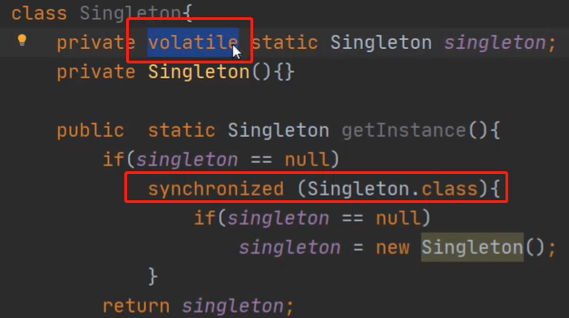
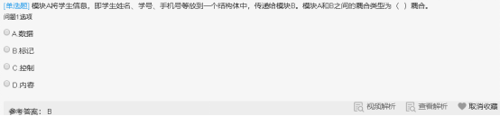

|          | 创建型模式                  |                     结构型模式                     | 行为型模式                                                   |
| -------- | --------------------------- | :------------------------------------------------: | ------------------------------------------------------------ |
| 类模式   | 工厂方法                    |                     (类)适配器                     | 模板方法 解释器                                              |
| 对象模式 | 单例  原型  抽象工厂 建造者 | (对象)适配器   代理   桥接   装饰 外观  享元  组合 | 策略  命令  职责链  状态  观察者  中介者 迭代器  访问者 备忘录 |


# 创建型


## 简单工厂/静态工厂

**根据传入的参数，动态决定应该创建哪一个产品子类**（这些产品子类继承自同一个父类或接口）的实例，并**以父类形式返回**


优点：客户端不负责对象的创建，而是由专门的工厂类完成；客户端只负责对象的调用，实现了**创建和调用分离**，降低了客户端代码的难度；
缺点：工厂类需要知道产品类的具体实现细节 ,并决定何时实例化产品类 .如果**增加和减少产品子类，需要修改简单工厂类**，违背了开闭原则；如果产品子类过多，会导致工厂类非常的庞大，违反了高内聚原则，不利于后期维护


简单工厂用来生产**同一等级结构**中的任意产品。（**不支持增加**产品）

只有伦敦工厂，并且这个工厂只生产三种类型的pizza：chesse,pepper,greak（固定产品）。


## 工厂方法

定义一个用于创建产品的接口，由子类决定生产什么产品	使类的实例化延迟到其子类

把必须要有的方法定义在工厂接口中


Collection接口	继承迭代器

```
public interface Collection<E> extends Iterable<E> {
```

有iterator()方法生产迭代器对象

在实现类ArrayList中 ,生产出适合ArrayList的具体产品ITr


工厂方法 ：用来生产同一等级结构中的固定产品。（支持拓展增加产品）

现在不光有伦敦工厂，还增设了纽约工厂（仍然是同一等级结构，但是支持了产品的拓展），这两个工厂依然只生产三种类型的pizza：chesse,pepper,greak（固定产品）。


## 抽象工厂

提供一个创建产品族的接口，用来生产不同产品族的全部产品。（**支持增加产品/产品族**）  

不光增设了纽约工厂（仍然是同一等级结构，但是支持了产品的拓展），这两个工厂还增加了一种新的类型的pizza：chinese pizza（增加产品族）。


# 单例模式

确保一个类只有一个实例,并且自行实例化并向整个系统提供这个实例

如序列号生成器 ,页面计数器等都可以用单例模式	创建对象需要消耗过多资源时 , 也可以用单例	减少重复创建对象 ,如io ,数据库连接

**构造方法private ,全局变量private static ,获取实例方法public static **


## 单例模式可能不只一个实例

* 分布式系统中 ,多个jvm各自有一个实例
* 一个jvm , 使用了多个类加载器同时加载这个类 ,产生多个实例


## 饿汉单例

在类**加载时创建**实例，而不是等到第一次请求实例时创建


## 懒汉单例

在类加载的时候不创建单例实例，只有在第一次请求实例时创建


通过synchronized加锁 ,防止被多次实例化


### 懒汉-双重检查锁

懒汉在第一次请求实例后创建了对象 ,就不会走singleton==null的判断了 ,也**不需要方法级别的锁**来保证它只被实例化一次

可以**缩小锁的范围** 让getInstance方法不是同步方法	

**双重检查是检查两次singleton==null ,因为没有了方法级别的锁 ,线程a在进行加锁前后 ,可能就已经被b给实例化了**

使用双重检查锁时 ,静态全局变量需要加上**volatile**

实例化分为3个步骤

* 分配内存
* 初始化对象
* 指向内存地址

虚拟机会进行优化 ,**初始化对象和指向内存地址的顺序可能会调换**

即	分配内存->指向地址	哪怕还没有进行实例化

这将导致**线程a在进行第一个singleton==null时 , true->加锁 ,再次判断singleton==null->分配内存->分配内存地址->实例化**

在线程a进行分配内存地址时 ,线程b开始进行singleton==null ,**此时singleton已经有内存地址**了 ,不为null ,直接被return




# 适配器模式 adapter

两个不兼容的接口之间的桥梁,结合了两个独立接口的功能.这种模式涉及到一个单一的类，该类负责加入独立的或不兼容的接口功能。


# 模板方法TemplateMethod

定义一个操作中的算法骨架，而**将算法的一些步骤延迟到子类**中，使得子类可以不改变该算法结构的情况下重定义该算法的某些特定步骤。


## 代理Proxy

为某对象提供一种代理以控制对该对象的访问。即客户端通过代理间接地访问该对象，从而限制、增强或修改该对象的一些特性。


### 静态代理 StaticProxy


1. 原型（Prototype）模式：将一个对象作为原型，通过对其进行复制而**克隆**出多个和原型类似的新实例。

3. 建造者（Builder）模式：将一个复杂对象分解成多个相对简单的部分，然后根据不同需要分别创建它们，最后构建成该复杂对象。
3. 

6. 桥接（Bridge）模式：将**抽象与实现分离**，使它们可以独立变化。它是**用组合关系代替继承**关系来实现，从而降低了抽象和实现这两个可变维度的耦合度。
7. 装饰（Decorator）模式：动态的给对象增加一些职责，即增加其额外的功能。
8. 外观（Facade）模式：为多个复杂的子系统提供一个一致的接口，使这些子系统更加容易被访问。
9. 享元（Flyweight）模式：运用共享技术来有效地支持大量细粒度对象的复用。
10. 组合（Composite）模式：将对象组合成树状层次结构，使用户对单个对象和组合对象具有一致的访问性。
11. 策略（Strategy）模式：定义了一系列**封装算法**，使它们可以相互替换，算法的改变不影响使用算法的客户
12. 命令（Command）模式：将一个请求封装为一个对象，从而可用不同的请求对客户进行参数化 ,将请求排队或记录请求日志 ,支持**可撤销**的操作 .使**发出请求的责任和执行请求的责任分离**。
13. 职责链（Chain of Responsibility）：给多个对象处理请求的机会 ,减少发送者和接收者之间的耦合 ,把接收对象链接起来 ,在链中传递请求 ,直到请求被响应为止
14. 状态（State）模式：允许一个对象在其**内部状态改变时改变其行为**。
15. 观察者（Observer）模式：多个对象间存在一对多关系，当**对象发生改变时，通知给其他对象**，从而影响其他对象的行为。
16. 中介者（Mediator）模式：定义一个中介对象来简化原有对象之间的交互关系，使原有对象**不需要显式地互相调用** ,低耦合 ,还可以独立地改变对象间的交互。
17. 迭代器（Iterator）模式：提供一种方法来顺序访问聚合对象中的一系列数据，而不暴露聚合对象的内部表示。
18. 访问者（Visitor）模式：在不改变集合元素的前提下，为一个集合中的每个元素**提供多种访问方式**，从而在不改变个元素的类的前提下作用于这些元素的新操作。
19. 备忘录（Memento）模式：在不破坏封装性的前提下，获取并保存一个对象的内部状态，以便以后恢复它。
20. 解释器（Interpreter）模式：提供如何定义语言的文法，以及对语言句子的解释方法，即解释器。


# 编程原则

面向对象设计原则是面向对象设计的基石，面向对象设计质量的依据和保障

设计模式是面向对象设计原则的经典应用

**开闭是面向对象设计的终极目标**。其他设计原则都可以看作是开闭原则的实现手段或方法


## 单一职责SRP	设计目的单一的类

高内聚:一个类只做它该做的事情。一个代码模块只完成一项功能，而不涉及与它无关的领域
模块化，每个功能模块是可以轻易的拿到其他系统中使用的，这样才能实现软件复用

## 开闭OCP	对扩展开放，对修改关闭

①抽象是关键，没有抽象类或接口就没有扩展点；
②封装可变性，将系统中的各种可变因素封装到一个继承结构中

## 依赖倒转DIP	

**依赖于抽象 ,而不是具体实现 ,针对接口编程 ,不根据实现编程**

面向接口编程。（声明方法的参数类型、方法的返回类型、变量的引用类型时，尽可能使用抽象类型而不用具体类型，因为抽象类型可以被它的任何一个子类型所替代）

## 里氏替换LSP	子类可以代替父类

任何时候都可以用子类型替换掉父类型。子类一定是增加父类的能力而不是减少父类的能力

## 接口隔离ISP	使用多个专门的接口比使用单一的总接口

接口要小而专，绝不能大而全。（臃肿的接口是对接口的污染，既然接口表示能力，那么一个接口只应该描述一种能力，接口也应该是高度内聚的。例如，琴棋书画就应该分别设计为四个接口，而不应设计成一个接口中的四个方法，因为如果设计成一个接口中的四个方法，那么这个接口很难用，毕竟琴棋书画四样都精通的人还是少数，而如果设计成四个接口，会几项就实现几个接口，这样的话每个接口被复用的可能性是很高的。

## 合成聚合复用CARP	尽量使用组合 ,而不是继承

每次继承都会先构造父类,每次释放都会从子类开始向上释放,这样会浪费很多资源,能用组合就不用继承

（类与类之间简单的说有三种关系，IS-A、HAS-A、USE-A，分别代表继承、关联和依赖。其中，关联关系根据其关联的强度又可以进一步划分为关联、聚合和合成，但说白了都是 HAS-A 关系

## 迪米特/最少知识LOD	一个对象应对其他对象尽可能更少的了解

一个对象应当对其他对象有尽可能少的了解。（“低耦合”，门面模式和调停者模式就是对迪米特法则的践行。对于门面模式可以举一个简单的例子，你去一家公司洽谈业务，你不需要了解这个公司内部是如何运作的，你甚至可以对这个公司一无所知，去的时候只需要找到公司入口处的前台美女，告诉她们你要做什么，她们会找到合适的人跟你接洽，前台的美女就是公司这个系统的门面。再复杂的系统都可以为用户提供一个简单的门面，Java Web 开发中作为前端控制器的 Servlet 或 Filter 不就是一个门面吗，浏览器对服务器的运作方式一无所知，但是通过前端控制器就能够根据你的请求得到相应的服务。调停者模式也可以举一个简单的例子来说明，例如一台计算机，CPU、内存、硬盘、显卡、声卡各种设备需要相互配合才能很好的工作，但是如果这些东西都直接连接到一起，计算机的布线将异常复杂，在这种情况下，主板作为一个调停者的身份出现，它将各个设备连接在一起而不需要每个设备之间直接交换数据，这样就减小了系统的耦合度和复杂度。迪米特法则用通俗的话来将就是不要和陌生人打交道，如果真的需要，找一个自己的朋友，让他替你和陌生人打交道。）


# UML


* 面向对象	
  * Booch
  * OOSE
  * OMT

* 面向数据结构
  * Jackson

* 面向数据流
  * 结构化方法


* 结构图
  * 类图
  * 对象图
  * 包图
  * 组合结构图   2.0新增
  * 构件图
  * **部署图**     软硬件之间映射 ,代码在实施中的物理节点分布
  * 制品图

* 行为图
  * 用例图	系统与外部参与者交互
  * 顺序图	强调时间顺序
  * 通信图
  * 定时图    2.0新增
  * 状态图
  * 活动图


## 类图关系


* 依赖    事物变化影响另一事物    如类A的方法中仅仅使用了类B的对象
* 泛化    特殊/一般关系    **a可以完成b同样的任务 ,并能补充额外的角色功能**
* 关联    
* 聚合    
* **组合    相同生命周期**
* 实现    接口和类的关系


include	

extend	执行一个用例 ,在需要时转向另一个用例 ,**执行完再返回**之前的用例


表示组件AccountManagement需要调用CreditCardServices组件和Logger 组件分别实现的Identity Verifier 接口和TransactionLogger 接口。


消息的同步异步:

同步	对方在线了我才能给他发消息

异步	不在线依然发

 

多态分两种:通用的多态和特定的多态,前者对类型不加限制,允许对不同类型的值执行相同的方法.后者只对指定的类型有效,并且对不同的类型执行不同代码

通用的多态又分为	参数/包含多态	

特定的多态			过载/强制多态

参数多态:采用参数化模板,通过给出不同的参数,使得一个结构有多种类型

包含多台:同样的操作可用于一个类型及其子类型(不是子类)包含多台一般需要运行时的类型检查

 

面向对象允许多继承

 

过载多态:同一个操作符/函数名在不同的上下文有不同的类型

强制多态:编译程序通过语义操作,把操作对象的类型强新变化(casting)

 

**面向对象分析包含5个活动：认定对象、组织对象、描述对象间的相互作用、定义对象的操作、定义对象的内部信息。**


面向对象分析没有考虑到系统测试问题

 高层模块不应该依赖于底层模块。传统的结构化设计中，髙层模块需要调用或使用底层模块，导致高层模块必须依赖于底层模块，但借助面向对象中的抽象类、接口等一系列机制，可以使得高层模块仅仅和接口耦合，而和实际的底层模块没有直接关联。

 

include定义了用例之间的包含关系，用于一个用例包含另一个用例的行为的建模

extend:	转向执行另一个用例，执行完后返回之前的用例

 

结构/行为/分组/注释	事物


## 耦合

数据耦合:两个模块彼此间通过数据参数交换信息

标记耦合:一组模块通过参数表传递记录信息,这个记录是某一个数据结构的子记录,而不是简单变量

控制耦合:两个模块彼此间传递的信息中有控制信息

内容耦合:一个模块需要设计到另一个模块的内部信息

