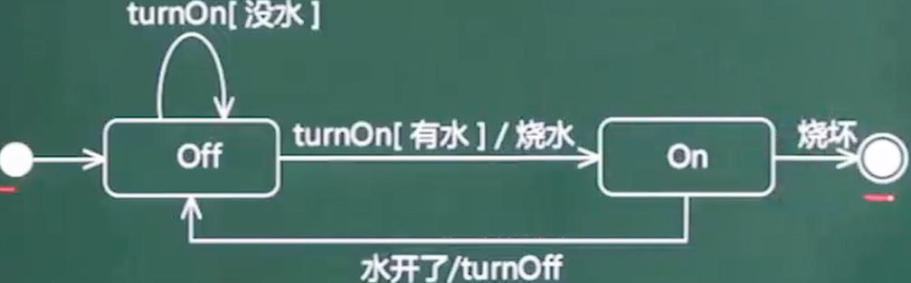

|          | 创建型模式            |             结构型模式             | 行为型模式                                         |
| -------- | --------------------- | :--------------------------------: | -------------------------------------------------- |
| 类模式   | 工厂方法              |                适配                | 模板方法 解释器                                    |
| 对象模式 | 单例 原型 抽象 建造者 | 适配 代理 桥接 装饰 外观 享元 组合 | 策略 命令 职责链 状态 观察 中介 迭代 访问者 备忘录 |


# 创建型


## 简单工厂/静态工厂


根据传入的参数，动态决定应该创建哪个产品子类的实例，**以父类形式返回**

可以根据条件生成不同的子类实例，这些子类有一个公共的抽象父类并且实现了相同的方法，但是这些方法针对不同的数据进行了不同的操作（多态）。 当得到子类的实例后，开发人员可以调用基类中的方法而不必考虑到底返回的是哪一个 子类的实例


* 优点
  * 客户端不负责对象的创建，而是由专门的工厂类完成；
  * 客户端只负责对象的调用，实现了**创建和调用分离**，降低了客户端代码的难度

* 缺点
  * 工厂类需要知道产品类的具体实现细节,并决定何时实例化产品类.如果**增加和减少产品子类，需要修改工厂类**，违背了开闭原则
  * 如果产品子类过多，会导致工厂类非常的庞大，违反了高内聚原则


简单工厂用来生产**同一等级结构**中的任意产品。（**不支持增加**产品）

只有伦敦工厂，并且这个工厂只生产三种类型的pizza：chesse,pepper,greak（固定产品）。


## 工厂方法

定义一个用于创建产品的接口，由子类决定生产什么产品	使类的实例化延迟到其子类

把必须要有的方法定义在工厂接口中


Collection接口	继承迭代器

```
public interface Collection<E> extends Iterable<E> {
```

有iterator()方法生产迭代器对象

在实现类ArrayList中,生产出适合ArrayList的具体产品ITr


工厂方法 ：用来生产同一等级结构中的固定产品。（支持拓展增加产品）

现在不光有伦敦工厂，还增设了纽约工厂（仍然是同一等级结构，但是支持了产品的拓展），这两个工厂依然只生产三种类型的pizza：chesse,pepper,greak（固定产品）。


## 抽象工厂

提供一个创建产品族的接口，用来生产不同产品族的全部产品。（**支持增加产品/产品族**）  

不光增设了纽约工厂（仍然是同一等级结构，但是支持了产品的拓展），这两个工厂还增加了一种新的类型的pizza：chinese pizza（增加产品族）。


## 原型 Prototype

将一个对象作为原型，通过对其进行复制而**克隆**出多个和原型类似的新实例


Prototype抽象原型类

ConcretePrototype具体原型类,实现具体的克隆方法


## 单例模式

确保一个类只有一个实例,并且自行实例化并向整个系统提供这个实例

如序列号生成器,页面计数器等都可以用单例模式	创建对象需要消耗过多资源时, 也可以用单例	减少重复创建对象,如io,数据库连接

**构造方法private,全局变量private static,获取实例方法public static **


**单例模式可能不只一个实例**

* 分布式系统中,多个jvm各自有一个实例
* 一个jvm, 使用了多个类加载器同时加载这个类,产生多个实例


### 饿汉单例

在类**加载时创建**实例，而不是等到第一次请求实例时创建


### 懒汉单例

在类加载的时候不创建单例实例，只有在第一次请求实例时创建


通过synchronized加锁,防止被多次实例化


### 懒汉-双重检查锁

懒汉在第一次请求实例后创建了对象,就不会走singleton==null的判断了,也**不需要方法级别的锁**来保证它只被实例化一次

可以**缩小锁的范围** 让getInstance方法不是同步方法	

**双重检查是检查两次singleton==null,因为没有了方法级别的锁,线程a在进行加锁前后,可能就已经被b给实例化了**

使用双重检查锁时,静态全局变量需要加上**volatile**

实例化分为3个步骤

* 分配内存
* 初始化对象
* 指向内存地址

虚拟机会进行优化,**初始化对象和指向内存地址的顺序可能会调换**

即	分配内存->指向地址	哪怕还没有进行实例化

这将导致**线程a在进行第一个singleton==null时, true->加锁,再次判断singleton==null->分配内存->分配内存地址->实例化**

在线程a进行分配内存地址时,线程b开始进行singleton==null,**此时singleton已经有内存地址**了,不为null,直接被return

```java
public class LazySingleton {

    private volatile static LazySingleton lazySingleton = null;

    private LazySingleton() {
    }

    /**
     * 懒汉在自己被调用时才会实例化
     */
    public static LazySingleton getInstance() {
        if (lazySingleton == null) {
            synchronized (LazySingleton.class) {
                if (lazySingleton == null) {
                    lazySingleton = new LazySingleton();
                }
            }
        }
        return lazySingleton; }}
```


## 生成器/建造者 Builder

将一个复杂对象分解成多个相对简单的部分，然后根据不同需要分别创建它们，最后构建成该复杂对象。


```java
    public static void main(String[] args) {
		//复杂对象House下有若干子对象,为了创建house,一种方法是全写在构造器中,但这将使构造方法变得过于复杂
      //另一种是用Builder来负责进行对象的创建
        new House.HouseBuilder().window().door().build()    }

@Data
@Builder
class House{
    private Window window;
    private Door door;}
```


# 结构型


## 适配器模式 adapter


原有接口与客户端不匹配,==无需修改原接口.通过关联方式将对象放入适配器中==,通过访问适配器的方法来间接操作对象,从而可以添加新的方法

另一种方法	继承,通过子类来访问父类原有的功能


新闻联播为失聪人士提供了手语,让有障碍的人也能正常观看

```java
public class AdapterPattern {
    public static void main(String[] args) {
    //通过Adapter适配器来操作Speaker对象
        new Adapter(new Speaker()).translate();}
}

//被适配类
class Speaker {
    public String speak() {
        return "搬砖";   }}

//原接口
interface Translator {  String translate();}

class Adapter implements Translator {
    private Speaker speaker;

    public Adapter(Speaker speaker) {
        this.speaker = speaker;}
        
	//适配器
    @Override
    public String translate() {
        return "翻译之后" + speaker.speak();}}
```


### 适配器与装饰器区别

适配器调节了原接口与被适配对象,==并未修改原接口==

装饰器对原有接口作拓展,修改了原接口 


## 桥接 Bridge


将**抽象与实现分离**，使它们可以独立变化。**用组合代替继承实现**，降低了抽象和实现这两个可变维度的耦合度。


## 组合 Composite

将对象组合成树状层次结构，使用户对单个对象和组合对象具有一致的访问性。


## 装饰器 Decorator


动态的给对象增加职责

运用了关联关系,把对象嵌入到装饰器中,由装饰器内部操作对象


```java
public class DecoratorPattern {

    public static void main(String[] args) {
    //装饰器的构造方法传入了FirstRobot对象,为原对象附加了新功能
        new RobotDecorator(new FirstRobot()).doMorething(); }}

//构件接口
interface Robot { void doSomething();}

//被装饰的构件
class FirstRobot implements Robot {
    @Override
    public void doSomething() {
        System.out.println("搬砖");
    }
}

//装饰器
class RobotDecorator implements Robot {

    private Robot robot;

    public RobotDecorator(Robot robot) {
        this.robot = robot;}

    @Override
    public void doSomething() { robot.doSomething();}

	//新方法	doSomething接口方法未被修改
    public void doMorething() {
        robot.doSomething();
        System.out.println("搬水泥"); }}
```


IO流大量运用装饰器模式,直接继承了InputStream的子类有

* ByteArrayInputStream
* FileInputStream
* ObjectInputStream
* PipedInputStream
* StringBufferInputStream
* ==FilterInputStream==


FilterInputStream与其它子类不同

```
public class FilterInputStream extends InputStream {

	//内部维护一个InputStream,调用InputStream的方法
    protected volatile InputStream in;

    protected FilterInputStream(InputStream in) {
        this.in = in;}
    public int read() throws IOException {
        return in.read(); }
    public int read(byte b[]) throws IOException {
        return read(b, 0, b.length); }
    public int read(byte b[], int off, int len) throws IOException {
        return in.read(b, off, len); }
    public void close() throws IOException {
        in.close();  }
```

FilterInputStream它什么事都不做 **,委托给内部的InputStream成员对象**


FilterInputStream的又有其子类，分别是：

* BufferedInputStream
* DataInputStream
* LineNumberInputStream
* PushbackInputStream


其中BufferedInputStream

    public synchronized int read() throws IOException {
    //当pos>=count时，需要缓冲数据，调用fill()将缓冲区加满
        if (pos >= count) {
            fill();
            if (pos >= count)
                return -1;
        }
        return getBufIfOpen()[pos++] & 0xff;}

BufferedInputStream就是一个装饰器，==为InputStream加上缓冲功能==,使得FileInputStream带有了缓冲功能

```
new BufferedInputStream(new FileInputStream(new File("")));
```


java IO 中需要完成对不同输入输出源的操作，如果单纯的使用继承这一方式，无疑需要很多的类。比如说，我们操作文件需要一个类，实现文件的字节读取需要一个类，实现文件的字符读取又需要一个类....一次类推每个特定的操作都需要一个特定的类。这无疑 会导致大量的 IO 继承类的出现。显然对于编程是很不利的。而装饰模式可以很好地解决这一问题，在装饰模式中：节点流（如 FileInputStream）直接与输入源交互， 之后通过过滤流（FilterInputStream）进行装饰，这样获得的 io 对象便具有某几个的功能，拓展了 IO 的功能。


## 外观	Facade

为==内部复杂的系统==提供一个**一致的接口**，使这些子系统更加容易被访问


* 优点	内外部的通信通过**统一的通信对象**进行,通信对象是高层次的,将内部复杂的操作进行封装,使得外观上简洁,内部复杂
* 缺点    **不符合开闭原则**	当内部发生改变时,外观也需要修改


```
public class FacadePattern {
    public static void main(String[] args) {
    //客户端调用外观的方法
        new Facade().facadeMethod();
    }
}

class Facade{
	//由外观对象进行复杂操作
    void facadeMethod(){
        new SubFlow1().method1();
        new SubFlow2().method2();}
}

class SubFlow1{ void method1(){}}
class SubFlow2{ void method2(){}}
```


## 享元 Flyweight

运用共享,支持大量细粒度对象复用


* 优点
  * 减少相同或相似对象的创建,节约资源
  * 享元对象的状态独立于外部环境  从而==可以在不同环境下被共享==

* 缺点
  * 需要分外部状态和内部状态,会导致系统复杂


类似网盘,同一份资源被不同人保存,实际被保存的文件只有一份

被保存的资源是对外一致的,被多人共享,是细粒度对象

而每个人的保存时间,保存目录是不一致的,是粗粒度对象


池技术	线程池,连接池,都是享元

```
public class FlyWeightPattern {
    public static void main(String[] args) {
        BikeFlyWeight bike = BikeFlyWeightFactory.getInstance().getBike();
        //当享元对象使用中时,其他人将无法操作这个对象
        bike.ride();
        //释放享元对象回池子
        bike.back(); }
}

//享元接口  需要定义状态属性,判断是否正在被使用  以及改变状态的方法
abstract class BikeFlyWeight {
    //0未使用    1使用中
    protected Integer state = 0;

    abstract void ride();
    //释放享元对象回池子 状态置为0
    void back() { state = 0; }

    public Integer getState() {
        return state;  }
}

class MoBikeFlyWeight extends BikeFlyWeight {
    private String bikeId;

    public MoBikeFlyWeight(String bikeId) {
        this.bikeId = bikeId; }

    @Override
    void ride() {
        state = 1;
        System.out.println("使用中");  }
}


class BikeFlyWeightFactory {
    private static BikeFlyWeightFactory instance = new BikeFlyWeightFactory();
    private Set<BikeFlyWeight> pool = new HashSet<>();

    public static BikeFlyWeightFactory getInstance() {
        return instance; }

    //向享元工厂加入享元对象
    private BikeFlyWeightFactory() {
        for (int i = 0; i < 2; i++) {
            pool.add(new MoBikeFlyWeight(i + "号"));   }
    }

    //获取享元对象
    public BikeFlyWeight getBike() {
        for (BikeFlyWeight bike : pool) {
            if (0 == bike.getState()) {
                return bike; }     }
        return null;  }
}
```


## 代理Proxy


为对象提供代理以控制对该对象的访问

客户端通过代理间接访问对象，从而限制、增强或修改该对象的一些特性。


==访问控制理念==

代理模式对客户端的访问限制思想同样运用在状态模式,策略模式等,根据状态或要执行的算法来限制去调用哪个方法.一个业务往往需要结合多种设计模式来完成


### 静态代理 StaticProxy


```
public class ProxyPattern {
    public static void main(String[] args){
        new RealSubjectProxy().doWork();  }}

interface Subject { void doWork();}

class RealSubject implements Subject {
    @Override
    public void doWork() {
        System.out.println("搬砖");  }}

//代理类
class RealSubjectProxy implements Subject {
    private RealSubject subject;
    public RealSubjectProxy(){
        //通过反射来加载类,从而让客户端无需传入参数
     this.subject = (RealSubject) this.getClass().getClassLoader().loadClass("RealSubject").newInstance(); }

    public void preMethod() { System.out.println("起床"); }
    public void afterMethod() { System.out.println("睡觉"); }

//通过代理可以为doWork()方法附加上前置和后置操作,增强了方法
    @Override
    public void doWork() {
        preMethod();
        subject.doWork();
        afterMethod();  }}
```


静态代理缺点：

- 代理类和目标对象的类都是在编译期间确定下来，不利于程序的扩展。
- 每一个代理类只能为一个接口服务，这样一来程序开发中必然产生过多的代理。


### 动态代理


- 动态代理是指客户通过代理类来调用其它对象的方法，在程序运行时根据需要动态创建目标类的代理对象
- 抽象角色中（接口）声明的所有方法都被转移到调用处理器一个集中的方法中处理，这样，我们可以更加灵活和统一的处理众多的方法


# 行为型


## 命令	Command

将==请求封装为对象==，从而可用不同的请求对客户进行参数化,将==请求排队或记录请求日志==,支持**可撤销**的操作.使**发出请求的责任和执行请求的责任分离**

==调用者调用命令对象,命令对象执行命令==


```java
public class CommandPattern {
    public static void main(String[] args) {
        SaveButton saveButton = new SaveButton();
        Textbox textbox = new Textbox();

        //将页面对象与命令绑定,命令的构造方法中传入了页面元素textbox
        saveButton.bindCommand(new PrintCommand(textbox));

        textbox.setContext("aa");
        //页面对象调用命令对象      命令对象调用业务逻辑,处理页面元素
        saveButton.doPrint();

        textbox.setContext("bb");
        saveButton.doPrint();
    }
}

/**
 * UI层,保存按钮
 */
class SaveButton {
    private Command command;

    /**
     *  传入命令对象,完成按钮与命令的绑定,实现了UI和逻辑的分离
     */
    public void bindCommand(Command command) {
        this.command = command;
    }

    public void doPrint() {
        if (null != command) {
            command.execute();
        }
    }
}

/**
 * UI层,按钮点击后显示的文本
 */
class Textbox {
    private String context;

    public String getContext() {
        return context;
    }

    public void setContext(String context) {
        this.context = context;
    }
}


/**
 * 逻辑层  打印服务
 */
class PrintService {
    public void print(String text) {
        System.out.print(text);
    }
}

/**
 * 命令接口
 */
interface Command {
    void execute();
}

/**
 * 具体命令
 */
class PrintCommand implements Command {

    private final PrintService printService = new PrintService();
    private Textbox textbox;

    public PrintCommand(Textbox textbox) {
        this.textbox = textbox;  }

    @Override
    public void execute() {
        printService.print(textbox.getContext());    }}
```


## 迭代器	Iterator

提供一种方法来顺序访问聚合对象中的一系列数据，而不暴露聚合对象的内部表示


## 访问者	Visitor

在不改变集合元素的前提下，为一个集合中的每个元素**提供多种访问方式**，从而在不改变个元素的类的前提下作用于这些元素的新操作


## 备忘录	Memento


不破坏封装性的前提下，获取并保存一个对象的内部状态，以便以后恢复它

备忘录类作为被备份类的私有内部类存在,二者内部属性一致,被备份类为private

备忘录类只能被备份类访问/修改,外部类只能访问到快照名称,时间等非关键信息


```java
public class MementoPattern {
    public static void main(String[] args) {
        History history = new History();
        Document document = new Document();

        //每次被修改时进行快照,同时快照对象入栈
        document.change("1");
        history.add(document.save());
        //恢复快照
        document.resume(history.getLastVersion());  }}

interface Memento {}

class History {
    //栈存储备忘录对象
    Stack<Backup> stack = new Stack<>();

    public void add(Backup backup) {
        stack.add(backup);
    }

    public Backup getLastVersion() {
        return stack.pop();  }}

class Document {
    //需要备份的内容
    private String content;

    public Backup save() {
        return new Backup(content);
    }

    public void resume(Backup backup) {
        content = backup.content;
    }

    public void change(String content) {
        this.content = content;   }}

class Backup implements Memento {
    String content;

    public Backup(String content) {
        this.content = content; }}
```


## 解释器	Interpreter


提供如何定义语言的文法，以及对语言句子的解释方法，即解释器


## 模板方法	TemplateMethod


定义算法骨架，**将算法的一些步骤延迟到子类**中，使得子类可以不改变该算法结构的情况下重定义该算法的某些特定步骤。==行为由父类控制,实现由子类完成==


类似于菜谱,规定了菜谱的模板,厨师只需按照步骤进行炒菜

```java
public class TemplateMethodPattern {
    public static void main(String[] args) {
        new CookingFood().cook(); }}

//给出了cook()的模板,但具体的步骤step1,step2由子类来实现
abstract class Cooking {
    protected abstract void step1();
    protected abstract void step2();
    public void cook() {
        step1();
        step2();  }
}

//子类继承模板,实现模板中的抽象方法
class CookingFood extends Cooking {
    @Override
    protected void step1() {
        System.out.println("臭豆腐,腐乳"); }
  
    @Override
    protected void step2() {
        System.out.println("面包片,老干妈"); }}
```


## 观察者(发布/订阅) Observer


观察者与被观察者存在多对一关系,1个被观察者发生状态改变,将通知1~n个观察者

而Observer收到通知后，将查询Subject的状态


* 适用场景
  * 一个抽象模型有两个方面，其中一个方面依赖于另一个方面。将这两者封装在独立的对象中以使它们可以各自独立地改变和复用
  * 当对一个对象的改变需要同时改变其他对象，而不知道具体有多少对象有待改变时
  * 当一个对象必须通知其他对象，但不能假定其他对象是谁，即不希望这些对象是紧耦合的

```java
public class ObserverPattern {
    public static void main(String[] args) {
        Debit zhangSan = new ZhangSan();
        zhangSan.borrow(new WangWu());
        zhangSan.notifyCredits();
    }
}

//借钱接口  有借钱/通知贷款人方法 当状态改变将触发notifyCredits()
interface Debit {
    void borrow(Credit credit);
    void notifyCredits();
}

//贷款接口  抽象收钱方法
interface Credit {
    void takeMoney();
}

//借款人   维护需要通知的对象,放入List
class ZhangSan implements Debit {
    List<Credit> list = new ArrayList<>();
    //状态标识  状态改变将进行通知
    private Integer state = 0;

    //将需要通知的对象放入列表
    @Override
    public void borrow(Credit credit) {
        list.add(credit);
    }

    //状态改变触发通知
    @Override
    public void notifyCredits() {
        list.forEach(Credit::takeMoney);
    }
}

//贷款人
class WangWu implements Credit {
    @Override
    public void takeMoney() {
        System.out.println("王五拿钱"); }
}
```


### 回调	特殊观察者


A向B提问，B思考一会儿，得到答案通知A

A中

```
创建B的实例	new B();
给B set回调函数,传入回调函数的参数
调用B的执行回调函数方法
```

B中：

```
对外提供传入回调函数的set方法
定义执行回调函数的方法
```


==回调函数只有1个观察者,1个被观察者,当A把回调函数set进B时,将调用B的执行回调函数方法,通知B可以开始执行==

```java
//回调函数接口
interface Callback {
    void callbackByTel(String answer);}

class A {
    public static void main(String[] args) {
        B b = new B();
        //向b传入将传入参数打印的回调函数
        b.setCallBack(System.out::println);
        //调用b的执行回调函数方法
        b.handleQustion();}
}

class B {
    private Callback callback;

    //对外提供传入回调函数的set方法
    public void setCallBack(Callback callback) {
        this.callback = callback;  }

    //执行回调函数的方法
    public void handleQustion() {
        callback.callbackByTel("搬砖");  }
}
```


## 中介者	Mediator


定义中介对象**简化原有对象之间的交互**，使原有对象**不需要显式地互相调用**

各个对象间的耦合松散，==只需关心和Mediator的关系，使多对多的关系变成了一对多的关系==，降低系统的复杂性，提髙可修改扩展性


## 状态	State

枚举所有状态,将对象的转换规则和业务进行封装,允许一个对象在其**内部状态改变时改变其行为**

==状态对象被多个环境对象共享==

* 优点	消除了if,switch等冗余语句，代码有层次性

* 缺点	会增加系统中类的个数 (状态类)

适用场景 ：

1、 行为随状态改变而改变的场景；

2、 业务含有庞大的分支结构，并且这些分支取决于对象的状态


```java
public class StatePattern {
    public static void main(String[] args) {
        Context context = new Context();
        //在改变了环境对象的状态属性后,将执行该状态的方法
        context.changeState(new Happy());
        context.doSomeThing();   }}

//状态的抽象类	将不同状态下的不同行为抽象为doWork()方法
abstract class State {
    abstract void doWork();}

class Happy extends State {
    @Override
    void doWork() {
        System.out.println("开心搬砖");  }}

class Sad extends State {
    @Override
    void doWork() {
        System.out.println("伤心摸鱼"); }}

//环境类内部维护状态,对外提供改变状态的方法
class Context {
    private State state;

    public void changeState(State state) {
        this.state = state;}

    public void doSomeThing() {
        state.doWork();}}
```


### 状态VS责任链


都能消除if分支过多的问题,当状态=责任时，两种模式可以互相转化

从定义来看，**状态模式强调对象内在状态的改变**，而**责任链模式强调外部对象间的改变**

从代码来看，状态模式需要知道下一个要转化的状态对象；而责任链模式并不清楚其下一个节点处理对象，因为链式组装由客户端负责


## 责任链 Chain of Responsibility


给多个对象处理请求的机会,==减少发送/接收者耦合==

把接收对象链接起来,在链中传递请求,直到请求被响应为止


* 优点
  * 请求者不需要知道谁来处理,**处理者不知道请求的全貌**
  * 灵活性高,易于新增处理器

* 缺点
  * 降低系统性能,责任链较长时,需要等待较长时间
  * 不利于调试,类似于递归,会导致不知道到底是谁处理了请求


```java
public class ChainRespPattern {
    public static void main(String[] args) {
        Handler leaderA = new Leader();
        Handler boss = new Boss();
        //为Leader设置高级负责人
        leaderA.setNextHandler(boss);
        //虽然一开始是Leader负责,但Leader权限不足,将责任流转到nextHandler
        leaderA.process(20);  }
}

//责任人接口,内部维护高一级的责任人nextHandler,形成责任链
abstract class Handler {
    protected Handler nextHandler;

    //责任流转接口,寻找能处理业务的负责人
    public abstract void process(Integer info);

    public void setNextHandler(Handler nextHandler) {
        this.nextHandler = nextHandler;  }
}

class Leader extends Handler {
    @Override
    public void process(Integer info) {
        //参数大于10时,Leader权限不足,将责任流转给Boss
        if (info > 10) {
            nextHandler.process(info);   }   }}

class Boss extends Handler {
    @Override
    public void process(Integer info) {
        System.out.println("Boss处理");  }}
```


## 策略 Strategy

定义一系列**封装算法**，使它们可以相互替换，算法的改变不影响使用算法的客户


JDK8中,ThreadPoolExecutor的构造方法可以传入RejectedExecutionHandler拒绝策略接口

拒绝策略是当有界队列满了时，拒绝添加到线程池

```java
public ThreadPoolExecutor(int corePoolSize,
                          int maximumPoolSize,
                          long keepAliveTime,
                          TimeUnit unit,
                          BlockingQueue<Runnable> workQueue,
                          ThreadFactory threadFactory,
                          //策略接口
                          RejectedExecutionHandler handler)
```


每个拒绝策略接口的实现类都封装了拒绝的算法,在构造方法中传入策略,从而使得线程池具有对应的算法

```java
public static class AbortPolicy implements RejectedExecutionHandler {

    public AbortPolicy() { }
    public void rejectedExecution(Runnable r, ThreadPoolExecutor e) {
        throw new RejectedExecutionException("Task " + r.toString() +
                                             " rejected from " +
                                             e.toString());  }}
```


### 策略VS状态

* 相同
  * 策略模式关注多种算法的内容

  * 状态模式关注多种状态的改变

* 不同
  * 2者都封装了执行的函数在环境类中,由环境类决定执行哪个函数


# 其他


## 生产/消费模式


缓冲区的作用

* 解耦
  * 让生产者直接调用消费者，将来消费者代码发生变化，会影响到生产者
  * 而如果两者都依赖于某个缓冲区，两者之间不直接依赖，耦合也就相应降低了。

* 支持并发
  * 由于函数调用是同步/阻塞的。万一消费者处理数据慢，会造成等待

* 支持忙闲不均
  * 生产快,消费慢时，未处理的数据暂时存在缓冲区中


### 数据单元

每次生产者放到缓冲区的，就是一个数据单元。对于前一个帖子中寄信的例子，我们可以把每一封单独的信件看成是一个数据单元。 不过光这么介绍，太过于简单，无助于大伙儿分析出这玩意儿。所以，后面咱们来看一下数据单元需要具备哪些特性。搞明白这些特性之 后，就容易从复杂的业务逻辑中分析出适合做数据单元的东西了。


数据单元特性

* 必须关联到某种业务对象
* 在考虑业务的时候，必须理解当前这个生产者／消费者模式所对应的业务逻辑,如果选错了业务对象，会导致后续程序设计和编码实现的复杂度大为上升，增加了开发和维护成本。
* 完整性 在传输过程中，要保证该数据单元的完整
*  独立性 所谓独立性，就是各个数据单元之间没有互相依赖，某个数据单元传输失败不应该影响已经完成传输的单元；也不应该影响尚未传输的单元。
  * 传输失败是由于生产过快,缓冲区达到上限，数据单元被丢弃
  * 如果数据单元相互独立，等到生产者的速度降下来之后，后续的数据单元继续处理，不会受到牵连
  * 如果数据单元耦合，被丢弃的数据单元会影响到后续其它单元的处理，会使程序逻辑复杂

* 颗粒度 数据单元和业务对象不需要一一对应

  

### 队列缓冲区


## 装潢模式


## 门面模式


去一家公司谈业务，不需要了解这个公司内部是如何运作的，你甚至可以对这个公司一无所知，去的时候只需要找到前台，告诉她们你要做什么，她们会找到合适的人跟你接洽，前台的美女就是公司这个系统的门面。

再复杂的系统都可以为用户提供一个简单的门面，Java Web 开发中作为前端控制器的 Servlet 或 Filter 不就是一个门面吗，浏览器对服务器的运作方式一无所知，但是通过前端控制器就能够根据你的请求得到相应的服务。调停者模式也可以举一个简单的例子来说明，例如一台计算机，CPU、内存、硬盘、显卡、声卡各种设备需要相互配合才能很好的工作，但是如果这些东西都直接连接到一起，计算机的布线将异常复杂，在这种情况下，主板作为一个调停者的身份出现，它将各个设备连接在一起而不需要每个设备之间直接交换数据，这样就减小了系统的耦合度和复杂度


# 编程原则


面向对象设计原则是面向对象设计的基石，面向对象设计质量的依据和保障

设计模式是面向对象设计原则的经典应用

**开闭是面向对象设计的终极目标**。其他设计原则都可以看作是开闭原则的实现手段或方法


## 单一职责SRP


设计目的单一的类

高内聚	一个代码只完成一项功能
模块化	模块可以轻易的拿到其他系统中使用


## 开闭OCP


* 抽象是关键，没有抽象类或接口就没有扩展点
* 封装可变性，将系统中的各种可变因素封装到继承结构


## 依赖倒转DIP


**依赖抽象,而不是具体实现,面向接口编程,不根据实现编程**

声明方法的参数类型、方法的返回类型、变量的引用类型时，尽可能使用抽象类型，因为抽象类型可以被它的任何一个子类型所替代


## 里氏替换LSP


任何时候都可以用子类型替换掉父类型。子类一定是增加父类的能力而不是减少父类的能力


## 接口隔离ISP	


多个专门的接口比使用单一的总接口更好

接口小而专,高度内聚

琴棋书画就应该分别设计为四个接口，而不应设计成一个接口中的四个方法，因为如果设计成一个接口中的四个方法，那么这个接口很难用，毕竟琴棋书画四样都精通的人还是少数，而如果设计成四个接口，会几项就实现几个接口，这样的话每个接口被复用的可能性是很高的


## 合成聚合复用CARP	


尽量使用组合,而不是继承

每次继承都会先构造父类,每次释放都会从子类开始向上释放,这样会浪费很多资源,能用组合就不用继承

* 类与类之间三种关系
  * IS-A	继承
  * HAS-A	关联
    * 根据其关联的强度又可以进一步划分为关联、聚合和合成
  * USE-A	依赖


## 迪米特/最少知识LOD	


一个对象对其他对象尽可能更少的了解,不要和陌生人打交道，如果真的需要，找一个自己的朋友，让他替你和陌生人打交道

“低耦合”，门面模式和调停者模式就是对迪米特法则的践行


# 面向对象的软件开发


* 面向对象分析

  * 抽取和整理用户需求并建立问题模型
  * **认定对象、组织对象、描述对象间的相互作用、定义对象的操作、定义对象的内部信息**
    * 认定对象：在应用领域中，按自然存在的实体确立对象
    * 组织对象：分析对象间的关系，将相关对象抽象成类
    * 描述对象间的相互作用：描述出各对象在应用系统中的关系

* 面向对象设计

采用协作的对象、对象的属性和方法说明软件解决方案的一种方式，强调定义软件对象和这些软件对象如何协作来满足需求，延续了面向对象分析

* 面向对象实现

釆用面向对象程序设计语言实现系统

* 面向对象测试

根据规范说明来验证系统设计的正确性


# UML


* 面向对象	
  * Booch
  * OOSE
  * OMT

* 面向数据结构
  * Jackson

* 面向数据流
  * 结构化方法


进行建模时，首先确定系统边界，识别出主要用例，建模用例图

然后对用例图中的复杂用例采用活动图进一步进行建模

再对用例执行过程中对象如何通过消息相互交互进行建模

* 结构图
  * 类图      系统的领域模型
  * 对象图
  * 包图
  * 组合结构图   2.0新增
  * 构件图
  * **部署图**     软硬件之间映射,代码在实施中的物理节点分布
  * 制品图

* 行为图
  * 用例图	系统与外部参与者交互
  * 顺序图	强调时间顺序     系统的交互关系
  * 通信图
  * 定时图    2.0新增
  * 状态图    
  * 活动图


## 类图

描述一组类/接口/协作和它们之间的关系


* 依赖    事物变化影响另一事物    如类A的方法中仅仅使用了类B的对象
* 泛化    特殊/一般关系    **a可以完成b同样的任务,并能补充额外的角色功能**
* 关联    
* 聚合    
* **组合    相同生命周期**
* 实现    接口和类的关系


## 对象图

描述一组对象及它们之间的关系	是对类图的静态快照


**多重度**


## 用例图


* include	两个用例中提取出的公共行为,是包含关系

* extend	执行用例时根据情况有不同的分支,可以将这个用例分为一个基本用例+若干个拓展用例,在需要时转向拓展用例,**执行完再返回**之前的用例

* 泛化		多个用例共同拥有类似的结构和行为,将共性抽象为父用例,其他用例作为泛化的子用例


学习课程和课程测试之前,都需要先检查权限,这是包含

在课程测试中途可以选择充入学习币,这是拓展

课程注册可以电话注册也可以网上注册,这是泛化


## 顺序图/序列图


## 活动图

==一个用例和多个对象的行为==


## 状态图

* 用于描述一个对象在多个用例中的行为

* 用于某些具有多个状态的对象而不是系统中大多数或全部对象

* 可以用于**用户界面或控制对象**


状态的父状态成为**超状态**





与活动图类似,重点反映状态的转化		箭头上的注释也倾向于状态


## 通信图

与顺序图一样,是交互图

顺序图强调时序,通信图强调**对象之间的组织结构**


## 构件图

描述一个封装的类和它的接口,端口,以及由内嵌的构建和连接件构成的内部结构


表示组件AccountManagement需要调用CreditCardServices组件和Logger 组件分别实现的Identity Verifier 接口和TransactionLogger 接口。


## 部署图


## 面向对象的多态


面向对象允许多继承


多态分两种:

* 通用多态	对类型不加限制,允许对不同类型的值执行相同的方法
  * 参数多态	采用参数化模板,通过给出不同的参数,使得一个结构有多种类型
  * 包含多态	同样的操作可用于一个类型及其子类型,一般需要运行时的类型检查

* 特定多态	只对指定的类型有效,并且对不同的类型执行不同代码
  * 过载多态	同一个操作符/函数名在不同的上下文有不同的类型
  * 强制多态	编译程序通过语义操作,把操作对象的类型强新变化(casting)


​		


==面向对象分析没有考虑到系统测试问题==

* 高层模块不应该依赖于底层模块。
* 传统的结构化设计中，髙层模块需要调用或使用底层模块，导致高层模块必须依赖于底层模块，但借助面向对象中的抽象类、接口等一系列机制，可以使得高层模块仅仅和接口耦合，而和实际的底层模块没有直接关联。

 

* include	包含

  * 一个用例包含另一个用例的行为

  * 被包含用例必须被执行

* extend	继承
  * 转向执行另一个用例，执行完后返回之前的用例
  * 子用例的执行是可选项

 

结构/行为/分组/注释	事物


# 内聚与耦合

* 内聚

  * 偶然内聚	各个处理元素之间没有任何联系。
  * 逻辑内聚	执行逻辑上相似的功能，**通过参数确定完成哪个功能**
  * 时间内聚	**同时执行的动作组合在一起**
  * 通信内聚	所有处理元素在**同一个数据结构**上操作，或者指各处理使用**相同的输入/输出数据**
  * 顺序内聚	各个处理元素必须顺序执行，==前一个功能元素的输出是下一个功能元素的输入==
  * 功能内聚	==最强的内聚==，所有元素**共同完成一个功能，缺一不可**

* 耦合

  * 数据耦合:两个模块彼此间通过数据**参数**交换信息
  * 标记耦合:通过**参数表**传递信息,这个记录是某一个**数据结构**的子记录,而不是简单变量
  * 控制耦合:两个模块彼此间传递的信息中有控制信息
  * 内容耦合:一个模块需要设计到另一个模块的内部信息


