面向过程:	先确定如何操作数据, 再决定数据结构

面向对象:	先确定数据结构, 在考虑操作数据的方法


**23种设计模式**

|          | 创建型模式            |             结构型模式             | 行为型模式                                         |
| -------- | --------------------- | :--------------------------------: | -------------------------------------------------- |
| 类模式   | 工厂方法              |                适配                | 模板方法 解释器                                    |
| 对象模式 | 单例 原型 抽象 建造者 | 适配 代理 桥接 装饰 外观 享元 组合 | 策略 命令 责任链 状态 观察 中介 迭代 访问者 备忘录 |


# 创建型


## 简单/静态工厂

根据入参动态决定创建哪个产品子类的实例，**以父类形式返回**

可以根据条件生成不同的子类实例，这些子类有一个公共的抽象父类并且实现了相同的方法，但是这些方法针对不同的数据进行了不同的操作（多态）。 当得到子类的实例后，开发人员可以调用基类中的方法而不必考虑到底返回的是哪个子类的实例


* 优点
  * 客户端不负责对象的创建，而是由专门的工厂类完成
  * 客户端只负责对象的调用，实现了**创建和调用分离**，降低了客户端代码的难度

* 缺点
  * 工厂类需要知道产品类的具体实现细节,并决定何时实例化产品类.如果**增加和减少产品子类，需要修改工厂类**，违背开闭原则
  * 如果产品子类过多，会导致工厂类庞大，违反了高内聚原则


简单工厂用来生产**同一等级结构**中的任意产品（**不支持增加**产品）

只有伦敦工厂，并且这个工厂只生产三种类型的pizza：chesse,pepper,greak（固定产品）


### 静态工厂创建对象


**优点**

能够指定创建对象的方法名

支持单例

**可以返回原类型的任意子类** 多态


**缺点**

不能通过类名查找,难以发现


## 工厂方法

定义一个用于创建产品的接口，由子类决定生产什么产品	**类的实例化延迟到子类**

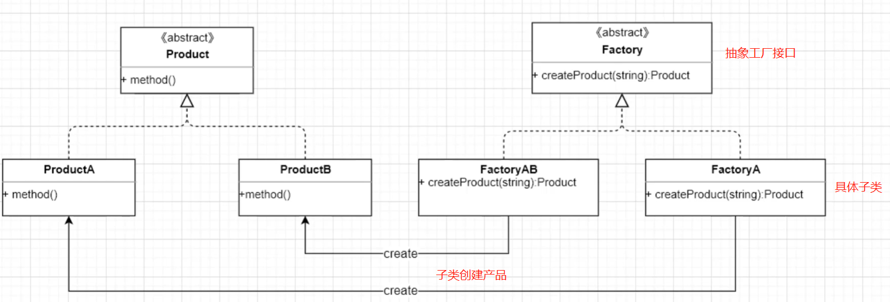


Collection接口	继承迭代器

```
public interface Collection<E> extends Iterable<E> {
```

有iterator()方法生产迭代器对象

在实现类ArrayList中,生产出适合ArrayList的具体产品ITr


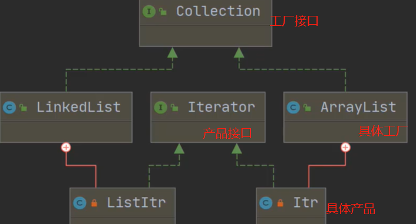


工厂方法 ：用来生产同一等级结构中的固定产品。（支持拓展增加产品）

现在不光有伦敦工厂，还增设了纽约工厂（仍然是同一等级结构，但是支持了产品的拓展），这两个工厂依然只生产三种类型的pizza：chesse,pepper,greak（固定产品）


### Spring `ApplicationContext`

Spring使用工厂模式可以通过 `BeanFactory` 或 `ApplicationContext` 创建 bean 对象。

**两者对比：**

-  `BeanFactory` ：延迟注入(使用到某个 bean 的时候才会注入),相比于`ApplicationContext` 来说会占用更少的内存，程序启动速度更快。

- `ApplicationContext` ：容器启动的时一次性创建所有 bean。`BeanFactory` 仅提供了最基本的依赖注入支持，` ApplicationContext` 扩展了 `BeanFactory` 

  

1. `ClassPathXmlApplication`：把上下文文件当成类路径资源
2. `FileSystemXmlApplication`：从文件系统中的 XML 文件载入上下文定义信息
3. `XmlWebApplicationContext`：从Web系统中的XML文件载入上下文定义信息


## 抽象工厂


提供一个创建产品族的接口，用来生产不同产品族的全部产品。（**支持增加产品/产品族**）  

不光增设了纽约工厂（仍然是同一等级结构，但是支持了产品的拓展），这两个工厂还增加了一种新的类型的pizza：chinese pizza（增加产品族）


## 原型 Prototype

将一个对象作为原型，通过对其进行复制而**克隆**出多个和原型类似的新实例

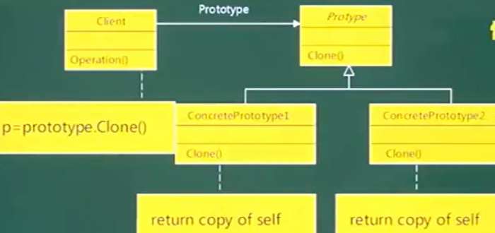


Prototype抽象原型类

ConcretePrototype具体原型类,实现具体的克隆方法


## 单例模式

确保一个类只有一个实例,并且自行实例化并向整个系统提供这个实例

如序列号生成器,页面计数器等都可以用单例模式	创建对象需要消耗过多资源时, 也可以用单例	减少重复创建对象,如io,数据库连接

**构造方法private,全局变量private static,获取实例方法public static **


**单例模式可能不只一个实例**

* 分布式系统中,多个jvm各自有一个实例
* 一个jvm, 使用了多个类加载器同时加载这个类,产生多个实例


### 饿汉


在类**加载时创建**实例，而不是等到第一次请求实例时创建


### 懒汉


在类加载的时候不创建单例实例，只有在第一次请求实例时创建


通过synchronized加锁,防止被多次实例化


### DCL 双重检查锁

double check lock 在自己被调用时才会实例化

==静态全局变量必须加volatile==


```java
private volatile static LazySingleton lazySingleton = null;

private LazySingleton() {}

public static LazySingleton getInstance() {
  if (lazySingleton == null) {
    synchronized (LazySingleton.class) {
      if (lazySingleton == null) {
        lazySingleton = new LazySingleton();
      }
    }
  }
  return lazySingleton; }
```


## Builder

将一个复杂对象分解成多个相对简单的部分，然后根据不同需要分别创建它们，最后构建成该复杂对象。


```java
public static void main(String[] args) {
  new House.HouseBuilder().window().door().build();
}

@Data
@Builder
class House{
  private Window window;
  private Door door;
}
```


# 结构型


## 桥接 Bridge


将**抽象与实现分离**，使它们可以独立变化。**用组合代替继承实现**，降低了抽象和实现这两个可变维度的耦合度。


## 组合 Composite


将对象组合成树状层次结构，使用户对单个对象和组合对象具有一致的访问性


```java
public class Compoment {

    public static void main(String[] args) {
        Composite china = new Composite();

        Composite zj = new Composite();
        zj.add(new City(1000));

        Composite jx = new Composite();
        jx.add(new City(500));

        //将子节点加入容器(子节点本身也可以是一个容器)
        china.add(zj);
        china.add(jx);

        china.count();
    }
}

interface Counter {
    int count();
}

class City implements Counter {

    private int sum;

    public City(int sum) {    this.sum = sum;}

    @Override
    public int count() {    return sum;}
}

//容器和节点都需要实现接口
class Composite implements Counter {

    private List<Counter> list = new ArrayList<>();

    public void add(Counter counter) {    list.add(counter);}

    public void delete(Counter counter) {   list.remove(counter);}

    public List<Counter> getChild() {   return list;}

    @Override
    public int count() {
        int sum = 0;
        for (Counter counter : list) {
            //在子节点是容器时,count()将进行递归
            sum += counter.count();
        }
        return sum;
    }
}
```


## 适配器模式 adapter


- Target（目标接口）:所要转换的所期待的接口
- Adaptee（源角色）：被适配类
- Adapter（适配器）：将源角色适配成目标接口，一般持有源接口的引用/继承源接口，且实现目标接口

原有接口与客户端不匹配,==无需修改原接口.通过关联方式将对象放入适配器中==,通过访问适配器的方法来间接操作对象,从而可以添加新的方法

另一种方法	继承,通过子类来访问父类原有的功能

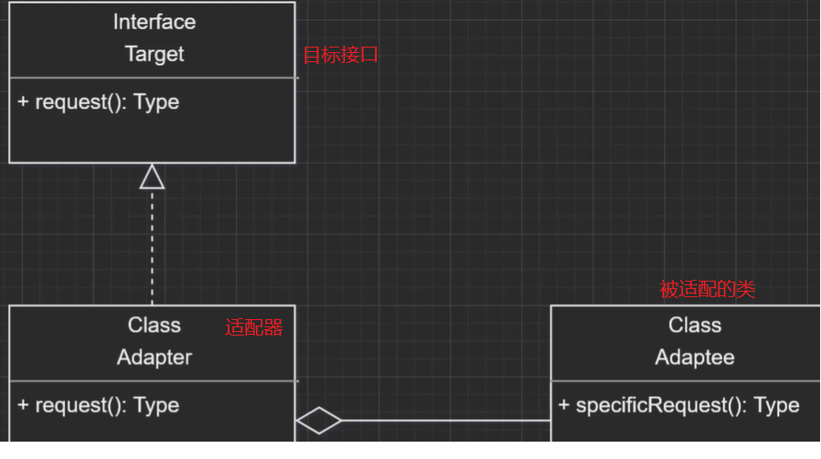


新闻联播为失聪人士提供了手语,让有障碍的人也能正常观看

```java
public class AdapterPattern {
    public static void main(String[] args) {
    //通过Adapter适配器来操作Speaker对象
        new Adapter(new Speaker()).translate();}
}

//被适配类
class Speaker {
    public String speak() { return "搬砖";   }
}

//原接口
interface Translator {  String translate();}

class Adapter implements Translator {
    private Speaker speaker;

    public Adapter(Speaker speaker) {  this.speaker = speaker;}
        
	//适配器
    @Override
    public String translate() {  return "翻译之后" + speaker.speak();}
}
```


### 适配VS装饰


适配器目的是从一个接口转变为另一个接口,**修改了原接口**

装饰器**未对原接口进行修改**,增强/改变原有对象的处理方式而提升性能，经过装饰后，操作对象的原有功能依然存在，并添加额外的功能


## 装饰器 Decorator


动态的给对象增加职责

运用了关联关系,把对象嵌入到装饰器中,由装饰器内部操作对象

==对被装饰类的使用者透明==


```java
public class DecoratorPattern {

  public static void main(String[] args) {
    //装饰器的构造方法传入了FirstRobot对象,为原对象附加了新功能
    new RobotDecorator(new FirstRobot()).doMorething(); }
}

//构件接口
interface Robot { void doSomething();}

//被装饰的构件
class FirstRobot implements Robot {
  @Override
  public void doSomething() {  System.out.println("搬砖"); }
}

//装饰器
class RobotDecorator implements Robot {

  private Robot robot;
  public RobotDecorator(Robot robot) { this.robot = robot;}

  @Override
  public void doSomething() { robot.doSomething();}

  //新方法	doSomething接口方法未被修改
  public void doMorething() {
    robot.doSomething();
    System.out.println("搬水泥"); }}
```


### InputStream


- InputStream 抽象组件
- FileInputStream 具体组件，提供了字节流输入操作
- FilterInputStream 抽象装饰器。例如 BufferedInputStream 为 FileInputStream 提供缓存的功能


FilterInputStream与其它子类不同

```java
public class FilterInputStream extends InputStream {

  //内部维护一个InputStream,调用InputStream的方法
  protected volatile InputStream in;

  protected FilterInputStream(InputStream in) { this.in = in;}
  public int read() throws IOException { return in.read(); }
  public int read(byte b[]) throws IOException { return read(b, 0, b.length); }
  public int read(byte b[], int off, int len) throws IOException {  return in.read(b, off, len); }
  public void close() throws IOException {  in.close();  }
```

FilterInputStream什么事都不做 **委托给内部的InputStream成员对象**


实例化一个具有缓存功能的字节流对象时，只需要在 FileInputStream 对象上再套一层 BufferedInputStream 对象即可

```java
FileInputStream fileInputStream = new FileInputStream(filePath);
BufferedInputStream bufferedInputStream = new BufferedInputStream(fileInputStream);
```


IO如果单纯使用继承，无疑需要很多的类。比如说，操作文件需要一个类，字节读取需要一个类，字符读取又需要一个类....会导致大量的 IO 继承类的出现。对编程不利

而装饰模式可以很好地解决这一问题，在装饰模式中：节点流（如 FileInputStream）直接与输入源交互，之后通过过滤流（FilterInputStream）进行装饰，这样获得的 io 对象便具有某几个的功能，拓展了 IO 的功能


### Collections.UnmodifiableCollection

传入一个List实例，返回实例的只读视图，类型依然是List

之后对视图进行add、remove等改变其内容的操作,直接抛出异常UnsupportedOperationException


### 装饰器 vs 继承

- 装饰器在运行时组成特征；继承在编译时组成特征。
- 装饰器由多个协作对象组成；继承产生一个明确类型的对象。
- 可以混合和匹配多个装饰；多重继承在概念上是困难的。


## 外观	Facade


为==内部复杂的系统==提供一个**一致的接口**，使这些子系统更加容易被访问

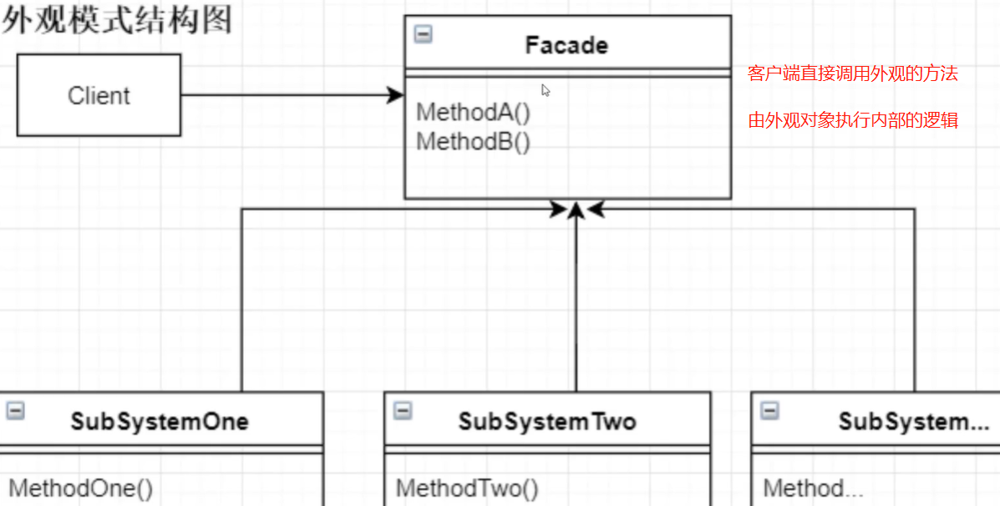


* 优点	内外部的通信通过**统一的通信对象**进行,通信对象是高层次的,将内部复杂的操作进行封装,使得外观上简洁,内部复杂
* 缺点    **不符合开闭原则**	当内部发生改变时,外观也需要修改


```java
public class FacadePattern {
    public static void main(String[] args) {
    //客户端调用外观的方法
        new Facade().facadeMethod();
    }
}

class Facade{
	//由外观对象进行复杂操作
    void facadeMethod(){
        new SubFlow1().method1();
        new SubFlow2().method2();}
}

class SubFlow1{ void method1(){}}
class SubFlow2{ void method2(){}}
```


## 享元 Flyweight


运用共享,支持大量细粒度对象复用


* 优点
  * 减少相同或相似对象的创建,节约资源
  * 享元对象的状态独立于外部环境  从而==可以在不同环境下被共享==

* 缺点
  * 需要分外部状态和内部状态,会导致系统复杂


类似网盘,同一份资源被不同人保存,实际被保存的文件只有一份

被保存的资源是对外一致的,被多人共享,是细粒度对象

而每个人的保存时间,保存目录是不一致的,是粗粒度对象


池技术	线程池,连接池,都是享元

```java
public class FlyWeightPattern {
    public static void main(String[] args) {
        BikeFlyWeight bike = BikeFlyWeightFactory.getInstance().getBike();
        //当享元对象使用中时,其他人将无法操作这个对象
        bike.ride();
        //释放享元对象回池子
        bike.back(); }
}

//享元接口  需要定义状态属性,判断是否正在被使用  以及改变状态的方法
abstract class BikeFlyWeight {
    //0未使用    1使用中
    protected Integer state = 0;

    abstract void ride();
    //释放享元对象回池子 状态置为0
    void back() { state = 0; }

    public Integer getState() {
        return state;  }
}

class MoBikeFlyWeight extends BikeFlyWeight {
    private String bikeId;

    public MoBikeFlyWeight(String bikeId) {
        this.bikeId = bikeId; }

    @Override
    void ride() {
        state = 1;
        System.out.println("使用中");  }
}


class BikeFlyWeightFactory {
    private static BikeFlyWeightFactory instance = new BikeFlyWeightFactory();
    private Set<BikeFlyWeight> pool = new HashSet<>();

    public static BikeFlyWeightFactory getInstance() {
        return instance; }

    //向享元工厂加入享元对象
    private BikeFlyWeightFactory() {
        for (int i = 0; i < 2; i++) {
            pool.add(new MoBikeFlyWeight(i + "号"));   }
    }

    //获取享元对象
    public BikeFlyWeight getBike() {
        for (BikeFlyWeight bike : pool) {
            if (0 == bike.getState()) {
                return bike; }     }
        return null;  }
}
```


## 代理Proxy


为对象提供代理以控制对该对象的访问

客户端通过代理间接访问对象，从而限制、增强或修改该对象的一些特性。


==访问控制理念==

代理模式对客户端的访问限制思想同样运用在状态模式,策略模式等,根据状态或要执行的算法来限制去调用哪个方法.一个业务往往需要结合多种设计模式来完成


### 静态代理 StaticProxy


```java
public class ProxyPattern {
  public static void main(String[] args){
    new RealSubjectProxy().doWork();  
  }
}

interface Subject { void doWork();}

class RealSubject implements Subject {
  @Override
  public void doWork() {
    System.out.println("搬砖");  }}

//代理类
class RealSubjectProxy implements Subject {
  private RealSubject subject;
  public RealSubjectProxy(){
    //通过反射来加载类,从而让客户端无需传入参数
    this.subject = (RealSubject) this.getClass().getClassLoader().loadClass("RealSubject").newInstance(); }

  public void preMethod() { System.out.println("起床"); }
  public void afterMethod() { System.out.println("睡觉"); }

  //通过代理可以为doWork()方法附加上前置和后置操作,增强了方法
  @Override
  public void doWork() {
    preMethod();
    subject.doWork();
    afterMethod();  
  }
}
```


静态代理缺点：

- 代理类和目标对象的类都是在编译期间确定下来，不利于程序的扩展
- 每一个代理类只能为一个接口服务，这样一来程序开发中必然产生过多的代理


### 动态代理


- 动态代理是指客户通过代理类来调用其它对象的方法，在程序运行时根据需要动态创建目标类的代理对象
- 抽象角色中（接口）声明的所有方法都被转移到调用处理器一个集中的方法中处理，这样，我们可以更加灵活和统一的处理众多的方法


# 行为型


## 命令 Command


将==请求封装为对象==，从而可用不同的请求对客户进行参数化,将==请求排队或记录请求日志==,支持**可撤销**的操作.使**发出请求的责任和执行请求的责任分离**

==调用者调用命令对象,命令对象执行命令==


```java
public class CommandPattern {
    public static void main(String[] args) {
        SaveButton saveButton = new SaveButton();
        Textbox textbox = new Textbox();

        //将页面对象与命令绑定,命令的构造方法中传入页面元素textbox
        saveButton.bindCommand(new PrintCommand(textbox));

        textbox.setContext("aa");
        //页面对象调用命令对象      命令对象调用业务逻辑,处理页面元素
        saveButton.doPrint();

        textbox.setContext("bb");
        saveButton.doPrint();
    }
}

/**
 * UI层,保存按钮
 */
class SaveButton {
    private Command command;

    /**
     *  传入命令对象,完成按钮与命令的绑定,实现了UI和逻辑的分离
     */
    public void bindCommand(Command command) { this.command = command;}

    public void doPrint() {
        if (null != command) { command.execute();  }
    }
}

/**
 * UI层,按钮点击后显示的文本
 */
class Textbox {
    private String context;
    public String getContext() { return context;}
    public void setContext(String context) { this.context = context;}
}


/**
 * 逻辑层  打印服务
 */
class PrintService {
    public void print(String text) {  System.out.print(text); }
}

/**
 * 命令接口
 */
interface Command {
    void execute();
}

/**
 * 具体命令
 */
class PrintCommand implements Command {
    private final PrintService printService = new PrintService();
    private Textbox textbox;

    public PrintCommand(Textbox textbox) {  this.textbox = textbox;  }

    @Override
    public void execute() {  printService.print(textbox.getContext());    }}
```


## 迭代器	Iterator


提供一种方法来顺序访问聚合对象中的一系列数据，而不暴露聚合对象的内部表示


## 访问者	Visitor


在不改变集合元素的前提下，为一个集合中的每个元素**提供多种访问方式**，从而在不改变个元素的类的前提下作用于这些元素的新操作

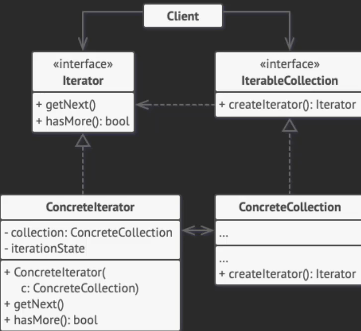


## 备忘录	Memento


不破坏封装性的前提下，获取并保存一个对象的内部状态，以便以后恢复它

备忘录类作为被备份类的私有内部类存在,二者内部属性一致,被备份类为private

备忘录类只能被备份类访问/修改,外部类只能访问到快照名称,时间等非关键信息


```java
public class MementoPattern {
    public static void main(String[] args) {
        History history = new History();
        Document document = new Document();

        //每次被修改时进行快照,同时快照对象入栈
        document.change("1");
        history.add(document.save());
        //恢复快照
        document.resume(history.getLastVersion());  }}

interface Memento {}

class History {
    //栈存储备忘录对象
    Stack<Backup> stack = new Stack<>();

    public void add(Backup backup) {   stack.add(backup);}

    public Backup getLastVersion() { return stack.pop();  }
}

class Document {
    //需要备份的内容
    private String content;

    public Backup save() { return new Backup(content);}

    public void change(String content) { this.content = content;   }
}

class Backup implements Memento {
    String content;

    public Backup(String content) { this.content = content; }}
```


## 解释器	Interpreter


提供如何定义语言的文法，以及对语言句子的解释方法，即解释器


## 模板方法	TemplateMethod


定义算法骨架，**将算法的一些步骤延迟到子类**中，使得子类可以不改变该算法结构的情况下重定义该算法的某些特定步骤

==行为由父类控制,实现由子类完成==


类似于菜谱,规定了菜谱的模板,厨师只需按照步骤进行炒菜

```java
public class TemplateMethodPattern {
    public static void main(String[] args) {  new CookingFood().cook(); }}

//给出了cook()的模板,但具体的步骤step1,step2由子类来实现
abstract class Cooking {
    protected abstract void step1();
    protected abstract void step2();
    public void cook() {
        step1();
        step2();  }
}

//子类继承模板,实现模板中的抽象方法
class CookingFood extends Cooking {
    @Override
    protected void step1() {   System.out.println("臭豆腐,腐乳"); }
  
    @Override
    protected void step2() {   System.out.println("面包片,老干妈"); }}
```


## 观察者(发布/订阅) Observer


观察者与被观察者存在多对一关系,1个被观察者发生状态改变,将通知1~n个观察者

而Observer收到通知后，将查询Subject的状态


* 适用场景
  * 一个抽象模型有两个方面，其中一个方面依赖于另一个方面。将这两者封装在独立的对象中以使它们可以各自独立地改变和复用
  * 当对一个对象的改变需要同时改变其他对象，而不知道具体有多少对象有待改变时
  * 当一个对象必须通知其他对象，但不能假定其他对象是谁，即不希望这些对象是紧耦合的

```java
public class ObserverPattern {
    public static void main(String[] args) {
        Debit zhangSan = new ZhangSan();
        zhangSan.borrow(new WangWu());
        zhangSan.notifyCredits();
    }
}

//借钱接口  有借钱/通知贷款人方法 当状态改变将触发notifyCredits()
interface Debit {
    void borrow(Credit credit);
    void notifyCredits();
}

//贷款接口  抽象收钱方法
interface Credit {
    void takeMoney();
}

//借款人   维护需要通知的对象,放入List
class ZhangSan implements Debit {
    List<Credit> list = new ArrayList<>();
    //状态标识  状态改变将进行通知
    private Integer state = 0;

    //将需要通知的对象放入列表
    @Override
    public void borrow(Credit credit) {  list.add(credit);}

    //状态改变触发通知
    @Override
    public void notifyCredits() {  list.forEach(Credit::takeMoney);}
}

//贷款人
class WangWu implements Credit {
    @Override
    public void takeMoney() { System.out.println("王五拿钱"); }
}
```


### 回调	特殊观察者


**高层调用底层,向底层传入回调函数，底层再回过头来调用高层**


A向B提问，B思考一会儿，得到答案通知A

A中

```
创建B的实例	new B();
给B set回调函数,传入回调函数的参数
调用B的执行回调函数方法
```

B中：

```
对外提供传入回调函数的set方法
定义执行回调函数的方法
```


==回调函数只有1个观察者,1个被观察者,当A把回调函数set进B时,将调用B的执行回调函数方法,通知B可以开始执行==

```java
//回调函数接口
interface Callback {
    void callbackByTel(String answer);}

class A {
    public static void main(String[] args) {
        B b = new B();
        //向b传入将传入参数打印的回调函数
        b.setCallBack(System.out::println);
        //调用b的执行回调函数方法
        b.handleQustion();}
}

class B {
    private Callback callback;

    //对外提供传入回调函数的set方法
    public void setCallBack(Callback callback) {  this.callback = callback;  }

    //执行回调函数的方法
    public void handleQustion() {  callback.callbackByTel("搬砖");  }
}
```


## 中介者	Mediator


定义中介对象**简化原有对象之间的交互**，使原有对象**不需要显式地互相调用**

各个对象间的耦合松散，==只需关心和Mediator的关系，使多对多的关系变成了一对多的关系==，降低系统的复杂性，提髙可修改扩展性


## 状态	State


枚举所有状态,将对象的转换规则和业务进行封装,允许一个对象在其**内部状态改变时改变其行为**

==状态对象被多个环境对象共享==

* 优点	消除了if,switch等冗余语句，代码有层次性

* 缺点	会增加系统中类的个数 (状态类)

适用场景 ：

1、 行为随状态改变而改变的场景；

2、 业务含有庞大的分支结构，并且这些分支取决于对象的状态


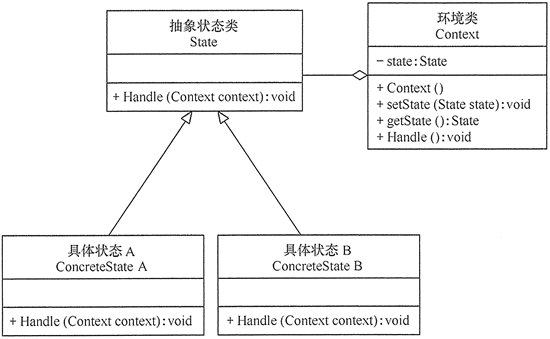


```java
public class StatePattern {
    public static void main(String[] args) {
        Context context = new Context();
        //在改变了环境对象的状态属性后,将执行该状态的方法
        context.changeState(new Happy());
        context.doSomeThing();   }}

//状态的抽象类	将不同状态下的不同行为抽象为doWork()方法
abstract class State {
    abstract void doWork();}

class Happy extends State {
    @Override
    void doWork() {  System.out.println("开心搬砖");  }
}

class Sad extends State {
    @Override
    void doWork() {  System.out.println("伤心摸鱼"); }
}

//环境类内部维护状态,对外提供改变状态的方法
class Context {
    private State state;

    public void changeState(State state) {   this.state = state;}

    public void doSomeThing() { state.doWork();}
}
```


### 状态VS责任链


都能消除if分支过多的问题,当状态=责任时，两种模式可以互相转化

从定义来看，**状态模式强调对象内在状态的改变**，而**责任链模式强调外部对象间的改变**

从代码来看，状态模式需要知道下一个要转化的状态对象；而责任链模式并不清楚其下一个节点处理对象，因为链式组装由客户端负责


## 责任链 Chain of Responsibility


给多个对象处理请求的机会,==减少发送/接收者耦合==

把接收对象链接起来,在链中传递请求,直到请求被响应为止

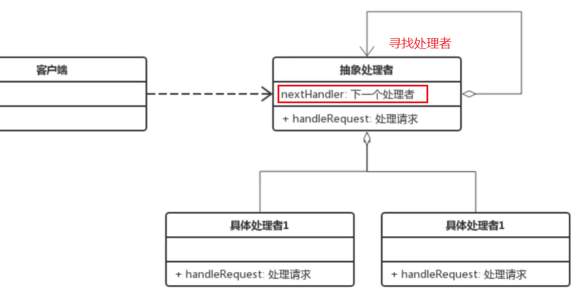


* 优点
  * 请求者不需要知道谁来处理,**处理者不知道请求的全貌**
  * 灵活性高,易于新增处理器

* 缺点
  * 降低系统性能,责任链较长时,需要等待较长时间
  * 不利于调试,类似于递归,会导致不知道到底是谁处理了请求


```java
public class ChainRespPattern {
    public static void main(String[] args) {
        Handler leaderA = new Leader();
        Handler boss = new Boss();
        //为Leader设置高级负责人
        leaderA.setNextHandler(boss);
        //虽然一开始是Leader负责,但Leader权限不足,将责任流转到nextHandler
        leaderA.process(20);  }
}

//责任人接口,内部维护高一级的责任人nextHandler,形成责任链
abstract class Handler {
    protected Handler nextHandler;

    //责任流转接口,寻找能处理业务的负责人
    public abstract void process(Integer info);

    public void setNextHandler(Handler nextHandler) { this.nextHandler = nextHandler;  }
}

class Leader extends Handler {
    @Override
    public void process(Integer info) {
        //参数大于10时,Leader权限不足,将责任流转给Boss
        if (info > 10) {   nextHandler.process(info);  }}
}

class Boss extends Handler {
    @Override
    public void process(Integer info) {
        System.out.println("Boss处理");  }
}
```


## 策略 Strategy

定义一系列**封装算法**，使它们可以相互替换，算法的改变不影响使用算法的客户


JDK8中,ThreadPoolExecutor的构造方法可以传入RejectedExecutionHandler拒绝策略接口

拒绝策略是当有界队列满了时，拒绝添加到线程池

```java
public ThreadPoolExecutor(int corePoolSize,
                          int maximumPoolSize,
                          long keepAliveTime,
                          TimeUnit unit,
                          BlockingQueue<Runnable> workQueue,
                          ThreadFactory threadFactory,
                          //策略接口
                          RejectedExecutionHandler handler)
```


每个拒绝策略接口的实现类都封装了拒绝的算法,在构造方法中传入策略,从而使得线程池具有对应的算法

```java
public static class AbortPolicy implements RejectedExecutionHandler {

    public AbortPolicy() { }
    public void rejectedExecution(Runnable r, ThreadPoolExecutor e) {
        throw new RejectedExecutionException("Task " + r.toString() +
                                             " rejected from " +
                                             e.toString());  }}
```


### 策略VS状态


* 相同
  * 策略模式关注多种算法的内容

  * 状态模式关注多种状态的改变

* 不同
  * 2者都封装了执行的函数在环境类中,由环境类决定执行哪个函数


# 其他


## 生产/消费模式

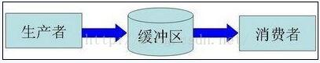


缓冲区的作用

* 解耦
  * 让生产者直接调用消费者，将来消费者代码发生变化，会影响到生产者
  * 而如果两者都依赖于某个缓冲区，两者之间不直接依赖，耦合也就相应降低了。

* 支持并发
  * 由于函数调用是同步/阻塞的。万一消费者处理数据慢，会造成等待

* 支持忙闲不均
  * 生产快,消费慢时，未处理的数据暂时存在缓冲区中


### 数据单元

每次生产者放到缓冲区的，就是一个数据单元。对于前一个帖子中寄信的例子，我们可以把每一封单独的信件看成是一个数据单元。 不过光这么介绍，太过于简单，无助于大伙儿分析出这玩意儿。所以，后面咱们来看一下数据单元需要具备哪些特性。搞明白这些特性之 后，就容易从复杂的业务逻辑中分析出适合做数据单元的东西了。


数据单元特性

* 必须关联到某种业务对象
* 在考虑业务的时候，必须理解当前这个生产者／消费者模式所对应的业务逻辑,如果选错了业务对象，会导致后续程序设计和编码实现的复杂度大为上升，增加了开发和维护成本。
* 完整性 在传输过程中，要保证该数据单元的完整
*  独立性 所谓独立性，就是各个数据单元之间没有互相依赖，某个数据单元传输失败不应该影响已经完成传输的单元；也不应该影响尚未传输的单元。
  * 传输失败是由于生产过快,缓冲区达到上限，数据单元被丢弃
  * 如果数据单元相互独立，等到生产者的速度降下来之后，后续的数据单元继续处理，不会受到牵连
  * 如果数据单元耦合，被丢弃的数据单元会影响到后续其它单元的处理，会使程序逻辑复杂

* 颗粒度 数据单元和业务对象不需要一一对应

  


### 工作密取


消费者:双端队列 = 1:1

当消费者完成了自己双端队列中的全部工作，就可以从其他消费者的队尾秘密地获取工作

消费者在需要访问其他队列时，**操作队尾而不是队头，进一步避免竞争**


避免消费者阻塞


### 工作共享


在生产者发现新的任务,若自身队列已满,将新任务追加到其他线程队尾


确保每个线程都处于忙碌状态


## 装潢模式


## 门面模式


去一家公司谈业务，不需要了解这个公司内部是如何运作的，你甚至可以对这个公司一无所知，去的时候只需要找到前台，告诉她们你要做什么，她们会找到合适的人跟你接洽，前台的美女就是公司这个系统的门面。

再复杂的系统都可以为用户提供一个简单的门面，Java Web 开发中作为前端控制器的 Servlet 或 Filter 不就是一个门面吗，浏览器对服务器的运作方式一无所知，但是通过前端控制器就能够根据你的请求得到相应的服务。调停者模式也可以举一个简单的例子来说明，例如一台计算机，CPU、内存、硬盘、显卡、声卡各种设备需要相互配合才能很好的工作，但是如果这些东西都直接连接到一起，计算机的布线将异常复杂，在这种情况下，主板作为一个调停者的身份出现，它将各个设备连接在一起而不需要每个设备之间直接交换数据，这样就减小了系统的耦合度和复杂度


### 中介 VS 门面


中介让两个类不直接发生关系，而是通过中介者联系，**中介者不偏向于任一方,双方的关系是双向的**

门面模式也是让两个类不直接发生关系，**门面偏向于某一方，某一方不一定甚至不会通过门面和另一方发生关系，偏向于单向关系**


门面模式是结构型模式，中介者模式是行为型模式。

门面模式所有的请求处理都委托给子系统完成，而中介者模式则由中心协调同事类和中心本身共同完成业务


**中介者模式应用在当事双方不方便或无能力直接联系的场合**


# 编程原则


面向对象设计原则是面向对象设计的基石，面向对象设计质量的依据和保障

设计模式是面向对象设计原则的经典应用

**开闭是面向对象设计的终极目标**。其他都是开闭的实现手段


## 单一职责SRP


设计目的单一的类

高内聚	一个代码完成一项功能
模块化	模块可以轻易地拿到其他系统中使用


## 开闭OCP


* 抽象是关键，没有抽象类或接口就没有扩展点
* 封装可变性，将系统中的各种可变因素封装到继承结构


## 依赖倒转DIP


**依赖抽象而不是实现,面向接口编程,不面向实现**

声明类型时，尽可能使用抽象类型，可以被子类型替代


## 里氏替换LSP


任何时候都可以用子类型替换掉父类型。子类一定是增加而不是减少父类的能力


## 接口隔离ISP	


多个专门的接口比单一的总接口更好

接口小而专,高度内聚

琴棋书画就应该分别设计为四个接口，而不应设计成一个接口中的四个方法，因为如果设计成一个接口中的四个方法，那么这个接口很难用，毕竟琴棋书画四样都精通的人还是少数，而如果设计成四个接口，会几项就实现几个接口，这样的话每个接口被复用的可能性是很高的


## 合成聚合复用CARP	


尽量使用组合,而不是继承

每次继承都会先构造父类,每次释放都会从子类开始向上释放,这样会浪费很多资源,能用组合就不用继承

* 类与类之间三种关系
  * IS-A	继承
  * HAS-A	关联
    * 根据其关联的强度又可以进一步划分为关联、聚合和合成
  * USE-A	依赖


## 迪米特/最少知识LOD	


对象间尽可能少的了解,不和陌生人打交道，如果真的需要，找一个自己的朋友，让他替你和陌生人打交道

“低耦合”，门面模式和调停者模式就是对迪米特法则的践行


# UML


* 面向对象	
  * Booch
  * OOSE
  * OMT

* 面向数据结构
  * Jackson

* 面向数据流
  * 结构化方法


进行建模时，首先确定系统边界，识别出主要用例，建模用例图

然后对用例图中的复杂用例采用活动图进一步进行建模

再对用例执行过程中对象如何通过消息相互交互进行建模

* 结构图
  * 类图      系统的领域模型
  * 对象图
  * 包图
  * 组合结构图   2.0新增
  * 构件图
  * **部署图**     软硬件之间映射,代码在实施中的物理节点分布
  * 制品图

* 行为图
  * 用例图	系统与外部参与者交互
  * 顺序图	强调时间顺序     系统的交互关系
  * 通信图
  * 定时图    2.0新增
  * 状态图    
  * 活动图


## 类图

描述一组类/接口/协作和它们之间的关系

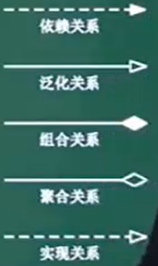

* 依赖    事物变化影响另一事物    如类A的方法中仅仅使用了类B的对象
* 泛化    特殊/一般关系    **a可以完成b同样的任务,并能补充额外的角色功能**
* 关联    
* 聚合    
* **组合    相同生命周期**
* 实现    接口和类的关系


## 对象图

描述一组对象及它们之间的关系	是对类图的静态快照


**多重度**

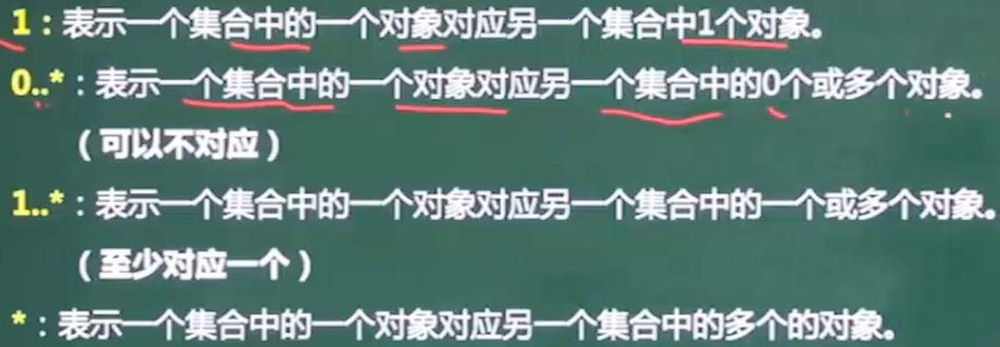


## 用例图


* include	两个用例中提取出的公共行为,是包含关系

* extend	执行用例时根据情况有不同的分支,可以将这个用例分为一个基本用例+若干个拓展用例,在需要时转向拓展用例,**执行完再返回**之前的用例

* 泛化		多个用例共同拥有类似的结构和行为,将共性抽象为父用例,其他用例作为泛化的子用例


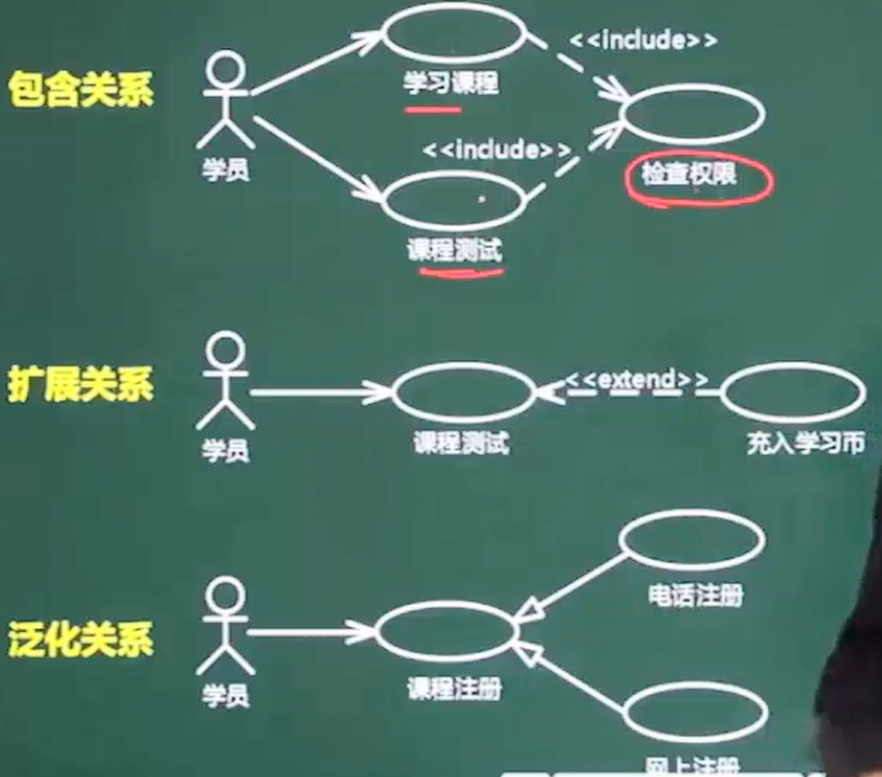

学习课程和课程测试之前,都需要先检查权限,这是包含

在课程测试中途可以选择充入学习币,这是拓展

课程注册可以电话注册也可以网上注册,这是泛化


## 顺序图/序列图


## 活动图

==一个用例和多个对象的行为==

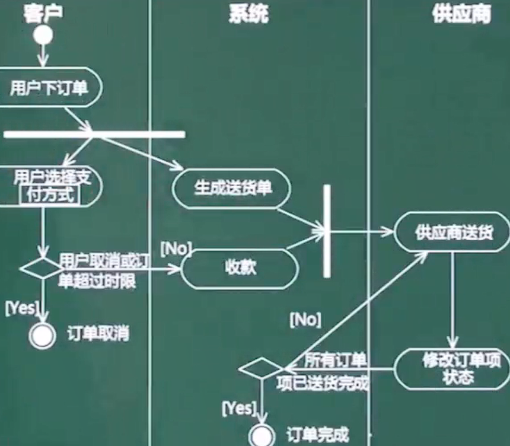


## 状态图

* 用于描述一个对象在多个用例中的行为

* 用于某些具有多个状态的对象而不是系统中大多数或全部对象

* 可以用于**用户界面或控制对象**


状态的父状态成为**超状态**


与活动图类似,重点反映状态的转化		箭头上的注释也倾向于状态


## 通信图

与顺序图一样,是交互图

顺序图强调时序,通信图强调**对象之间的组织结构**


## 构件图

描述一个封装的类和它的接口,端口,以及由内嵌的构建和连接件构成的内部结构


表示组件AccountManagement需要调用CreditCardServices组件和Logger 组件分别实现的Identity Verifier 接口和TransactionLogger 接口。


## 部署图


# 多态


面向对象允许多继承


多态分两种:

* 通用多态	对类型不加限制,允许对不同类型的值执行相同的方法
  * 参数多态	采用参数化模板,通过给出不同的参数,使得一个结构有多种类型
  * 包含多态	同样的操作可用于一个类型及其子类型,一般需要运行时的类型检查

* 特定多态	只对指定的类型有效,并且对不同的类型执行不同代码
  * 过载多态	同一个操作符/函数名在不同的上下文有不同的类型
  * 强制多态	编译程序通过语义操作,把操作对象的类型强新变化(casting)


## 动态代理和多态

多态通常可以分为两种：编译时多态和运行时多态。Java的重载是编译时多态,重写是运行时多态

编译时多态指的就是函数名相同，但是参数列表不同

运行时多态则是指虚函数的多态，父类和子类、不同子类的实现不一样


## List的多态


List list = new ArrayList() 与 ArrayList list = new ArrayList()

List接口有多个实现类，从ArrayList换成LinkedList/Vector只需改变一行    

这就是面向接口编程,LinkedList和ArrayList都实现了List接口,在List list时,并不知道实例化了Linked还是Array,但list都是要去add()


# 内聚/耦合


* 内聚

  * 偶然内聚	处理元素间没有联系
  * 逻辑内聚	执行逻辑上相似的功能，**通过参数确定完成哪个功能**
  * 时间内聚	**同时执行的动作组合在一起**
  * 通信内聚	所有处理元素在**同一数据结构**上操作，或使用**相同的输入/输出数据**
  * 顺序内聚	==前一个功能元素的输出是下一个功能元素的输入==
  * 功能内聚	==最强的内聚==，所有元素**共同完成一个功能，缺一不可**

* 耦合

  * 数据耦合:模块间通过数据**参数**交换信息
  * 标记耦合:通过**参数表(某种数据结构**)传递信息
  * 控制耦合:模块间传递的信息中有控制信息
  * 内容耦合:涉及到另一个模块的内部信息


* 高层模块不应该依赖于底层模块
* 借助抽象、接口，可以使得高层模块仅仅和接口耦合，而和实际的底层模块没有直接关联

 


# 继承


超类和子类 成员变量名称相同

子类拥有父类对象所有的属性和方法（包括私有属性和私有方法），但是父类中的私有属性和方法子类是无法访问，**只是拥有**

不会重写父类成员变量,**子类中将有两个相同名称的变量**

==子类重写父类的方法，访问级别不允许低于父类== -> 里氏替换

```java
public class A {  
  public int m = 1;  

  public void view(){
    System.out.println(this.m);
  }  
}  

public class B extends A{  

  public int m = 2;  

  /**
 *  @Override
 *  public void view(){
 *      System.out.println(this.m);		//2
 *      System.out.println(super.m);	//1
 *  }
 */  

  public static void main(String[] args) {
    B b = new B();
    b.view();		//1
  }  
}
```


==继承打破封装性==

> 需求:继承HashSet实现新类,增加插入元素的计数的功能
>
> 
>
> 实现1:重写add和addAll,每加入一个元素计数+1,调用super.add/addAll
>
> 然而HashSet的addAll依赖于add进行实现,这将使得addAll进行了+2
>
> 
>
> 实现2:完全重写addAll,不依赖于super.add实现
>
> 这使得编程变得极为复杂

哪怕不覆盖现有方法,也存在父类方法间互相调用而导致子类的实现有所差异

子类将依赖于父类的特定功能的实现细节,当父类随着发行版本而变化,子类将必须随之改变


## 复合

将现有类变为新类的一个组件,完全不拓展现有类,而是在新类增加私有域去引用现有类的一个实例

新类的每个方法都可以调用现有类的实现


```java
//继承
public class CountSet<E> extends HashSet<E>{
  private int count = 0;
  public boolean add(E e) {
    count++;
    return super.add(e);
  }
}

//复合
public class CountSet<E> extends HashSet<E>{
  private int count = 0;
  HashSet s = new HashSet<>();
  
  public boolean add(E e) {
    count++;
    return s.add(e);
  }
}
```


只在真正是子类型,存在is-a关系时,才适合用继承

每个B都是A么?	在大多数情况下,B只需包含A的一个私有实例,利用它的实现细节罢了


在Java类库中,Stack并不是向量,却继承了向量Vector -> Vector废弃将导致Stack也废弃


## 继承优于标签


以标签区分类型,代码中将充斥着样板代码，包括枚举声明、标签域以及条件语句

在标签过多时,也会加大bug的概率

标签类完全可以转化为等价的继承关系

```java
public class Figure {
  enum Shape {RECTANGLE, CIRCL}	//标签区分类型,决定用到的成员变量,area方法的计算方式
  final Shape shape;
	
  double length;	//RECTANGLE专用
  double width;

  double radius;	//CIRCL专用

  Figure(double radius) {
    shape = Shape.CIRCL;
    this.radius = radius;
  }

  public Figure(double length, double width) {
    shape = Shape.RECTANGLE;
    this.length = length;
    this.width = width;
  }

  double area() {
    switch (shape) {	//新增类型,构造器也需增加新的逻辑,否则运行失败
      case CIRCL:
        return Math.PI * (radius * radius);
      case RECTANGLE:
        return length * width;
      default:
        throw new AssertionError(shape);
    }
  }
}
```


用继承改写后,带来了层级关系,去除了标签的冗余逻辑

```java
abstract class Figure {
  abstract double area();	//公共的area()
}

class Cicle extends Figure {

  final double radius;	//CIRCL类型对应(radius)

  public Cicle(double radius) { this.radius = radius; }

  @Override
  double area() { return Math.PI * (radius * radius); }
}
```


另外一点,子类的构造器也能反映与父类的关系

```java
class Square extends Recyangle {
  Square(double side) {
    super(side, side);
  }
}
```


## 永远打上Override


[Object.equals](#equals)入参为Object,在子类往往因定义的入参不是Object,而导致仅仅重载equals


打上@Override能利用编译器的检查,减少此类bug

也能及时发现有@Override却没有重写方法


## 重写


1. 返回值类型、方法名、参数列表相同
2. 抛出的异常<=父类异常，访问修饰符范围>=父类
3. 如果父类方法访问修饰符为 `private/final/static` 则子类就不能重写该方法，但是被 static 修饰的方法能够被再次声明
4. 构造方法无法被重写


## 慎用重载


```java
String classify(Set<?> s) { return "Set"; }
String classify(List<?> s) { return "List"; }
String classify(Collection<?> s) { return "Collection"; }

public void test() {
  Collection<?>[] collections = {
    new HashSet<>(),
    new ArrayList<>(),
    new HashMap<>().values()
  };

  for (Collection<?> c : collections) {
    System.out.println(classify(c));	//输出Collection * 3
  }
}
```


==重载方法的类型在编译时决定,重写方法的类型在运行时决定== -> **重载方法的选择是静态的，被覆盖的方法的选择则是动态的**

每次调用的对象类型不同,但这并不影响选择重载方法,因为对象在编译时的类型是确定的


重写是标准规范,而重载机制是例外 -> 重写机制符合正常逻辑,在使用重载时可能引发无法理解的bug


根本原因是重载入参的混淆性,父子类入参在重载时的调用不符合预期	一种方法是严格规定入参为绝不会混淆的类型

**命名代替重载**

[ObjectOutputStream.write](#ObjectOutputStream)对每种参数类型都有一种变形,但这些变形并不是重载 write，而是通过命名区分 writeBoolean()/writeInt()


但构造器必定是重载的,无法命名,但可以通过静态工厂取代构造器


自动拆箱装箱也会导致重载的混淆

List.remove(Object)移除指定元素	List.remove(int)移除指定下标

若为List<Integer>,删除时入参为int,以为会被自动装箱为Integer,实际调用的是List.remove(int),根据下标删除导致删除异常


重载时需要留意:各个方法的逻辑大体一致,入参可以通过简单的类型转换就转发给不同的重载方法 -> 多种重载实际生效的只应该有一个


# 接口


## ~~常量接口~~

constant interface


==接口只用于定义类型==,常量接口是对接口的不良使用

类内部的常量属于实现细节,类中常量的命名也将被接口类常量占用


## 标记接口

不包含方法声明的接口,只代表一个类实现了具有某种属性的接口

```java
实现Serializable意味着对象可以被ObjectOutputStream.writeObject()
```


标记接口相较于标记注解,能够提供类型的限制 -> 编译时IDE的类型提示


## default 1.8+


~~public~~ default


抽象类更多的是提供一个模板，子类间流程大致相同，仅仅是某个步骤可能不一样（模板方法设计模式），这个时候使用抽象类，该可变步骤定义为抽象方法

default直接提供了方法的实现,不需要修改实现类


**default缺点**

并非每一个实现类都需要default方法,新增defalut会带来历史子类的测试,不适配的子类必须重写default方法

新增default方法后,子类并不会出现编译时的报错,但运行时可能因为新增方法而异常

尽管default能够为所有子类新增一个已实现的方法,但这很可能会带来难以测试的bug


## 静态方法 1.8+


不会被实现类所实现,**只用于内部调用**


两个接口定义**相同静态方法**，实现类实现这两个接口，并不会产生错误，编译器通过**反射**区分是哪个接口下的方法

两个接口定义**相同非静态方法**，实现类实现了这两个接口，必须在实现类中重写默认方法


## FunctionalInterface


只在编译期起作用。编译期强制检查该接口是否符合函数式接口的条件，不符合则会报错

* **只有一个抽象方法**
* default属于默认实现，不属于抽象方法
* 接口重写了Object的公共方法也不算入内


### Supplier


T get()	获取一个泛型参数指定类型的对象数据	**生产一个数据**

```java
public void testGetUser() {
  User user = getUser(User::new);}

private User getUser(Supplier<User> supplier) {
  return supplier.get();}
```

 

Supplier求数组元素的最小值

```java
public void testGetMin(){
  int[] arr={5,3,100,10};
  int min = getMin(()->{
    int minNum=arr[0];
    for (int i : arr) {
      if (i<minNum) minNum=i;}
    return minNum;
  });}

private Integer getMin(Supplier<Integer> supplier) {
  return supplier.get();
}
```

 

### Consumer

**与Supplier接口相反**，消费一个数据


**抽象方法：accept**，消费一个指定泛型的数据

```java
public void testConsumer() {
  User user = new User();
  setUserDefaultSex(u -> u.setSex("nan"), user);	//user的sex被改变
}
private void setUserDefaultSex(Consumer<User> consumer, User user) {
  consumer.accept(user);
}
```


**默认方法：andThen**

**方法的参数和返回值全都是 Consumer 类型**，那么就可以实现效果：消费数据的时候，首先做一个操作，然后再做一个操作，实现组合

要想实现组合，需要两个或多个Lambda表达式

```java
public void testConsumer2() {
  User user = new User();
  setUserNameAndSex(u -> u.setSex("nan"), u -> u.setName("aa"), user);
  System.out.println(user.getSex() + user.getName());}

private void setUserNameAndSex(Consumer<User> one, Consumer<User> two, User user) {
  one.andThen(two).accept(user);
}
```

 

### BiConsumer


```java
void accept(T t, U u);	//接受2个入参的Consumer

default BiConsumer<T, U> andThen(BiConsumer<? super T, ? super U> after) {
  Objects.requireNonNull(after);

  return (l, r) -> {
    accept(l, r);
    after.accept(l, r);
  };
}
```


### Predicate

判断型接口，**得到boolean**结果

**抽象方法：test** 	用于条件判断

```java
public void testPredicate() {
  longThan(s -> s.length() > 5, "hello!!");}

private void longThan(Predicate<String> predicate, String str) {
  boolean flag = predicate.test(str);}
```


**默认方法：and** 

**默认方法：or** 

```
public void testSuccess() {
    successMan(s -> s.contains("富"), s -> s.contains("帅"), "高富帅");}

private void successMan(Predicate<String> one, Predicate<String> two, String str) {
    boolean flag = one.or(two).test(str);}
```

**默认方法：negate** 	取反


```java
public interface Predicate<T> {

  boolean test(T t);

  default Predicate<T> and(Predicate<? super T> other) {	//与
    Objects.requireNonNull(other);
    return (t) -> test(t) && other.test(t);
  }

  default Predicate<T> negate() {	//非
    return (t) -> !test(t);
  }

  default Predicate<T> or(Predicate<? super T> other) {	//或
    Objects.requireNonNull(other);
    return (t) -> test(t) || other.test(t);
  }

  static <T> Predicate<T> isEqual(Object targetRef) {
    return (null == targetRef) ? Objects::isNull : object -> targetRef.equals(object);
  }
}
```


### Function


**抽象方法：apply** 

java.util.function.Function<T,R>根据 T类型的参数得到 R类型的返回值

```java
public void testFunction() {
  Integer value = parseInteger(Integer::parseInt, "10");}

private Integer parseInteger(Function<String, Integer> function, String str) {
  return function.apply(str);}
```

**默认方法：andThen**


静态方法 identity

```java
static <T> Function<T, T> identity() {
  return t -> t;	//返回入参本身
}
```


## Lambda


函数式编程思想,只关注做什么,不关注怎么做

编译器通过类型推断得到参数的类型


lambda表达式可以访问给它传递的变量，访问自己内外部的变量。但**只能访问外部final变量时**,即一旦定义后，在后面就不能再随意修改引用

实例变量存在堆中，而局部变量存在栈，**lambda会在另一个线程中执行**。如果在线程中要直接访问一个局部变量，可能线程执行时该局部变量已经被销毁了，而 **final 类型的局部变量在 Lambda 表达式(匿名类) 中其实是局部变量的一个拷贝**

[不可变则一定是线程安全的](#Immutable)


==在lambda中，this不是指向lambda表达式产生的那个对象，而是声明它的外部对象==


### 延迟执行


先合并字符串,再判断level==1,决定要不要执行方法 

```java
public class Demo01Logger {
    private static void log(int level, String msg) {
        if (level == 1) {
            System.out.println(msg);}}
  
    public static void main(String[] args) {
        String msgA = "Hello";
        String msgB = "World";
        log(1, msgA + msgB);}}
```


优化后,先判断,后执行字符串合并

```java
@FunctionalInterface
public interface MessageBuilder {
    String buildMessage();
}

public class Demo02LoggerLambda {
    private static void log(int level, MessageBuilder builder) {
        if (level == 1) {
            System.out.println(builder.buildMessage());}}

    public static void main(String[] args) {
        String msgA = "Hello";
        String msgB = "World";
        log(1, () -> msgA + msgB  );//避免字符串合并
    }}
```


### 方法引用 ::

如果Lambda要表达的函数方案已存在于某个方法的实现中，可以通过::来引用该方法

* Lambda写法	 s -> System.out.println(s); 	拿到参数之后经Lambda之手，继而传递给 System.out.println 方法去处理

* 方法引用写法	 System.out::println     直接让println 方法来取代Lambda

* 对象名引用	user :: getName

* 构造器引用	User::new

* 类名引用		User::getName

* super引用成员方法  super::sayHello

* this引用	this::buyHouse


## 接口 VS 抽象类的区别


* 相同
  * **都不能实例化**，位于继承树的顶端，用来被继承和实现
  * 都不全为abstract,接口也可以有default

* 不同
  * 接口中只能定义全局静态常量，不能定义变量。抽象类中可以定义常量和变量
  * **接口不能定义构造方法/成员变量**,抽象类中可以有构造方法，但不能用来实例化
  * ==单继承多接口==

 

接口负责定义类型/缺省方法,然后继承接口,形成骨架实现类 -> ==模板方法模式==

骨架实现类与抽象类不同点在于:骨架实现类是为了继承而设计的,并非完全都是抽象,已将大部分功能完成了实现,甚至可以直接上手


**接口可以继承接口**

==抽象类可以实现接口==，抽象类可以继承实体类,可以有main方法


==最主要区别还是设计理念==

*  接口  接口定义“做什么”，实现类负责“怎么做”,是一种**自上向下**的设计。**has-a **
*  抽象类 **is-a**  抽象类是将子类的共有特性进行抽象,是**自下向上**的设计
   *  鸟是一种动物 -> 抽象类
   *  鸟会飞 -> 接口


本质上，**抽象类保护一个类不被实例化，或者允许一个类包含未实现的抽象方法。而接口仅暴露了必要的method,适合多态**


## 重写 VS 重载


重写（Override）	访问权限<=父类方法,返回值相同,异常类型为父类异常或异常的子类

重载（Overload）	参数类型、个数、顺序至少一个不同


构造方法只能重载,不能重写


